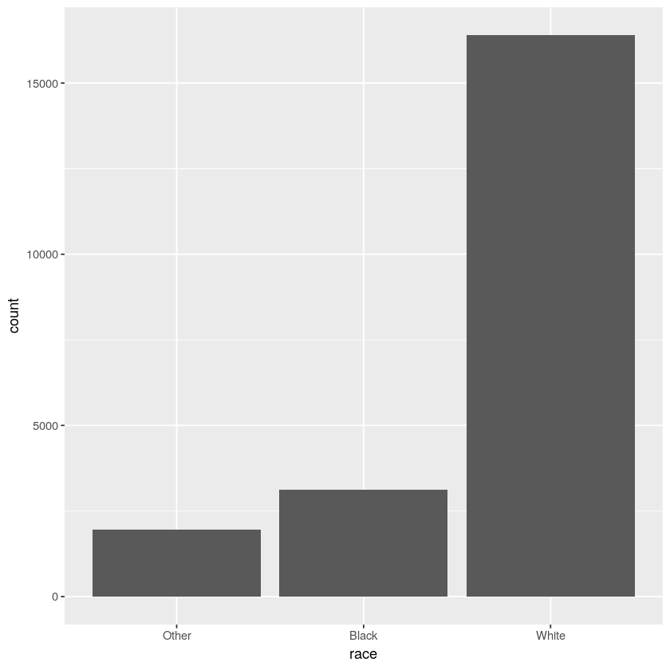

# 使用forcats处理因子

因子在Ｒ中是很常用的，本章使用forcats包处理因子


```R
library(tidyverse)
library(forcats)
```


```R
# 使用字符串记录月份
x1 <- c("Dec", "Apr", "Jan", "Mar")
x2 <- c("Dec", "Apr", "Jam", "Mar")
# 排序
sort(x1)
# 创建月份有效水平
month_levels <-c("Jan", "Feb", "Mar", "Apr", 
                 "May", "Jun",  "Jul", "Aug", 
                 "Sep", "Oct", "Nov", "Dec" )
# 创建因子
y1 <-factor(x1, levels = month_levels)
y1
sort(y1)
y2 <-factor(x2, levels = month_levels)
y2
# 我们容易发现x2的错误
# 如果想要显示错误信息，那么可以使用readr::parse_factor()函数：
y2 <-parse_factor(x2, levels = month_levels)

# 如果省略了定义水平的这个步骤，那么会将按字母顺序排序的数据作为水平：
factor(x1)
```


<ol class=list-inline>
	<li>'Apr'</li>
	<li>'Dec'</li>
	<li>'Jan'</li>
	<li>'Mar'</li>
</ol>


<ol class=list-inline>
	<li>Dec</li>
	<li>Apr</li>
	<li>Jan</li>
	<li>Mar</li>
</ol>

<details>
	<summary style=display:list-item;cursor:pointer>
		<strong>Levels</strong>:
	</summary>
	<ol class=list-inline>
		<li>'Jan'</li>
		<li>'Feb'</li>
		<li>'Mar'</li>
		<li>'Apr'</li>
		<li>'May'</li>
		<li>'Jun'</li>
		<li>'Jul'</li>
		<li>'Aug'</li>
		<li>'Sep'</li>
		<li>'Oct'</li>
		<li>'Nov'</li>
		<li>'Dec'</li>
	</ol>
</details>


<ol class=list-inline>
	<li>Jan</li>
	<li>Mar</li>
	<li>Apr</li>
	<li>Dec</li>
</ol>

<details>
	<summary style=display:list-item;cursor:pointer>
		<strong>Levels</strong>:
	</summary>
	<ol class=list-inline>
		<li>'Jan'</li>
		<li>'Feb'</li>
		<li>'Mar'</li>
		<li>'Apr'</li>
		<li>'May'</li>
		<li>'Jun'</li>
		<li>'Jul'</li>
		<li>'Aug'</li>
		<li>'Sep'</li>
		<li>'Oct'</li>
		<li>'Nov'</li>
		<li>'Dec'</li>
	</ol>
</details>


<ol class=list-inline>
	<li>Dec</li>
	<li>Apr</li>
	<li>&lt;NA&gt;</li>
	<li>Mar</li>
</ol>

<details>
	<summary style=display:list-item;cursor:pointer>
		<strong>Levels</strong>:
	</summary>
	<ol class=list-inline>
		<li>'Jan'</li>
		<li>'Feb'</li>
		<li>'Mar'</li>
		<li>'Apr'</li>
		<li>'May'</li>
		<li>'Jun'</li>
		<li>'Jul'</li>
		<li>'Aug'</li>
		<li>'Sep'</li>
		<li>'Oct'</li>
		<li>'Nov'</li>
		<li>'Dec'</li>
	</ol>
</details>


    Warning message:
    “1 parsing failure.
    row col           expected actual
      3  -- value in level set    Jam
    ”


<ol class=list-inline>
	<li>Dec</li>
	<li>Apr</li>
	<li>Jan</li>
	<li>Mar</li>
</ol>

<details>
	<summary style=display:list-item;cursor:pointer>
		<strong>Levels</strong>:
	</summary>
	<ol class=list-inline>
		<li>'Apr'</li>
		<li>'Dec'</li>
		<li>'Jan'</li>
		<li>'Mar'</li>
	</ol>
</details>


```R
# 使因子的顺序与初始数据的顺序保持一致。
# 在创建因子时，将水平设置为unique(x)，
# 或者在创建因子后再对其使用fct_inorder()函数
f1 <-factor(x1, levels =unique(x1))
f1
f2 <- x1 %>%factor() %>%fct_inorder() 
f2
# 显示因子有效水平
levels(f2)
```


<ol class=list-inline>
	<li>Dec</li>
	<li>Apr</li>
	<li>Jan</li>
	<li>Mar</li>
</ol>

<details>
	<summary style=display:list-item;cursor:pointer>
		<strong>Levels</strong>:
	</summary>
	<ol class=list-inline>
		<li>'Dec'</li>
		<li>'Apr'</li>
		<li>'Jan'</li>
		<li>'Mar'</li>
	</ol>
</details>


<ol class=list-inline>
	<li>Dec</li>
	<li>Apr</li>
	<li>Jan</li>
	<li>Mar</li>
</ol>

<details>
	<summary style=display:list-item;cursor:pointer>
		<strong>Levels</strong>:
	</summary>
	<ol class=list-inline>
		<li>'Dec'</li>
		<li>'Apr'</li>
		<li>'Jan'</li>
		<li>'Mar'</li>
	</ol>
</details>


<ol class=list-inline>
	<li>'Dec'</li>
	<li>'Apr'</li>
	<li>'Jan'</li>
	<li>'Mar'</li>
</ol>


## 综合社会调查


```R


gss_cat %>% head()# 查看数据

# 查看因子水平的方法
gss_cat %>% count(race)# 计数
gss_cat %>% ggplot(aes(race)) + geom_bar()
```

<table>
<caption>A tibble: 6 × 9</caption>
<thead>
	<tr><th scope=col>year</th><th scope=col>marital</th><th scope=col>age</th><th scope=col>race</th><th scope=col>rincome</th><th scope=col>partyid</th><th scope=col>relig</th><th scope=col>denom</th><th scope=col>tvhours</th></tr>
	<tr><th scope=col>&lt;int&gt;</th><th scope=col>&lt;fct&gt;</th><th scope=col>&lt;int&gt;</th><th scope=col>&lt;fct&gt;</th><th scope=col>&lt;fct&gt;</th><th scope=col>&lt;fct&gt;</th><th scope=col>&lt;fct&gt;</th><th scope=col>&lt;fct&gt;</th><th scope=col>&lt;int&gt;</th></tr>
</thead>
<tbody>
	<tr><td>2000</td><td>Never married</td><td>26</td><td>White</td><td>$8000 to 9999 </td><td>Ind,near rep      </td><td>Protestant        </td><td>Southern baptist</td><td>12</td></tr>
	<tr><td>2000</td><td>Divorced     </td><td>48</td><td>White</td><td>$8000 to 9999 </td><td>Not str republican</td><td>Protestant        </td><td>Baptist-dk which</td><td>NA</td></tr>
	<tr><td>2000</td><td>Widowed      </td><td>67</td><td>White</td><td>Not applicable</td><td>Independent       </td><td>Protestant        </td><td>No denomination </td><td> 2</td></tr>
	<tr><td>2000</td><td>Never married</td><td>39</td><td>White</td><td>Not applicable</td><td>Ind,near rep      </td><td>Orthodox-christian</td><td>Not applicable  </td><td> 4</td></tr>
	<tr><td>2000</td><td>Divorced     </td><td>25</td><td>White</td><td>Not applicable</td><td>Not str democrat  </td><td>None              </td><td>Not applicable  </td><td> 1</td></tr>
	<tr><td>2000</td><td>Married      </td><td>25</td><td>White</td><td>$20000 - 24999</td><td>Strong democrat   </td><td>Protestant        </td><td>Southern baptist</td><td>NA</td></tr>
</tbody>
</table>


<table>
<caption>A tibble: 3 × 2</caption>
<thead>
	<tr><th scope=col>race</th><th scope=col>n</th></tr>
	<tr><th scope=col>&lt;fct&gt;</th><th scope=col>&lt;int&gt;</th></tr>
</thead>
<tbody>
	<tr><td>Other</td><td> 1959</td></tr>
	<tr><td>Black</td><td> 3129</td></tr>
	<tr><td>White</td><td>16395</td></tr>
</tbody>
</table>





```R
# 默认情况下，ggplot2会丢弃没有任何数据的那些水平，你可以使用以下代码来强制显示这些水平：
ggplot(gss_cat, aes(race)) +
geom_bar() +
scale_x_discrete(drop =FALSE)
```


## 修改因子水平


```R
# 修改水平最常用、最强大的工具是fct_recode()函数，它可以对每个水平进行修改或重新编码
gss_cat %>% count(partyid)
```


<table>
<caption>A tibble: 10 × 2</caption>
<thead>
	<tr><th scope=col>partyid</th><th scope=col>n</th></tr>
	<tr><th scope=col>&lt;fct&gt;</th><th scope=col>&lt;int&gt;</th></tr>
</thead>
<tbody>
	<tr><td>No answer         </td><td> 154</td></tr>
	<tr><td>Don't know        </td><td>   1</td></tr>
	<tr><td>Other party       </td><td> 393</td></tr>
	<tr><td>Strong republican </td><td>2314</td></tr>
	<tr><td>Not str republican</td><td>3032</td></tr>
	<tr><td>Ind,near rep      </td><td>1791</td></tr>
	<tr><td>Independent       </td><td>4119</td></tr>
	<tr><td>Ind,near dem      </td><td>2499</td></tr>
	<tr><td>Not str democrat  </td><td>3690</td></tr>
	<tr><td>Strong democrat   </td><td>3490</td></tr>
</tbody>
</table>


```R
# 修改
gss_cat %>%mutate(partyid =fct_recode(partyid,     
     "Republican, strong"    = "Strong republican",    
     "Republican, weak"      = "Not str republican",    
     "Independent, near rep" = "Ind,near rep",    
     "Independent, near dem" = "Ind,near dem",    
     "Democrat, weak"        = "Not str democrat",    
     "Democrat, strong"      = "Strong democrat"   )) %>%
count(partyid) 
```


<table>
<caption>A tibble: 10 × 2</caption>
<thead>
	<tr><th scope=col>partyid</th><th scope=col>n</th></tr>
	<tr><th scope=col>&lt;fct&gt;</th><th scope=col>&lt;int&gt;</th></tr>
</thead>
<tbody>
	<tr><td>No answer            </td><td> 154</td></tr>
	<tr><td>Don't know           </td><td>   1</td></tr>
	<tr><td>Other party          </td><td> 393</td></tr>
	<tr><td>Republican, strong   </td><td>2314</td></tr>
	<tr><td>Republican, weak     </td><td>3032</td></tr>
	<tr><td>Independent, near rep</td><td>1791</td></tr>
	<tr><td>Independent          </td><td>4119</td></tr>
	<tr><td>Independent, near dem</td><td>2499</td></tr>
	<tr><td>Democrat, weak       </td><td>3690</td></tr>
	<tr><td>Democrat, strong     </td><td>3490</td></tr>
</tbody>
</table>


```R
# 将多个原水平赋给同一个新水平，这样就可以合并原来的分类：
gss_cat %>%mutate(partyid =fct_recode(partyid,     
     "Republican, strong"    = "Strong republican",    
     "Republican, weak"      = "Not str republican",    
     "Independent, near rep" = "Ind,near rep",    
     "Independent, near dem" = "Ind,near dem",    
     "Democrat, weak"        = "Not str democrat",    
     "Democrat, strong"      = "Strong democrat",    
     "Other"                 = "No answer",    
     "Other"                 = "Don't know",    
     "Other"                 = "Other party"  )) %>%count(partyid)
```


<table>
<caption>A tibble: 8 × 2</caption>
<thead>
	<tr><th scope=col>partyid</th><th scope=col>n</th></tr>
	<tr><th scope=col>&lt;fct&gt;</th><th scope=col>&lt;int&gt;</th></tr>
</thead>
<tbody>
	<tr><td>Other                </td><td> 548</td></tr>
	<tr><td>Republican, strong   </td><td>2314</td></tr>
	<tr><td>Republican, weak     </td><td>3032</td></tr>
	<tr><td>Independent, near rep</td><td>1791</td></tr>
	<tr><td>Independent          </td><td>4119</td></tr>
	<tr><td>Independent, near dem</td><td>2499</td></tr>
	<tr><td>Democrat, weak       </td><td>3690</td></tr>
	<tr><td>Democrat, strong     </td><td>3490</td></tr>
</tbody>
</table>


```R
# 如果想要合并多个水平，那么可以使用fct_recode()函数的变体fct_collapse()函数。对于每个新水平，你都可以提供一个包含原水平的向量：
gss_cat %>%mutate(partyid =fct_collapse(partyid,     
      other =c("No answer", "Don't know", "Other party"),     
      rep =c("Strong republican", "Not str republican"),     
      ind =c("Ind,near rep", "Independent", "Ind,near dem"),     
      dem =c("Not str democrat", "Strong democrat")   )) %>%
count(partyid) 
```


<table>
<caption>A tibble: 4 × 2</caption>
<thead>
	<tr><th scope=col>partyid</th><th scope=col>n</th></tr>
	<tr><th scope=col>&lt;fct&gt;</th><th scope=col>&lt;int&gt;</th></tr>
</thead>
<tbody>
	<tr><td>other</td><td> 548</td></tr>
	<tr><td>rep  </td><td>5346</td></tr>
	<tr><td>ind  </td><td>8409</td></tr>
	<tr><td>dem  </td><td>7180</td></tr>
</tbody>
</table>


## 练习

美国民主党、共和党和中间派的人数比例是如何随时间而变化的？


```R
gss_cat %>%mutate(partyid =fct_collapse(partyid,     
      other =c("No answer", "Don't know", "Other party"),     
      rep =c("Strong republican", "Not str republican"),     
      ind =c("Ind,near rep", "Independent", "Ind,near dem"),     
      dem =c("Not str democrat", "Strong democrat")   )) %>%
ggplot(aes(year, fill = partyid)) + geom_bar(position = "stack") +
theme_classic()
```


