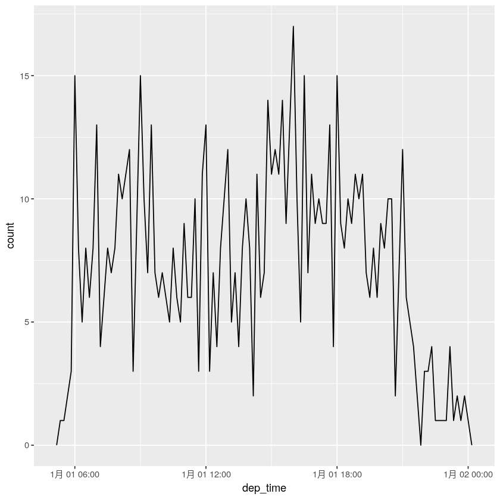
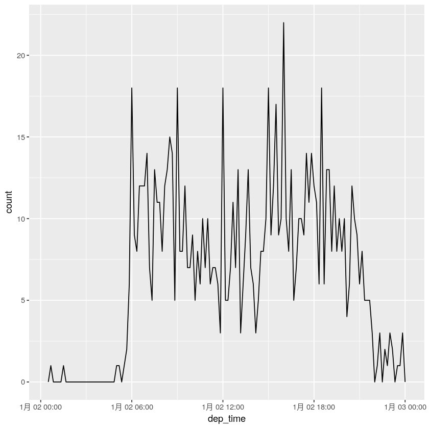
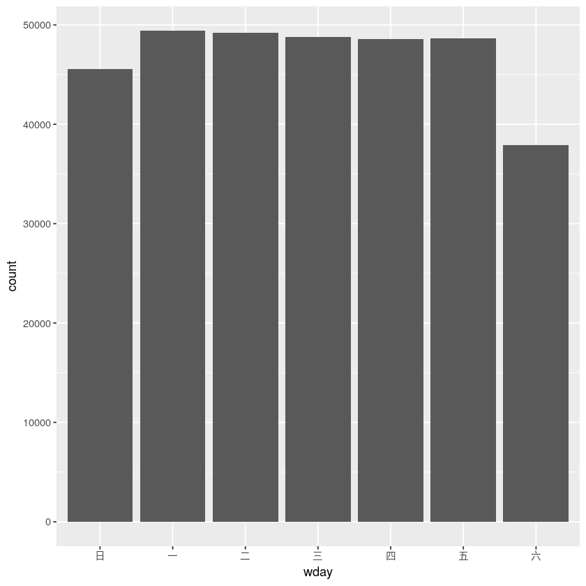
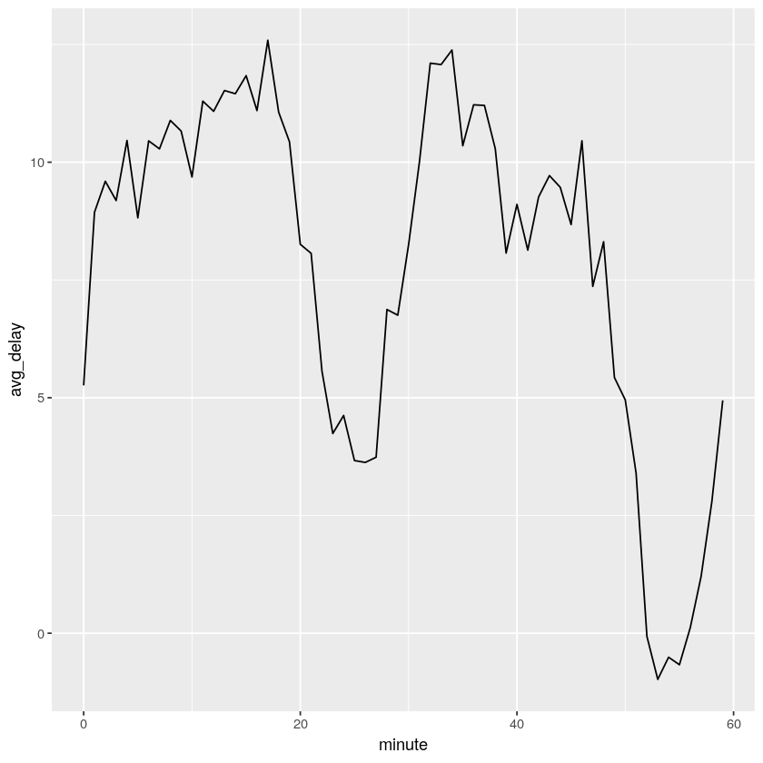
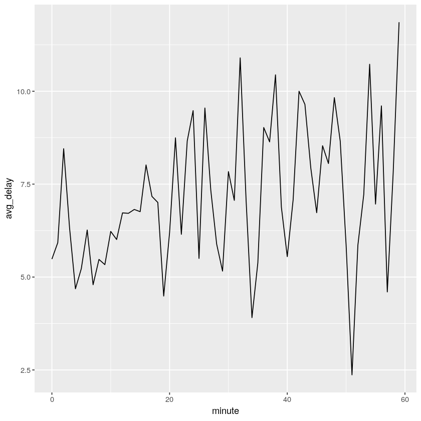
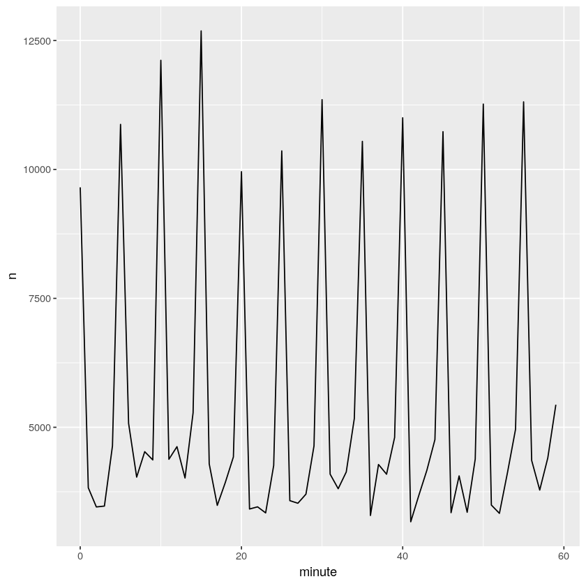
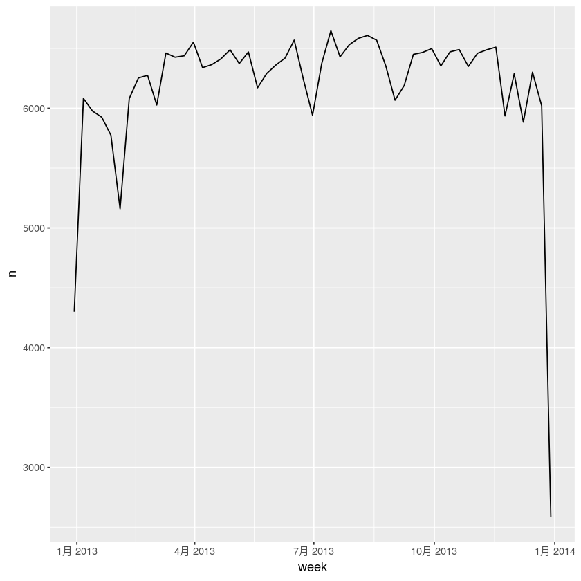
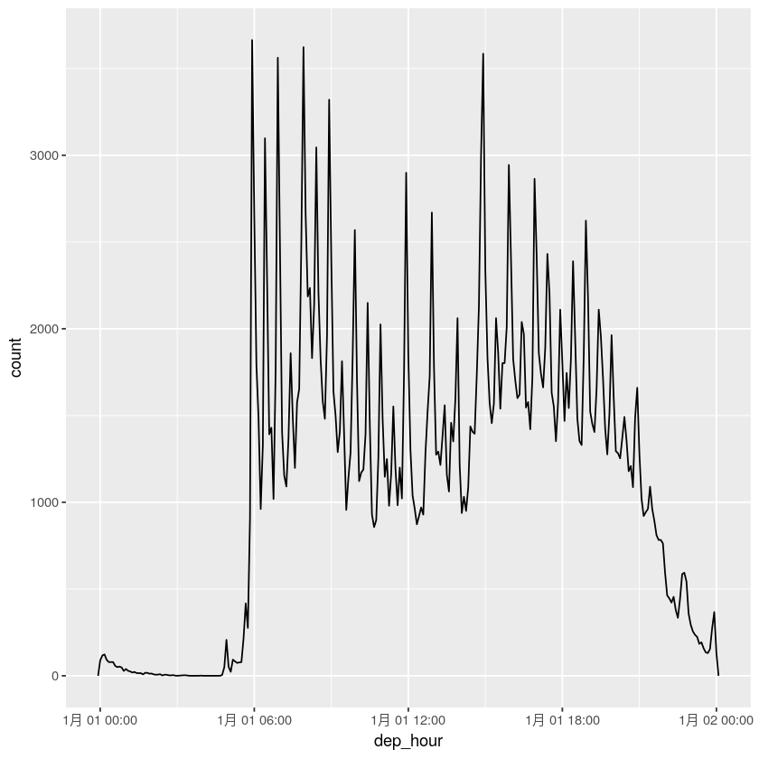

# 使用lubridate处理日期和时间

日期和时间说简单也简单，因为我们用不着太多，说复杂也很复杂，就不展开了。

本章主要讨论lubridate包，它可以使得R对日期和时间的处理更加容易。


```R
library(tidyverse)
library(lubridate)
library(nycflights13)
```

    ─ Attaching packages ──────────────────── tidyverse 1.2.1 ─
    ✔ ggplot2 3.2.0     ✔ purrr   0.3.2
    ✔ tibble  2.1.3     ✔ dplyr   0.8.3
    ✔ tidyr   0.8.3     ✔ stringr 1.4.0
    ✔ readr   1.3.1     ✔ forcats 0.4.0
    ─ Conflicts ───────────────────── tidyverse_conflicts() ─
    ✖ dplyr::filter() masks stats::filter()
    ✖ dplyr::lag()    masks stats::lag()
    
    Attaching package: ‘lubridate’
    
    The following object is masked from ‘package:base’:
    
        date
    


```R
# 获取当前日期时间
today()
now()
```


<time datetime="2019-12-13">2019-12-13</time>


    [1] "2019-12-13 00:51:14 CST"


## 通过字符串创建日期或时间


```R
# 通过y、m和d的顺序解析日期
ymd("2019-12-12")
mdy("January 31st, 2019")
dmy("31-Jan-2019")
ymd("2019/12/12")# 斜杠和连字符都可以
dmy(12122019)# 不带引号也可以
```


<time datetime="2019-12-12">2019-12-12</time>


<time datetime="2019-01-31">2019-01-31</time>


<time datetime="2019-01-31">2019-01-31</time>


<time datetime="2019-12-12">2019-12-12</time>


<time datetime="2019-12-12">2019-12-12</time>


```R
# 同理，时间用h、m和s
ymd_hms("2019-12-12 0:27:12")
ymd_hm("20191212 00:28")
hms("01:28:21")

# 通过添加一个时区参数，你可以将一个日期强制转换为日期时间：
ymd(20190131, tz ="UTC") 
```


    [1] "2019-12-12 00:27:12 UTC"


    [1] "2019-12-12 00:28:00 UTC"


1H 28M 21S


    [1] "2019-01-31 UTC"


## 通过各个成分创建


```R
# flights表格中的日期时间数据
flights %>% select(year, month, day, hour, minute) %>% head()
```


<table>
<caption>A tibble: 6 × 5</caption>
<thead>
	<tr><th scope=col>year</th><th scope=col>month</th><th scope=col>day</th><th scope=col>hour</th><th scope=col>minute</th></tr>
	<tr><th scope=col>&lt;int&gt;</th><th scope=col>&lt;int&gt;</th><th scope=col>&lt;int&gt;</th><th scope=col>&lt;dbl&gt;</th><th scope=col>&lt;dbl&gt;</th></tr>
</thead>
<tbody>
	<tr><td>2013</td><td>1</td><td>1</td><td>5</td><td>15</td></tr>
	<tr><td>2013</td><td>1</td><td>1</td><td>5</td><td>29</td></tr>
	<tr><td>2013</td><td>1</td><td>1</td><td>5</td><td>40</td></tr>
	<tr><td>2013</td><td>1</td><td>1</td><td>5</td><td>45</td></tr>
	<tr><td>2013</td><td>1</td><td>1</td><td>6</td><td> 0</td></tr>
	<tr><td>2013</td><td>1</td><td>1</td><td>5</td><td>58</td></tr>
</tbody>
</table>


```R
# 使用make_date()函数创建日期，使用make_datetime()函数创建日期时间
flights %>% select(year, month, day, hour, minute) %>% 
mutate(departure = make_datetime(year, month, day, hour, minute)) %>% 
head()
```


<table>
<caption>A tibble: 6 × 6</caption>
<thead>
	<tr><th scope=col>year</th><th scope=col>month</th><th scope=col>day</th><th scope=col>hour</th><th scope=col>minute</th><th scope=col>departure</th></tr>
	<tr><th scope=col>&lt;int&gt;</th><th scope=col>&lt;int&gt;</th><th scope=col>&lt;int&gt;</th><th scope=col>&lt;dbl&gt;</th><th scope=col>&lt;dbl&gt;</th><th scope=col>&lt;dttm&gt;</th></tr>
</thead>
<tbody>
	<tr><td>2013</td><td>1</td><td>1</td><td>5</td><td>15</td><td>2013-01-01 05:15:00</td></tr>
	<tr><td>2013</td><td>1</td><td>1</td><td>5</td><td>29</td><td>2013-01-01 05:29:00</td></tr>
	<tr><td>2013</td><td>1</td><td>1</td><td>5</td><td>40</td><td>2013-01-01 05:40:00</td></tr>
	<tr><td>2013</td><td>1</td><td>1</td><td>5</td><td>45</td><td>2013-01-01 05:45:00</td></tr>
	<tr><td>2013</td><td>1</td><td>1</td><td>6</td><td> 0</td><td>2013-01-01 06:00:00</td></tr>
	<tr><td>2013</td><td>1</td><td>1</td><td>5</td><td>58</td><td>2013-01-01 05:58:00</td></tr>
</tbody>
</table>


```R
# flights数据中４个时间列表示时间的方法有点奇怪，需要处理一下
head(flights) %>% select(ends_with("delay"),ends_with("time"))
# 构造分离小时与分钟函数
make_datetime_100 <- function(year, month, day, time){
    make_datetime(year, month, day, time %/% 100, time %% 100)
}
```


<table>
<caption>A tibble: 6 × 7</caption>
<thead>
	<tr><th scope=col>dep_delay</th><th scope=col>arr_delay</th><th scope=col>dep_time</th><th scope=col>sched_dep_time</th><th scope=col>arr_time</th><th scope=col>sched_arr_time</th><th scope=col>air_time</th></tr>
	<tr><th scope=col>&lt;dbl&gt;</th><th scope=col>&lt;dbl&gt;</th><th scope=col>&lt;int&gt;</th><th scope=col>&lt;int&gt;</th><th scope=col>&lt;int&gt;</th><th scope=col>&lt;int&gt;</th><th scope=col>&lt;dbl&gt;</th></tr>
</thead>
<tbody>
	<tr><td> 2</td><td> 11</td><td>517</td><td>515</td><td> 830</td><td> 819</td><td>227</td></tr>
	<tr><td> 4</td><td> 20</td><td>533</td><td>529</td><td> 850</td><td> 830</td><td>227</td></tr>
	<tr><td> 2</td><td> 33</td><td>542</td><td>540</td><td> 923</td><td> 850</td><td>160</td></tr>
	<tr><td>-1</td><td>-18</td><td>544</td><td>545</td><td>1004</td><td>1022</td><td>183</td></tr>
	<tr><td>-6</td><td>-25</td><td>554</td><td>600</td><td> 812</td><td> 837</td><td>116</td></tr>
	<tr><td>-4</td><td> 12</td><td>554</td><td>558</td><td> 740</td><td> 728</td><td>150</td></tr>
</tbody>
</table>


```R
flights_dt <- flights %>% filter(!is.na(dep_time), !is.na(arr_time)) %>% 
mutate(dep_time = make_datetime_100(year, month, day, dep_time),
      arr_time = make_datetime_100(year, month, day, arr_time),
      sched_dep_time = make_datetime_100(year, month, day, sched_arr_time),
      sched_arr_time = make_datetime_100(year, month, day, sched_arr_time)) %>% 
select(origin, dest, ends_with("delay"), ends_with("time"))

flights_dt %>% head()
```


<table>
<caption>A tibble: 6 × 9</caption>
<thead>
	<tr><th scope=col>origin</th><th scope=col>dest</th><th scope=col>dep_delay</th><th scope=col>arr_delay</th><th scope=col>dep_time</th><th scope=col>sched_dep_time</th><th scope=col>arr_time</th><th scope=col>sched_arr_time</th><th scope=col>air_time</th></tr>
	<tr><th scope=col>&lt;chr&gt;</th><th scope=col>&lt;chr&gt;</th><th scope=col>&lt;dbl&gt;</th><th scope=col>&lt;dbl&gt;</th><th scope=col>&lt;dttm&gt;</th><th scope=col>&lt;dttm&gt;</th><th scope=col>&lt;dttm&gt;</th><th scope=col>&lt;dttm&gt;</th><th scope=col>&lt;dbl&gt;</th></tr>
</thead>
<tbody>
	<tr><td>EWR</td><td>IAH</td><td> 2</td><td> 11</td><td>2013-01-01 05:17:00</td><td>2013-01-01 08:19:00</td><td>2013-01-01 08:30:00</td><td>2013-01-01 08:19:00</td><td>227</td></tr>
	<tr><td>LGA</td><td>IAH</td><td> 4</td><td> 20</td><td>2013-01-01 05:33:00</td><td>2013-01-01 08:30:00</td><td>2013-01-01 08:50:00</td><td>2013-01-01 08:30:00</td><td>227</td></tr>
	<tr><td>JFK</td><td>MIA</td><td> 2</td><td> 33</td><td>2013-01-01 05:42:00</td><td>2013-01-01 08:50:00</td><td>2013-01-01 09:23:00</td><td>2013-01-01 08:50:00</td><td>160</td></tr>
	<tr><td>JFK</td><td>BQN</td><td>-1</td><td>-18</td><td>2013-01-01 05:44:00</td><td>2013-01-01 10:22:00</td><td>2013-01-01 10:04:00</td><td>2013-01-01 10:22:00</td><td>183</td></tr>
	<tr><td>LGA</td><td>ATL</td><td>-6</td><td>-25</td><td>2013-01-01 05:54:00</td><td>2013-01-01 08:37:00</td><td>2013-01-01 08:12:00</td><td>2013-01-01 08:37:00</td><td>116</td></tr>
	<tr><td>EWR</td><td>ORD</td><td>-4</td><td> 12</td><td>2013-01-01 05:54:00</td><td>2013-01-01 07:28:00</td><td>2013-01-01 07:40:00</td><td>2013-01-01 07:28:00</td><td>150</td></tr>
</tbody>
</table>


```R
# 一年间出发时间可视化
flights_dt %>% ggplot(aes(dep_time)) +
geom_freqpoly(binwidth = 86400)

# 某天的分布
flights_dt %>% filter(dep_time < ymd(20130102)) %>% 
ggplot(aes(dep_time)) + geom_freqpoly(binwidth = 600)

flights_dt %>% filter(dep_time > ymd(20130102) & dep_time < ymd(20130103)) %>% 
ggplot(aes(dep_time)) + geom_freqpoly(binwidth = 600)
```








```R
# 通过其他类型数据创建
# 使用as_datetime()函数和as_date()函数转换
as_datetime(today())
as_date(now())
```


    [1] "2019-12-13 UTC"


<time datetime="2019-12-13">2019-12-13</time>


练习就不说了，很简单。

# 日期时间成分


```R
# 提取出日期中的独立成分
datetime <- ymd_hms("2019-12-12 23:30:32")

year(datetime)
month(datetime)
mday(datetime)
yday(datetime)
wday(datetime)# 一周的第几天和我们的不一样
wday(datetime, abbr = F, label = T)
```


2019


12


12


346


5


星期四
<details>
	<summary style=display:list-item;cursor:pointer>
		<strong>Levels</strong>:
	</summary>
	<ol class=list-inline>
		<li>'星期日'</li>
		<li>'星期一'</li>
		<li>'星期二'</li>
		<li>'星期三'</li>
		<li>'星期四'</li>
		<li>'星期五'</li>
		<li>'星期六'</li>
	</ol>
</details>


```R
# 工作日出发的航班是否多于周末出发的航班？
flights_dt %>% mutate(wday = wday(dep_time, label = T)) %>% 
ggplot(aes(x = wday)) + geom_bar()
```





```R
# 查看一小时内每分钟的平均出发延误
flights_dt %>% mutate(minute = minute(dep_time)) %>% 
group_by(minute) %>% 
summarise(avg_delay = mean(arr_delay, na.rm = T),n = n()) %>%
ggplot(aes(minute, avg_delay)) + geom_line()
```





```R
# 检查计划出发时间
sched_dep <- flights_dt %>% mutate(minute = minute(sched_dep_time)) %>% 
group_by(minute) %>% 
summarise(avg_delay = mean(arr_delay, na.rm = T), n = n())

ggplot(sched_dep, aes(minute, avg_delay)) + geom_line()
```





```R
ggplot(sched_dep, aes(minute, n)) + geom_line()
```





```R
# floor_date()、round_date()和ceiling_date()函数将日期舍入到临近的一个时间单位。
# 函数会将这个向量舍下、入上或四舍五入到这个时间单位

# 绘制出每周的航班数量
flights_dt %>% count(week = floor_date(dep_time, "week")) %>% 
ggplot(aes(week, n)) + geom_line()
```





```R
# 通过year()，month()，day()函数等可以设置日期时间中的成分
datetime <- ymd_hms("2019-12-12 23:30:32")
datetime
year(datetime) <- 2020
datetime
# 其他类似函数就不演示了
hour(datetime) <- hour(datetime) + 1
datetime
```


    [1] "2019-12-12 23:30:32 UTC"


    [1] "2020-12-12 23:30:32 UTC"


    [1] "2020-12-13 00:30:32 UTC"


```R
# 也可以同时设置多个成分
update(datetime, year =2020, month =2, mday =2, hour =2) 
# 如果设置的值过大，那么可以自动向后滚动
ymd("2015-02-01") %>% update(mday =30)
```


    [1] "2020-02-02 02:30:32 UTC"


<time datetime="2015-03-02">2015-03-02</time>


```R
# 一年中所有航班的出发时间在一天内的分布
flights_dt %>% mutate(dep_hour = update(dep_time, yday = 1)) %>%
ggplot(aes(dep_hour)) + 
geom_freqpoly(binwidth = 300)
# 可以明显看到还是白天出发的多
```





## 时间间隔

### 时期


```R
 today() - ymd(20181213)# 和书上不一样啊
```


    Time difference of 365 days


```R
# 我们看lubridate提供的总是使用秒为单位的另一种计时对象——时期
as.duration(today() - ymd(20181213))
```


31536000s (~52.14 weeks)


```R
dseconds(15)
dminutes(10)
dhours(c(2,5))
# 同样的，其他几个就不示范了
```


15s


600s (~10 minutes)


<ol class=list-inline>
	<li>7200s (~2 hours)</li>
	<li>18000s (~5 hours)</li>
</ol>


```R
# 由于时期总是以秒为单位来记录时间间隔，可以方便的运算
2*dyears(1)
dyears(1) + dweeks(3) + dhours(5)
# 至于因为夏时制出现的问题暂不讨论
```


63072000s (~2 years)


33368400s (~1.06 years)


### 阶段

阶段也是一种时间间隔，但它不以秒为单位；相反，它使用“人工”时间，比如日和月


```R
seconds(12)
minutes(45)
weeks(3)

# 可以对阶段进行加法和乘法操作
10* (months(6) +days(1)) 
# 其他看书吧，暂时不讨论
```


12S


45M 0S


21d 0H 0M 0S


60m 10d 0H 0M 0S


### 区间

区间是带有起点的时期，这使得其非常精确，你可以确切地知道它的长度


```R
next_year <-today() + years(1) 
(today() %--% next_year) /ddays(1)
```


366


### 时区

时区用到再来看，目前自己用不着
