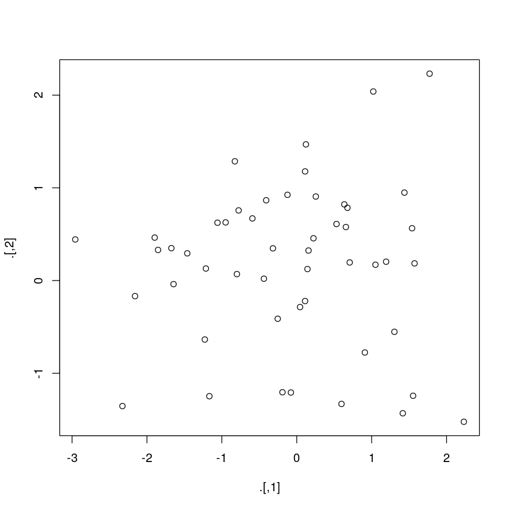
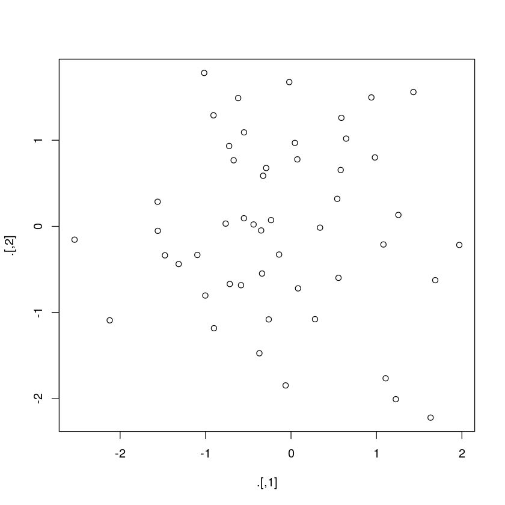

# 使用magrittr进行管道操作

这一章介绍的很简单，主要是几种管道操作符


```R
# 加载magrittr包，其提供了多种管道
library(magrittr)
```


```R
# R是如何管理数据的，添加新的列
diamonds <- ggplot2::diamonds
diamonds2 <- diamonds %>% dplyr::mutate(price_per_carat = price / carat)
```


```R
# 看两个数据框大小
# pryr提供的函数显示占用内存大小
pryr::object_size(diamonds)
pryr::object_size(diamonds2)
pryr::object_size(diamonds, diamonds2)
```

    Registered S3 method overwritten by 'pryr':
      method      from
      print.bytes Rcpp


    3.46 MB


    3.89 MB


    3.89 MB


```R
# 从上面可以看到R在共享数据列
# 再改变一列共用列比较大小
diamonds$carat[1] <- NA
pryr::object_size(diamonds)
pryr::object_size(diamonds2)
pryr::object_size(diamonds, diamonds2)
```


    3.46 MB


    3.89 MB


    4.32 MB


管道的原理作者也介绍了，前面也用过很多次“%>%”管道，不再写了，有些情况是不适合使用管道的，看书

## T操作符"%T>%"

T操作符和管道是很像的，不过它返回的是左侧项，对比下面的例子就明白了


```R
# 管道操作符返回为NULL
rnorm(100) %>% matrix(ncol = 2) %>% plot() %>% str()
```

     NULL





```R
# T操作符返回数据类型
rnorm(100) %>% matrix(ncol = 2) %T>% plot() %>% str()
```

     num [1:50, 1:2] -0.14 -1.561 1.082 0.59 -0.234 ...





## 爆炸操作符"%$%"

爆炸操作符适用于函数是基于向量而非数据框的情况，感觉和attach()函数与with()函数将数据框加载到内存中，直接使用数据框中每列的列名像，不过更简洁


```R
mtcars %>% head()
# 查看数据
```


<table>
<caption>A data.frame: 6 × 11</caption>
<thead>
	<tr><th></th><th scope=col>mpg</th><th scope=col>cyl</th><th scope=col>disp</th><th scope=col>hp</th><th scope=col>drat</th><th scope=col>wt</th><th scope=col>qsec</th><th scope=col>vs</th><th scope=col>am</th><th scope=col>gear</th><th scope=col>carb</th></tr>
	<tr><th></th><th scope=col>&lt;dbl&gt;</th><th scope=col>&lt;dbl&gt;</th><th scope=col>&lt;dbl&gt;</th><th scope=col>&lt;dbl&gt;</th><th scope=col>&lt;dbl&gt;</th><th scope=col>&lt;dbl&gt;</th><th scope=col>&lt;dbl&gt;</th><th scope=col>&lt;dbl&gt;</th><th scope=col>&lt;dbl&gt;</th><th scope=col>&lt;dbl&gt;</th><th scope=col>&lt;dbl&gt;</th></tr>
</thead>
<tbody>
	<tr><th scope=row>Mazda RX4</th><td>21.0</td><td>6</td><td>160</td><td>110</td><td>3.90</td><td>2.620</td><td>16.46</td><td>0</td><td>1</td><td>4</td><td>4</td></tr>
	<tr><th scope=row>Mazda RX4 Wag</th><td>21.0</td><td>6</td><td>160</td><td>110</td><td>3.90</td><td>2.875</td><td>17.02</td><td>0</td><td>1</td><td>4</td><td>4</td></tr>
	<tr><th scope=row>Datsun 710</th><td>22.8</td><td>4</td><td>108</td><td> 93</td><td>3.85</td><td>2.320</td><td>18.61</td><td>1</td><td>1</td><td>4</td><td>1</td></tr>
	<tr><th scope=row>Hornet 4 Drive</th><td>21.4</td><td>6</td><td>258</td><td>110</td><td>3.08</td><td>3.215</td><td>19.44</td><td>1</td><td>0</td><td>3</td><td>1</td></tr>
	<tr><th scope=row>Hornet Sportabout</th><td>18.7</td><td>8</td><td>360</td><td>175</td><td>3.15</td><td>3.440</td><td>17.02</td><td>0</td><td>0</td><td>3</td><td>2</td></tr>
	<tr><th scope=row>Valiant</th><td>18.1</td><td>6</td><td>225</td><td>105</td><td>2.76</td><td>3.460</td><td>20.22</td><td>1</td><td>0</td><td>3</td><td>1</td></tr>
</tbody>
</table>


```R
mtcars %$% cor(disp, mpg)
```


-0.847551379262479


```R
attach(mtcars)
cor(disp, mpg)
detach(mtcars)
```


-0.847551379262479


```R
with(mtcars,cor(disp, mpg))
```


-0.847551379262479


能看出来它们三个实现的功能是一样的，爆炸操作符更爽
