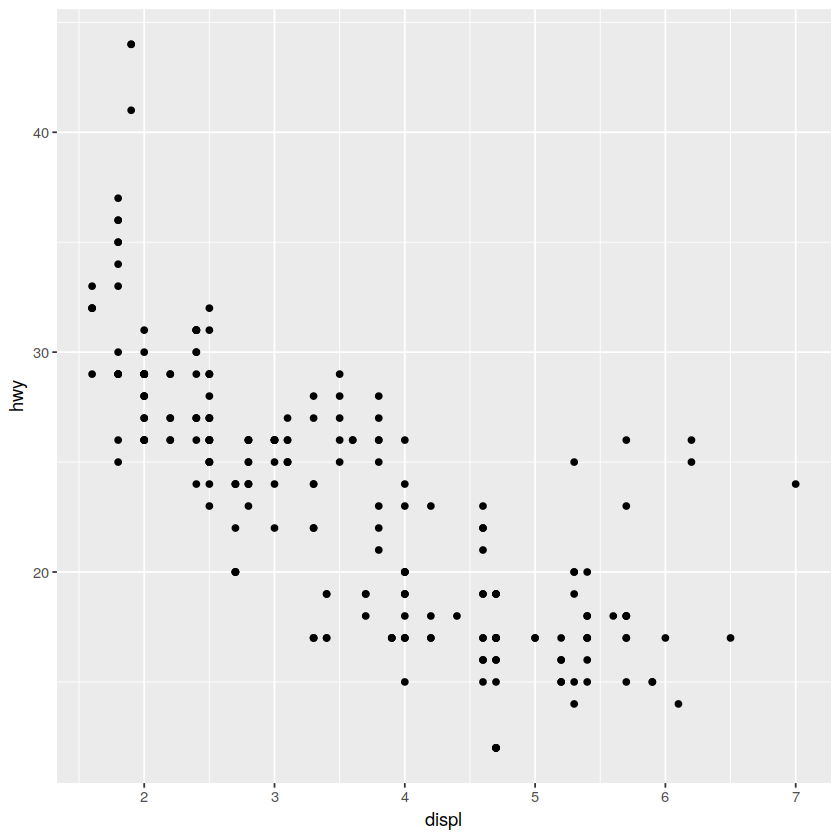
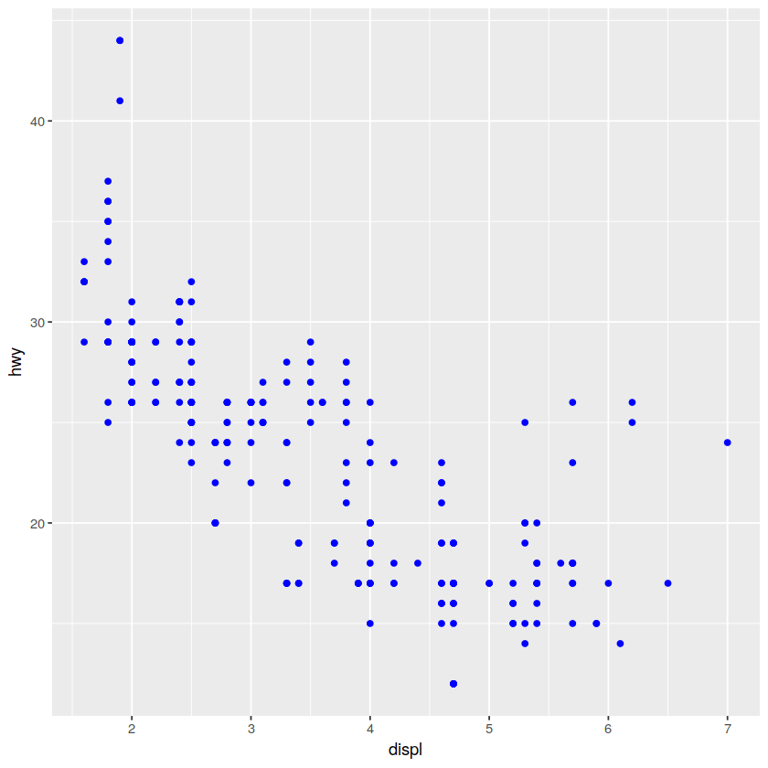
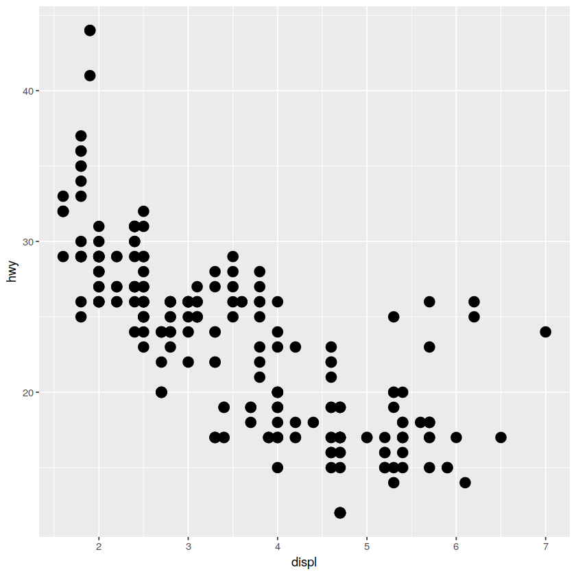
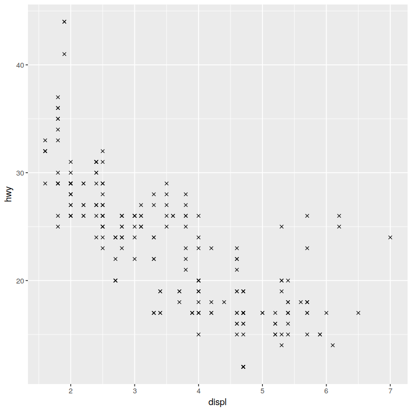
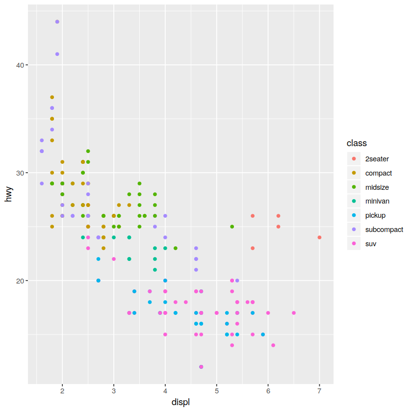
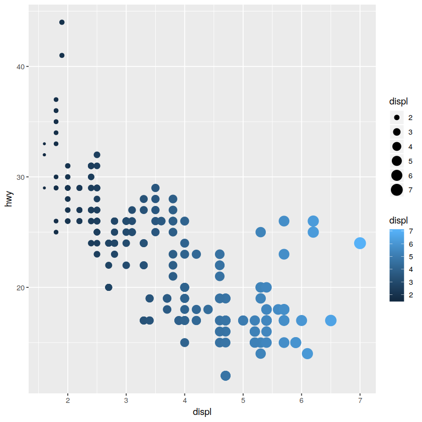

# ggplot属性映射
使用mpg数据进行ggplot２属性映射练习

## 首先是了解mpg数据


```R
# 先安装并加载tidyverse
# install.packages("tidyverse")
library(tidyverse)
```

## 关于mpg数据，可以使用***?mpg***查看帮助
## 使用***mpg***查看mpg数据
## 使用***str(mpg)***查看mpg数据类型


```R
str(mpg)
```

    Classes ‘tbl_df’, ‘tbl’ and 'data.frame':	234 obs. of  11 variables:
     $ manufacturer: chr  "audi" "audi" "audi" "audi" ...
     $ model       : chr  "a4" "a4" "a4" "a4" ...
     $ displ       : num  1.8 1.8 2 2 2.8 2.8 3.1 1.8 1.8 2 ...
     $ year        : int  1999 1999 2008 2008 1999 1999 2008 1999 1999 2008 ...
     $ cyl         : int  4 4 4 4 6 6 6 4 4 4 ...
     $ trans       : chr  "auto(l5)" "manual(m5)" "manual(m6)" "auto(av)" ...
     $ drv         : chr  "f" "f" "f" "f" ...
     $ cty         : int  18 21 20 21 16 18 18 18 16 20 ...
     $ hwy         : int  29 29 31 30 26 26 27 26 25 28 ...
     $ fl          : chr  "p" "p" "p" "p" ...
     $ class       : chr  "compact" "compact" "compact" "compact" ...


## 使用ggplot2绘图


```R
ggplot(data = mpg) + 
    geom_point(mapping = aes(x = displ, y = hwy))
```





```R
# 上面的代码不方便复用，可以这样
p <- ggplot(mpg,aes(x = displ, y = hwy))
p + geom_point()
```


```R
p + geom_point(color = "blue")
```





```R
p + geom_point(size = 4)
```





### R自带形状有25种，分别从0-24,0-14用color指定形状的颜色，15-20用color指定填充颜色，21-24用color指定颜色，fill指定填充


```R
p + geom_point(shape = 4)
```





```R
# 其实上面改进的代码也有不足的地方可以这样
f <- ggplot(mpg)
f + geom_point(mapping = aes(x = displ, y = hwy))
```


```R
f + geom_point(mapping = aes(x = displ, y = hwy, color = class))
# 指定class为按颜色的分类变量
```





```R
# 也可以将一个变量映射的多个图形属性
f + geom_point(mapping = aes(x = displ, y = hwy, color = displ, size = displ))
```





## 注意
图形属性有color,size,shape,alpha,stroke,fill等

注意aes()函数内的图形属性设置和aes()函数外的不同

图形属性可以叠加


```R

```
