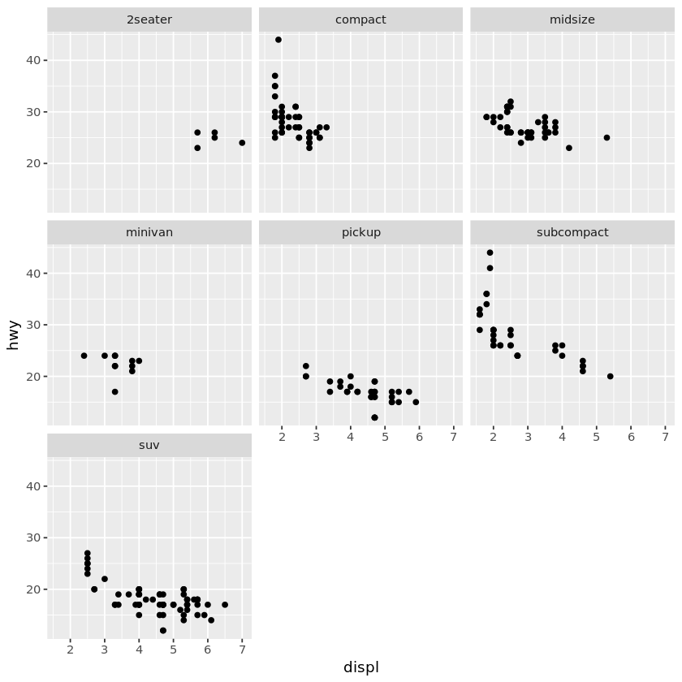
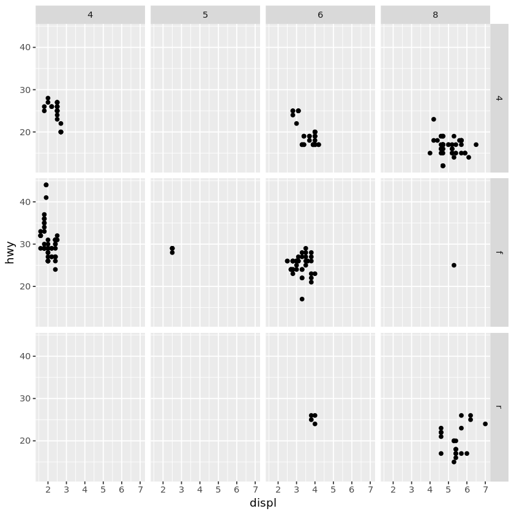
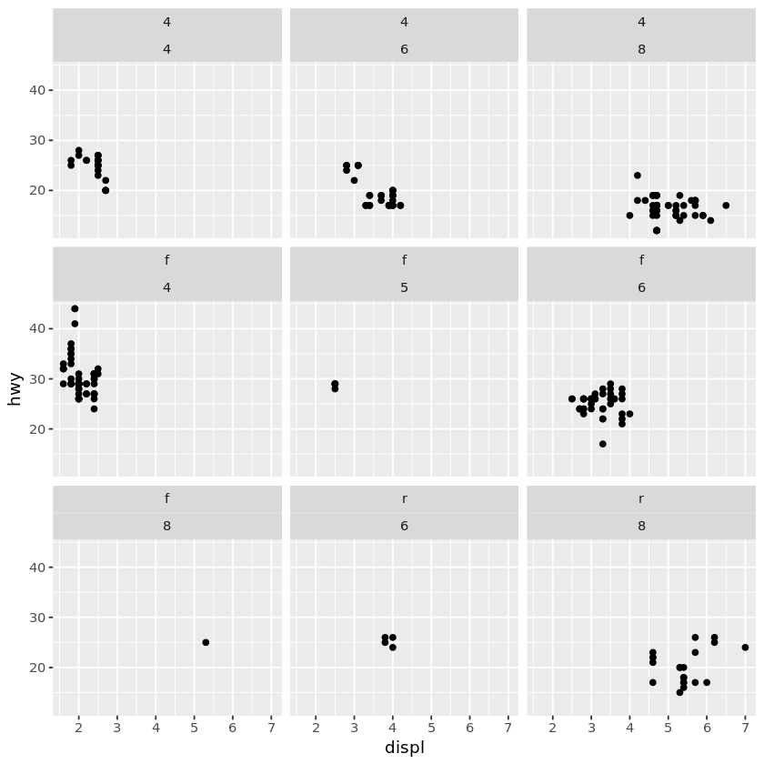
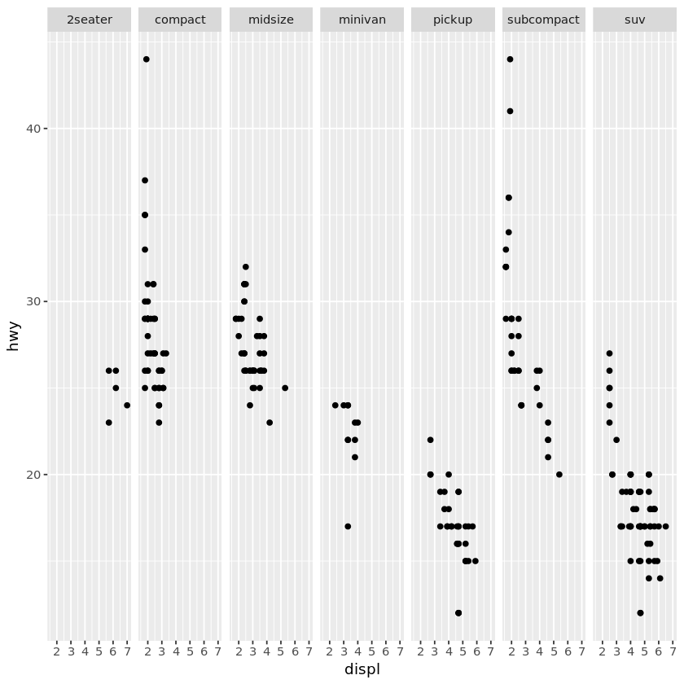
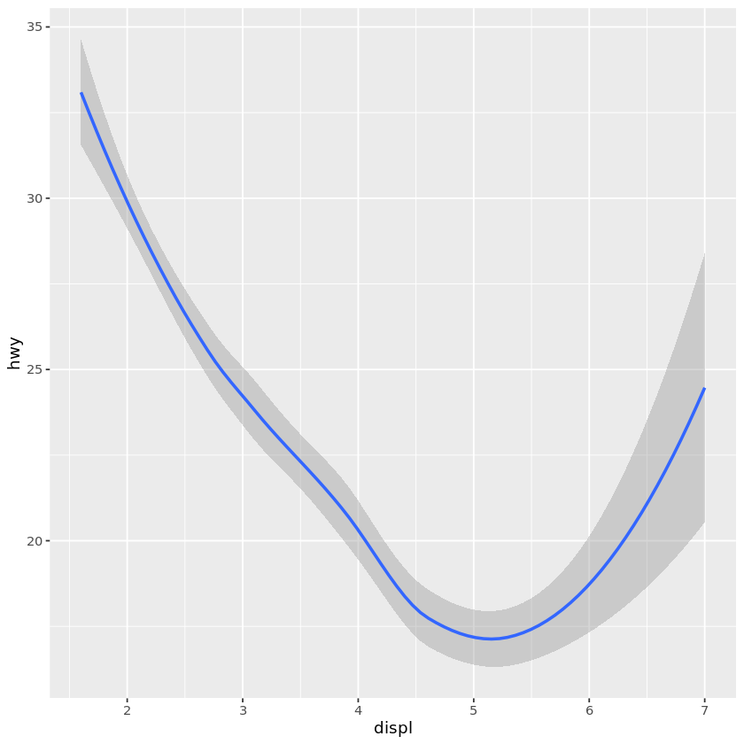
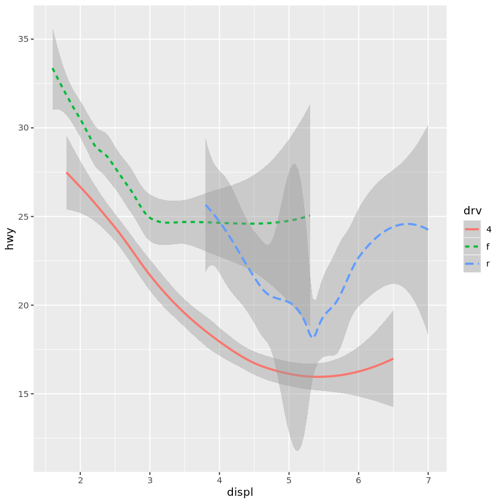
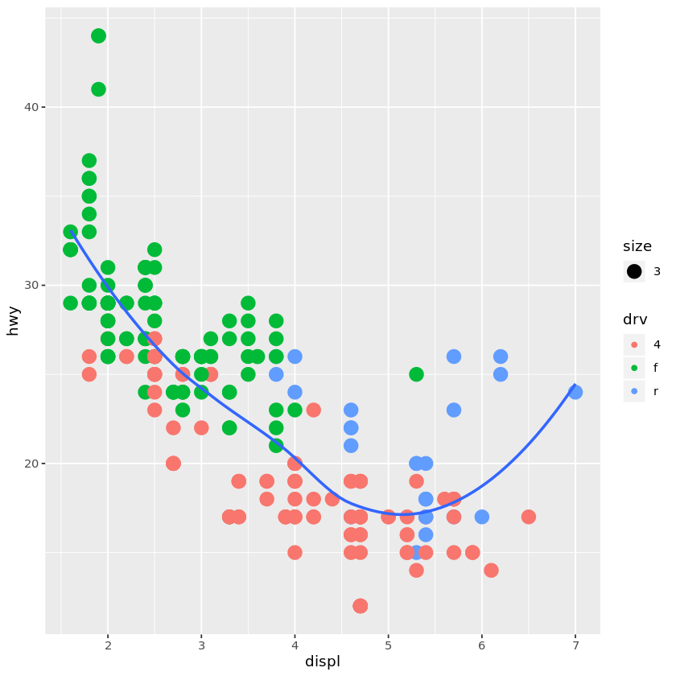
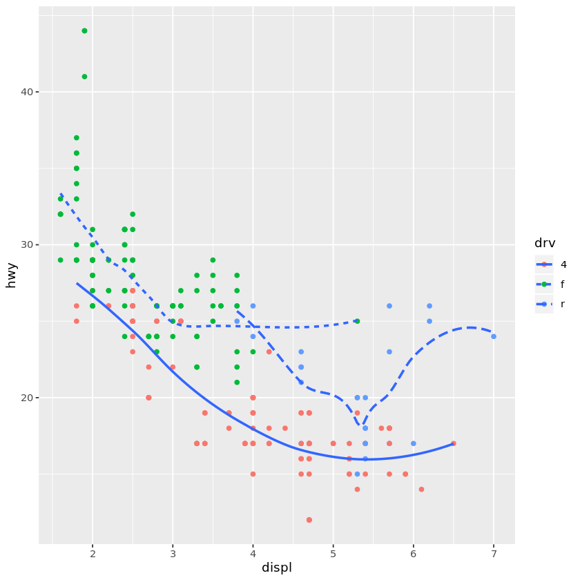
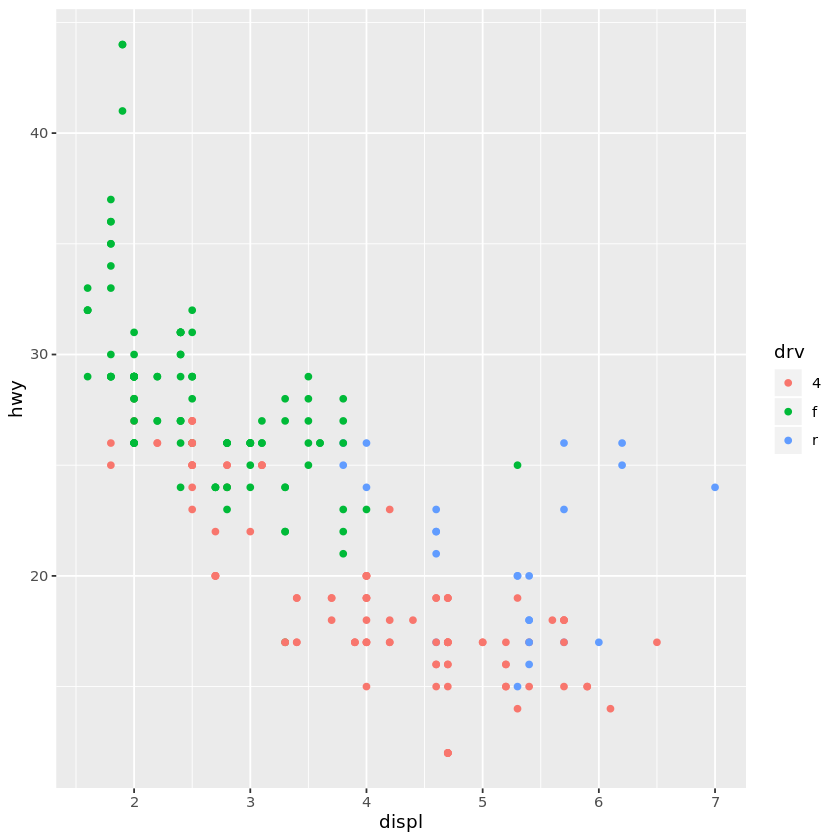

# ggplot几何对象与分面
以geom_point()函数和geom_smooth()函数为例


```R
library(tidyverse)
```

    ── Attaching packages ─────────────────────────────────────── tidyverse 1.2.1 ──
    ✔ ggplot2 3.2.1     ✔ purrr   0.3.2
    ✔ tibble  2.1.3     ✔ dplyr   0.8.3
    ✔ tidyr   0.8.3     ✔ stringr 1.4.0
    ✔ readr   1.3.1     ✔ forcats 0.4.0
    ── Conflicts ────────────────────────────────────────── tidyverse_conflicts() ──
    ✖ dplyr::filter() masks stats::filter()
    ✖ dplyr::lag()    masks stats::lag()


ggplot中的几何对象是指点、线、面、箱线图、小提琴图什么的，分面是指按某个变量分别显示


```R
# 使用mpg数据，按照class进行分面显示
ggplot(mpg) + 
geom_point(mapping = aes(displ,hwy)) + 
facet_wrap(~ class, nrow = 3)
```


```R
# 和上面相同
ggplot(mpg) + 
geom_point(mapping = aes(displ,hwy)) + 
facet_wrap(vars(class),nrow = 3)
```





```R
# 双变量分面，比较一下和下面代码的不同
ggplot(mpg) + 
geom_point(mapping = aes(displ,hwy)) + 
facet_grid(drv ~ cyl)
```





```R
ggplot(mpg) + 
geom_point(mapping = aes(displ,hwy)) + 
facet_wrap(vars(drv,cyl))
```





```R
ggplot(mpg) + 
geom_point(mapping = aes(displ,hwy)) + 
facet_grid(. ~ class)# 注意一下“.”的作用
```





## 输入***?facet_wrap***查看帮助，了解更加详细的用法

## 先以下面两幅图比较几何对象
分别是***geom_point()***绘制的点图和***geom_smooth()***绘制的线图


```R
ggplot(mpg) + 
geom_point(mapping = aes(displ,hwy))

ggplot(mpg) + 
geom_smooth(mapping = aes(displ,hwy))
```

    `geom_smooth()` using method = 'loess' and formula 'y ~ x'





## 前面已经说过***geom_point()***，这里展示几个***geom_smooth()***的用法


```R
p <- ggplot(mpg,mapping = aes(displ,hwy))
p + geom_smooth(se = TRUE, method = loess, level = 0.99)# 有很多参数的
```


```R
ggplot(mpg) + 
geom_smooth(mapping = aes(displ,hwy,linetype = drv, color = drv))
# 指定线型和颜色
```

    `geom_smooth()` using method = 'loess' and formula 'y ~ x'





## 更具体的***geom_smooth()***函数用法参见帮助***?geom_smooth***

# 下面的几何对象的叠加


```R
ggplot(mpg) + 
geom_point(mapping = aes(displ,hwy,color = class,shape = drv)) + 
geom_smooth(mapping = aes(displ,hwy,color = drv,linetype = drv),show.legend = FALSE)
# show.legend控制是否显示图例
```

    `geom_smooth()` using method = 'loess' and formula 'y ~ x'


```R
ggplot(mpg,mapping = aes(displ, hwy)) + 
geom_point(mapping = aes(color = class, size = cyl < 6)) + 
geom_smooth(data = filter(mpg, class == "subcompact"))
# ggplot的图形叠加就是这么厉害
```

    Warning message:
    “Using size for a discrete variable is not advised.”`geom_smooth()` using method = 'loess' and formula 'y ~ x'


## 最后再实现思考中的六幅图
目前还不会将多幅图排版，就一幅一幅来了


```R
ggplot(mpg, mapping = aes(displ,hwy)) + 
geom_point() + 
geom_smooth(se = FALSE)
```

    `geom_smooth()` using method = 'loess' and formula 'y ~ x'


```R
ggplot(mpg, mapping = aes(displ,hwy)) + 
geom_point() + 
geom_smooth(mapping =  aes(displ,hwy,group = drv),se = FALSE)
```

    `geom_smooth()` using method = 'loess' and formula 'y ~ x'


```R
ggplot(mpg) + 
geom_point(mapping = aes(displ, hwy, color = drv)) + 
geom_smooth(mapping = aes(displ, hwy, color = drv), se = FALSE)
```

    `geom_smooth()` using method = 'loess' and formula 'y ~ x'


```R
ggplot(mpg) + 
geom_point(mapping = aes(displ, hwy, color = drv, size = 3)) + 
geom_smooth(mapping = aes(displ, hwy), se = FALSE)
```

    `geom_smooth()` using method = 'loess' and formula 'y ~ x'





```R
ggplot(mpg) + 
geom_point(mapping = aes(displ, hwy, color = drv)) + 
geom_smooth(mapping = aes(displ, hwy, linetype = drv), se = FALSE)
```

    `geom_smooth()` using method = 'loess' and formula 'y ~ x'





```R
ggplot(mpg) + 
geom_point(mapping = aes(displ, hwy, color = drv))
```





```R

```
