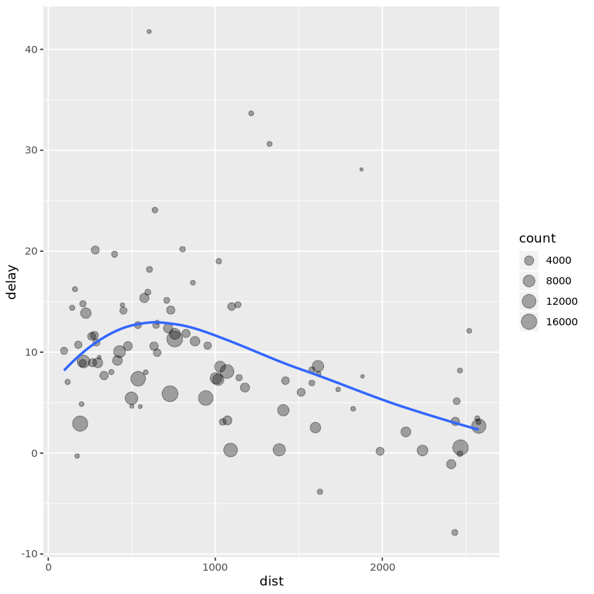
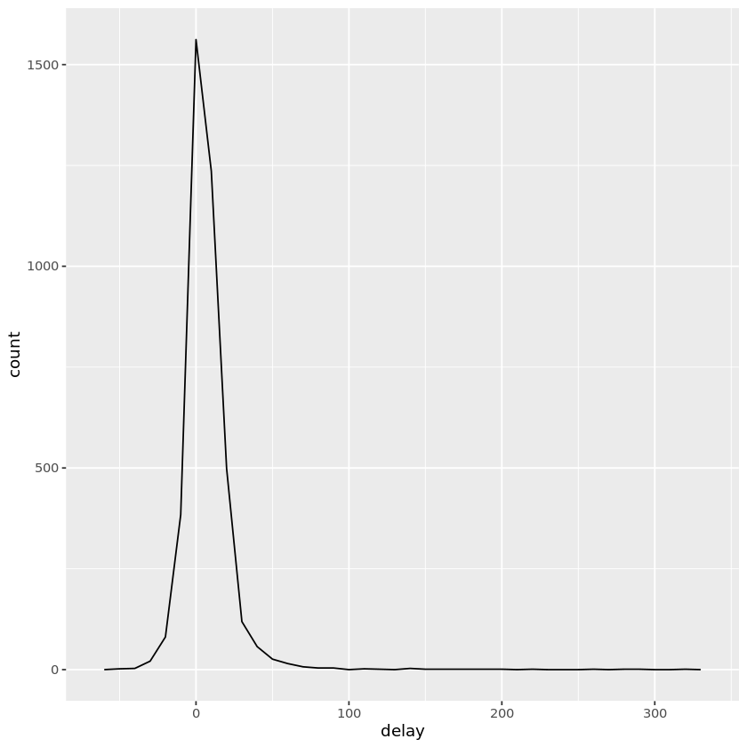
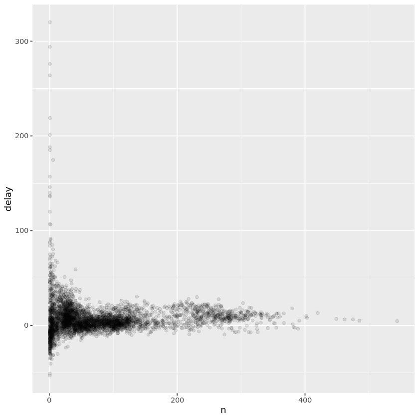
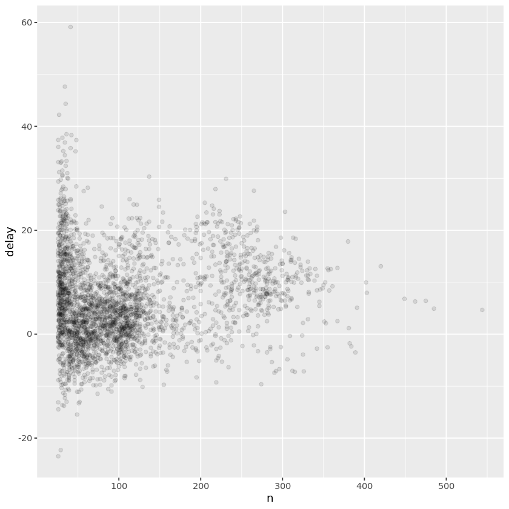
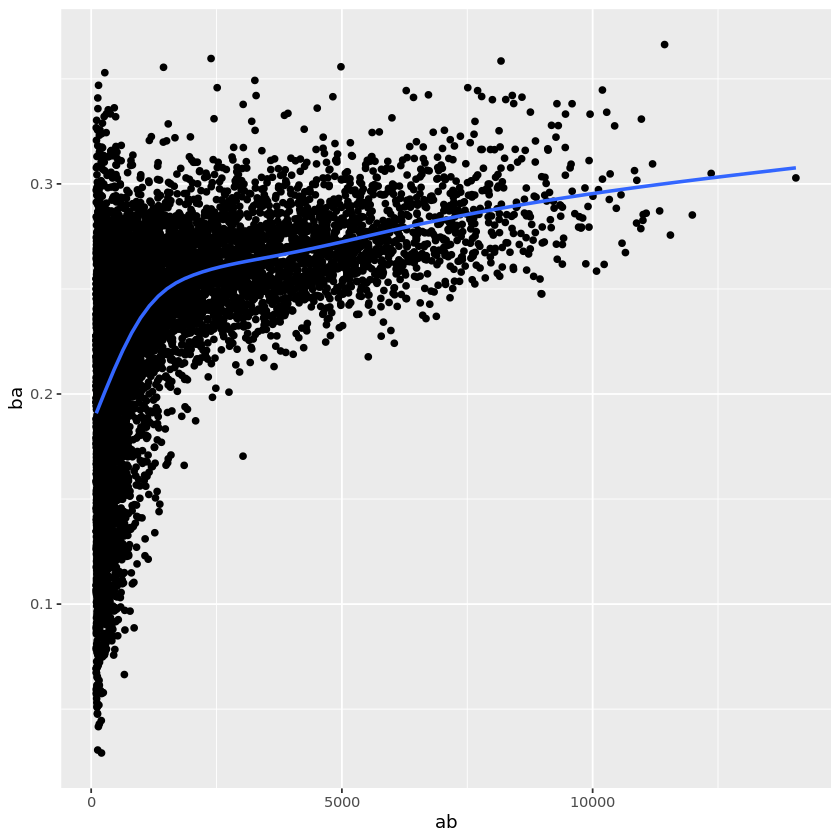

# 使用dplyr进行数据转换

1. 使用dplyr进行数据转换主要使用***tidyverse***包和***nycflights13***数据包

2. dplyr五个核心函数

    a. 按值筛选函数***filter()***
    
    b. 对行重新排序函数***arrange()***
    
    c. 按名称选取变量函数***select()***
    
    d. 创建新变量函数***mutate()***
    
    e. 获得摘要统计量函数***summarize()***


```R
# 加载包
# install.packages("Lahman")
library(Lahman)
library(tidyverse)
library(nycflights13)
```

    ── Attaching packages ─────────────────────────────────────── tidyverse 1.2.1 ──
    ✔ ggplot2 3.2.1     ✔ purrr   0.3.2
    ✔ tibble  2.1.3     ✔ dplyr   0.8.3
    ✔ tidyr   0.8.3     ✔ stringr 1.4.0
    ✔ readr   1.3.1     ✔ forcats 0.4.0
    ── Conflicts ────────────────────────────────────────── tidyverse_conflicts() ──
    ✖ dplyr::filter() masks stats::filter()
    ✖ dplyr::lag()    masks stats::lag()


查看flights数据

jupyter对于tibble数据框的显示不如rstudio好，看截图


```R
head(flights)
str(flights)
```


<table>
<caption>A tibble: 6 × 19</caption>
<thead>
	<tr><th scope=col>year</th><th scope=col>month</th><th scope=col>day</th><th scope=col>dep_time</th><th scope=col>sched_dep_time</th><th scope=col>dep_delay</th><th scope=col>arr_time</th><th scope=col>sched_arr_time</th><th scope=col>arr_delay</th><th scope=col>carrier</th><th scope=col>flight</th><th scope=col>tailnum</th><th scope=col>origin</th><th scope=col>dest</th><th scope=col>air_time</th><th scope=col>distance</th><th scope=col>hour</th><th scope=col>minute</th><th scope=col>time_hour</th></tr>
	<tr><th scope=col>&lt;int&gt;</th><th scope=col>&lt;int&gt;</th><th scope=col>&lt;int&gt;</th><th scope=col>&lt;int&gt;</th><th scope=col>&lt;int&gt;</th><th scope=col>&lt;dbl&gt;</th><th scope=col>&lt;int&gt;</th><th scope=col>&lt;int&gt;</th><th scope=col>&lt;dbl&gt;</th><th scope=col>&lt;chr&gt;</th><th scope=col>&lt;int&gt;</th><th scope=col>&lt;chr&gt;</th><th scope=col>&lt;chr&gt;</th><th scope=col>&lt;chr&gt;</th><th scope=col>&lt;dbl&gt;</th><th scope=col>&lt;dbl&gt;</th><th scope=col>&lt;dbl&gt;</th><th scope=col>&lt;dbl&gt;</th><th scope=col>&lt;dttm&gt;</th></tr>
</thead>
<tbody>
	<tr><td>2013</td><td>1</td><td>1</td><td>517</td><td>515</td><td> 2</td><td> 830</td><td> 819</td><td> 11</td><td>UA</td><td>1545</td><td>N14228</td><td>EWR</td><td>IAH</td><td>227</td><td>1400</td><td>5</td><td>15</td><td>2013-01-01 05:00:00</td></tr>
	<tr><td>2013</td><td>1</td><td>1</td><td>533</td><td>529</td><td> 4</td><td> 850</td><td> 830</td><td> 20</td><td>UA</td><td>1714</td><td>N24211</td><td>LGA</td><td>IAH</td><td>227</td><td>1416</td><td>5</td><td>29</td><td>2013-01-01 05:00:00</td></tr>
	<tr><td>2013</td><td>1</td><td>1</td><td>542</td><td>540</td><td> 2</td><td> 923</td><td> 850</td><td> 33</td><td>AA</td><td>1141</td><td>N619AA</td><td>JFK</td><td>MIA</td><td>160</td><td>1089</td><td>5</td><td>40</td><td>2013-01-01 05:00:00</td></tr>
	<tr><td>2013</td><td>1</td><td>1</td><td>544</td><td>545</td><td>-1</td><td>1004</td><td>1022</td><td>-18</td><td>B6</td><td> 725</td><td>N804JB</td><td>JFK</td><td>BQN</td><td>183</td><td>1576</td><td>5</td><td>45</td><td>2013-01-01 05:00:00</td></tr>
	<tr><td>2013</td><td>1</td><td>1</td><td>554</td><td>600</td><td>-6</td><td> 812</td><td> 837</td><td>-25</td><td>DL</td><td> 461</td><td>N668DN</td><td>LGA</td><td>ATL</td><td>116</td><td> 762</td><td>6</td><td> 0</td><td>2013-01-01 06:00:00</td></tr>
	<tr><td>2013</td><td>1</td><td>1</td><td>554</td><td>558</td><td>-4</td><td> 740</td><td> 728</td><td> 12</td><td>UA</td><td>1696</td><td>N39463</td><td>EWR</td><td>ORD</td><td>150</td><td> 719</td><td>5</td><td>58</td><td>2013-01-01 05:00:00</td></tr>
</tbody>
</table>


    Classes ‘tbl_df’, ‘tbl’ and 'data.frame':	336776 obs. of  19 variables:
     $ year          : int  2013 2013 2013 2013 2013 2013 2013 2013 2013 2013 ...
     $ month         : int  1 1 1 1 1 1 1 1 1 1 ...
     $ day           : int  1 1 1 1 1 1 1 1 1 1 ...
     $ dep_time      : int  517 533 542 544 554 554 555 557 557 558 ...
     $ sched_dep_time: int  515 529 540 545 600 558 600 600 600 600 ...
     $ dep_delay     : num  2 4 2 -1 -6 -4 -5 -3 -3 -2 ...
     $ arr_time      : int  830 850 923 1004 812 740 913 709 838 753 ...
     $ sched_arr_time: int  819 830 850 1022 837 728 854 723 846 745 ...
     $ arr_delay     : num  11 20 33 -18 -25 12 19 -14 -8 8 ...
     $ carrier       : chr  "UA" "UA" "AA" "B6" ...
     $ flight        : int  1545 1714 1141 725 461 1696 507 5708 79 301 ...
     $ tailnum       : chr  "N14228" "N24211" "N619AA" "N804JB" ...
     $ origin        : chr  "EWR" "LGA" "JFK" "JFK" ...
     $ dest          : chr  "IAH" "IAH" "MIA" "BQN" ...
     $ air_time      : num  227 227 160 183 116 150 158 53 140 138 ...
     $ distance      : num  1400 1416 1089 1576 762 ...
     $ hour          : num  5 5 5 5 6 5 6 6 6 6 ...
     $ minute        : num  15 29 40 45 0 58 0 0 0 0 ...
     $ time_hour     : POSIXct, format: "2013-01-01 05:00:00" "2013-01-01 05:00:00" ...


## 使用filter()筛选行


```R
# 筛选1月1日的航班,数据有点多，使用head()函数仅仅显示前6行,下同
head(filter(flights, month == 1, day == 1))
#注意是两个等号“==”
```


<table>
<caption>A tibble: 6 × 19</caption>
<thead>
	<tr><th scope=col>year</th><th scope=col>month</th><th scope=col>day</th><th scope=col>dep_time</th><th scope=col>sched_dep_time</th><th scope=col>dep_delay</th><th scope=col>arr_time</th><th scope=col>sched_arr_time</th><th scope=col>arr_delay</th><th scope=col>carrier</th><th scope=col>flight</th><th scope=col>tailnum</th><th scope=col>origin</th><th scope=col>dest</th><th scope=col>air_time</th><th scope=col>distance</th><th scope=col>hour</th><th scope=col>minute</th><th scope=col>time_hour</th></tr>
	<tr><th scope=col>&lt;int&gt;</th><th scope=col>&lt;int&gt;</th><th scope=col>&lt;int&gt;</th><th scope=col>&lt;int&gt;</th><th scope=col>&lt;int&gt;</th><th scope=col>&lt;dbl&gt;</th><th scope=col>&lt;int&gt;</th><th scope=col>&lt;int&gt;</th><th scope=col>&lt;dbl&gt;</th><th scope=col>&lt;chr&gt;</th><th scope=col>&lt;int&gt;</th><th scope=col>&lt;chr&gt;</th><th scope=col>&lt;chr&gt;</th><th scope=col>&lt;chr&gt;</th><th scope=col>&lt;dbl&gt;</th><th scope=col>&lt;dbl&gt;</th><th scope=col>&lt;dbl&gt;</th><th scope=col>&lt;dbl&gt;</th><th scope=col>&lt;dttm&gt;</th></tr>
</thead>
<tbody>
	<tr><td>2013</td><td>1</td><td>1</td><td>517</td><td>515</td><td> 2</td><td> 830</td><td> 819</td><td> 11</td><td>UA</td><td>1545</td><td>N14228</td><td>EWR</td><td>IAH</td><td>227</td><td>1400</td><td>5</td><td>15</td><td>2013-01-01 05:00:00</td></tr>
	<tr><td>2013</td><td>1</td><td>1</td><td>533</td><td>529</td><td> 4</td><td> 850</td><td> 830</td><td> 20</td><td>UA</td><td>1714</td><td>N24211</td><td>LGA</td><td>IAH</td><td>227</td><td>1416</td><td>5</td><td>29</td><td>2013-01-01 05:00:00</td></tr>
	<tr><td>2013</td><td>1</td><td>1</td><td>542</td><td>540</td><td> 2</td><td> 923</td><td> 850</td><td> 33</td><td>AA</td><td>1141</td><td>N619AA</td><td>JFK</td><td>MIA</td><td>160</td><td>1089</td><td>5</td><td>40</td><td>2013-01-01 05:00:00</td></tr>
	<tr><td>2013</td><td>1</td><td>1</td><td>544</td><td>545</td><td>-1</td><td>1004</td><td>1022</td><td>-18</td><td>B6</td><td> 725</td><td>N804JB</td><td>JFK</td><td>BQN</td><td>183</td><td>1576</td><td>5</td><td>45</td><td>2013-01-01 05:00:00</td></tr>
	<tr><td>2013</td><td>1</td><td>1</td><td>554</td><td>600</td><td>-6</td><td> 812</td><td> 837</td><td>-25</td><td>DL</td><td> 461</td><td>N668DN</td><td>LGA</td><td>ATL</td><td>116</td><td> 762</td><td>6</td><td> 0</td><td>2013-01-01 06:00:00</td></tr>
	<tr><td>2013</td><td>1</td><td>1</td><td>554</td><td>558</td><td>-4</td><td> 740</td><td> 728</td><td> 12</td><td>UA</td><td>1696</td><td>N39463</td><td>EWR</td><td>ORD</td><td>150</td><td> 719</td><td>5</td><td>58</td><td>2013-01-01 05:00:00</td></tr>
</tbody>
</table>


dplyr函数不会修改输入，如果要保存结果需要使用赋值操作“<-”

如果既要输出结果，又要保存结果，则使用"()"将赋值操作括起来


```R
head(fm1d1 <- filter(flights, month == 1, day == 1))
```


<table>
<caption>A tibble: 6 × 19</caption>
<thead>
	<tr><th scope=col>year</th><th scope=col>month</th><th scope=col>day</th><th scope=col>dep_time</th><th scope=col>sched_dep_time</th><th scope=col>dep_delay</th><th scope=col>arr_time</th><th scope=col>sched_arr_time</th><th scope=col>arr_delay</th><th scope=col>carrier</th><th scope=col>flight</th><th scope=col>tailnum</th><th scope=col>origin</th><th scope=col>dest</th><th scope=col>air_time</th><th scope=col>distance</th><th scope=col>hour</th><th scope=col>minute</th><th scope=col>time_hour</th></tr>
	<tr><th scope=col>&lt;int&gt;</th><th scope=col>&lt;int&gt;</th><th scope=col>&lt;int&gt;</th><th scope=col>&lt;int&gt;</th><th scope=col>&lt;int&gt;</th><th scope=col>&lt;dbl&gt;</th><th scope=col>&lt;int&gt;</th><th scope=col>&lt;int&gt;</th><th scope=col>&lt;dbl&gt;</th><th scope=col>&lt;chr&gt;</th><th scope=col>&lt;int&gt;</th><th scope=col>&lt;chr&gt;</th><th scope=col>&lt;chr&gt;</th><th scope=col>&lt;chr&gt;</th><th scope=col>&lt;dbl&gt;</th><th scope=col>&lt;dbl&gt;</th><th scope=col>&lt;dbl&gt;</th><th scope=col>&lt;dbl&gt;</th><th scope=col>&lt;dttm&gt;</th></tr>
</thead>
<tbody>
	<tr><td>2013</td><td>1</td><td>1</td><td>517</td><td>515</td><td> 2</td><td> 830</td><td> 819</td><td> 11</td><td>UA</td><td>1545</td><td>N14228</td><td>EWR</td><td>IAH</td><td>227</td><td>1400</td><td>5</td><td>15</td><td>2013-01-01 05:00:00</td></tr>
	<tr><td>2013</td><td>1</td><td>1</td><td>533</td><td>529</td><td> 4</td><td> 850</td><td> 830</td><td> 20</td><td>UA</td><td>1714</td><td>N24211</td><td>LGA</td><td>IAH</td><td>227</td><td>1416</td><td>5</td><td>29</td><td>2013-01-01 05:00:00</td></tr>
	<tr><td>2013</td><td>1</td><td>1</td><td>542</td><td>540</td><td> 2</td><td> 923</td><td> 850</td><td> 33</td><td>AA</td><td>1141</td><td>N619AA</td><td>JFK</td><td>MIA</td><td>160</td><td>1089</td><td>5</td><td>40</td><td>2013-01-01 05:00:00</td></tr>
	<tr><td>2013</td><td>1</td><td>1</td><td>544</td><td>545</td><td>-1</td><td>1004</td><td>1022</td><td>-18</td><td>B6</td><td> 725</td><td>N804JB</td><td>JFK</td><td>BQN</td><td>183</td><td>1576</td><td>5</td><td>45</td><td>2013-01-01 05:00:00</td></tr>
	<tr><td>2013</td><td>1</td><td>1</td><td>554</td><td>600</td><td>-6</td><td> 812</td><td> 837</td><td>-25</td><td>DL</td><td> 461</td><td>N668DN</td><td>LGA</td><td>ATL</td><td>116</td><td> 762</td><td>6</td><td> 0</td><td>2013-01-01 06:00:00</td></tr>
	<tr><td>2013</td><td>1</td><td>1</td><td>554</td><td>558</td><td>-4</td><td> 740</td><td> 728</td><td> 12</td><td>UA</td><td>1696</td><td>N39463</td><td>EWR</td><td>ORD</td><td>150</td><td> 719</td><td>5</td><td>58</td><td>2013-01-01 05:00:00</td></tr>
</tbody>
</table>


除了使用等于"=="，还可以使用其他比较运算符"!="、">"、"<="，以及逻辑运算符
"&"、"|"、"!"


```R
# 实践一下，找出8月中旬的航班与12月的航班
head(eord <- filter(flights, month == 8 & day >= 10 & day <= 20 | month == 2))
```


<table>
<caption>A tibble: 6 × 19</caption>
<thead>
	<tr><th scope=col>year</th><th scope=col>month</th><th scope=col>day</th><th scope=col>dep_time</th><th scope=col>sched_dep_time</th><th scope=col>dep_delay</th><th scope=col>arr_time</th><th scope=col>sched_arr_time</th><th scope=col>arr_delay</th><th scope=col>carrier</th><th scope=col>flight</th><th scope=col>tailnum</th><th scope=col>origin</th><th scope=col>dest</th><th scope=col>air_time</th><th scope=col>distance</th><th scope=col>hour</th><th scope=col>minute</th><th scope=col>time_hour</th></tr>
	<tr><th scope=col>&lt;int&gt;</th><th scope=col>&lt;int&gt;</th><th scope=col>&lt;int&gt;</th><th scope=col>&lt;int&gt;</th><th scope=col>&lt;int&gt;</th><th scope=col>&lt;dbl&gt;</th><th scope=col>&lt;int&gt;</th><th scope=col>&lt;int&gt;</th><th scope=col>&lt;dbl&gt;</th><th scope=col>&lt;chr&gt;</th><th scope=col>&lt;int&gt;</th><th scope=col>&lt;chr&gt;</th><th scope=col>&lt;chr&gt;</th><th scope=col>&lt;chr&gt;</th><th scope=col>&lt;dbl&gt;</th><th scope=col>&lt;dbl&gt;</th><th scope=col>&lt;dbl&gt;</th><th scope=col>&lt;dbl&gt;</th><th scope=col>&lt;dttm&gt;</th></tr>
</thead>
<tbody>
	<tr><td>2013</td><td>2</td><td>1</td><td>456</td><td>500</td><td>-4</td><td> 652</td><td> 648</td><td>  4</td><td>US</td><td>1117</td><td>N197UW</td><td>EWR</td><td>CLT</td><td> 98</td><td> 529</td><td>5</td><td> 0</td><td>2013-02-01 05:00:00</td></tr>
	<tr><td>2013</td><td>2</td><td>1</td><td>520</td><td>525</td><td>-5</td><td> 816</td><td> 820</td><td> -4</td><td>UA</td><td>1018</td><td>N24211</td><td>EWR</td><td>IAH</td><td>209</td><td>1400</td><td>5</td><td>25</td><td>2013-02-01 05:00:00</td></tr>
	<tr><td>2013</td><td>2</td><td>1</td><td>527</td><td>530</td><td>-3</td><td> 837</td><td> 829</td><td>  8</td><td>UA</td><td> 650</td><td>N470UA</td><td>LGA</td><td>IAH</td><td>233</td><td>1416</td><td>5</td><td>30</td><td>2013-02-01 05:00:00</td></tr>
	<tr><td>2013</td><td>2</td><td>1</td><td>532</td><td>540</td><td>-8</td><td>1007</td><td>1017</td><td>-10</td><td>B6</td><td> 725</td><td>N554JB</td><td>JFK</td><td>BQN</td><td>195</td><td>1576</td><td>5</td><td>40</td><td>2013-02-01 05:00:00</td></tr>
	<tr><td>2013</td><td>2</td><td>1</td><td>540</td><td>540</td><td> 0</td><td> 859</td><td> 850</td><td>  9</td><td>AA</td><td>1141</td><td>N615AA</td><td>JFK</td><td>MIA</td><td>169</td><td>1089</td><td>5</td><td>40</td><td>2013-02-01 05:00:00</td></tr>
	<tr><td>2013</td><td>2</td><td>1</td><td>552</td><td>600</td><td>-8</td><td> 714</td><td> 715</td><td> -1</td><td>EV</td><td>5716</td><td>N829AS</td><td>JFK</td><td>IAD</td><td> 58</td><td> 228</td><td>6</td><td> 0</td><td>2013-02-01 06:00:00</td></tr>
</tbody>
</table>


```R
# 检查一下上面筛选的有没有问题
# 使用t()函数转置一下

unique(eord$month)#是否只有8月和12月

t(unique(filter(eord, month == 8)$day))# 8月是否是中旬

matrix(unique(filter(eord, month == 2)$day),ncol = 7, byrow = T)# 12月是否是全月
# 为了显示，转成了矩阵，,刚好2月是7的整数倍，不然不足的就自动填充了
```


<ol class=list-inline>
	<li>2</li>
	<li>8</li>
</ol>


<table>
<caption>A matrix: 1 × 11 of type int</caption>
<tbody>
	<tr><td>10</td><td>11</td><td>12</td><td>13</td><td>14</td><td>15</td><td>16</td><td>17</td><td>18</td><td>19</td><td>20</td></tr>
</tbody>
</table>


<table>
<caption>A matrix: 4 × 7 of type int</caption>
<tbody>
	<tr><td> 1</td><td> 2</td><td> 3</td><td> 4</td><td> 5</td><td> 6</td><td> 7</td></tr>
	<tr><td> 8</td><td> 9</td><td>10</td><td>11</td><td>12</td><td>13</td><td>14</td></tr>
	<tr><td>15</td><td>16</td><td>17</td><td>18</td><td>19</td><td>20</td><td>21</td></tr>
	<tr><td>22</td><td>23</td><td>24</td><td>25</td><td>26</td><td>27</td><td>28</td></tr>
</tbody>
</table>


复杂的表达式最好用小括号括起来，看起来更清楚，而且很多复杂表达式可以简化

还有一种操作是"%in%"


```R
# 筛选出7-9月的航班
head(filter(flights, month %in% c(7:9)))
tail(filter(flights, month %in% c(7:9)))
```


<table>
<caption>A tibble: 6 × 19</caption>
<thead>
	<tr><th scope=col>year</th><th scope=col>month</th><th scope=col>day</th><th scope=col>dep_time</th><th scope=col>sched_dep_time</th><th scope=col>dep_delay</th><th scope=col>arr_time</th><th scope=col>sched_arr_time</th><th scope=col>arr_delay</th><th scope=col>carrier</th><th scope=col>flight</th><th scope=col>tailnum</th><th scope=col>origin</th><th scope=col>dest</th><th scope=col>air_time</th><th scope=col>distance</th><th scope=col>hour</th><th scope=col>minute</th><th scope=col>time_hour</th></tr>
	<tr><th scope=col>&lt;int&gt;</th><th scope=col>&lt;int&gt;</th><th scope=col>&lt;int&gt;</th><th scope=col>&lt;int&gt;</th><th scope=col>&lt;int&gt;</th><th scope=col>&lt;dbl&gt;</th><th scope=col>&lt;int&gt;</th><th scope=col>&lt;int&gt;</th><th scope=col>&lt;dbl&gt;</th><th scope=col>&lt;chr&gt;</th><th scope=col>&lt;int&gt;</th><th scope=col>&lt;chr&gt;</th><th scope=col>&lt;chr&gt;</th><th scope=col>&lt;chr&gt;</th><th scope=col>&lt;dbl&gt;</th><th scope=col>&lt;dbl&gt;</th><th scope=col>&lt;dbl&gt;</th><th scope=col>&lt;dbl&gt;</th><th scope=col>&lt;dttm&gt;</th></tr>
</thead>
<tbody>
	<tr><td>2013</td><td>7</td><td>1</td><td> 1</td><td>2029</td><td>212</td><td>236</td><td>2359</td><td>157</td><td>B6</td><td> 915</td><td>N653JB</td><td>JFK</td><td>SFO</td><td>315</td><td>2586</td><td>20</td><td>29</td><td>2013-07-01 20:00:00</td></tr>
	<tr><td>2013</td><td>7</td><td>1</td><td> 2</td><td>2359</td><td>  3</td><td>344</td><td> 344</td><td>  0</td><td>B6</td><td>1503</td><td>N805JB</td><td>JFK</td><td>SJU</td><td>200</td><td>1598</td><td>23</td><td>59</td><td>2013-07-01 23:00:00</td></tr>
	<tr><td>2013</td><td>7</td><td>1</td><td>29</td><td>2245</td><td>104</td><td>151</td><td>   1</td><td>110</td><td>B6</td><td> 234</td><td>N348JB</td><td>JFK</td><td>BTV</td><td> 66</td><td> 266</td><td>22</td><td>45</td><td>2013-07-01 22:00:00</td></tr>
	<tr><td>2013</td><td>7</td><td>1</td><td>43</td><td>2130</td><td>193</td><td>322</td><td>  14</td><td>188</td><td>B6</td><td>1371</td><td>N794JB</td><td>LGA</td><td>FLL</td><td>143</td><td>1076</td><td>21</td><td>30</td><td>2013-07-01 21:00:00</td></tr>
	<tr><td>2013</td><td>7</td><td>1</td><td>44</td><td>2150</td><td>174</td><td>300</td><td> 100</td><td>120</td><td>AA</td><td> 185</td><td>N324AA</td><td>JFK</td><td>LAX</td><td>297</td><td>2475</td><td>21</td><td>50</td><td>2013-07-01 21:00:00</td></tr>
	<tr><td>2013</td><td>7</td><td>1</td><td>46</td><td>2051</td><td>235</td><td>304</td><td>2358</td><td>186</td><td>B6</td><td> 165</td><td>N640JB</td><td>JFK</td><td>PDX</td><td>304</td><td>2454</td><td>20</td><td>51</td><td>2013-07-01 20:00:00</td></tr>
</tbody>
</table>


<table>
<caption>A tibble: 6 × 19</caption>
<thead>
	<tr><th scope=col>year</th><th scope=col>month</th><th scope=col>day</th><th scope=col>dep_time</th><th scope=col>sched_dep_time</th><th scope=col>dep_delay</th><th scope=col>arr_time</th><th scope=col>sched_arr_time</th><th scope=col>arr_delay</th><th scope=col>carrier</th><th scope=col>flight</th><th scope=col>tailnum</th><th scope=col>origin</th><th scope=col>dest</th><th scope=col>air_time</th><th scope=col>distance</th><th scope=col>hour</th><th scope=col>minute</th><th scope=col>time_hour</th></tr>
	<tr><th scope=col>&lt;int&gt;</th><th scope=col>&lt;int&gt;</th><th scope=col>&lt;int&gt;</th><th scope=col>&lt;int&gt;</th><th scope=col>&lt;int&gt;</th><th scope=col>&lt;dbl&gt;</th><th scope=col>&lt;int&gt;</th><th scope=col>&lt;int&gt;</th><th scope=col>&lt;dbl&gt;</th><th scope=col>&lt;chr&gt;</th><th scope=col>&lt;int&gt;</th><th scope=col>&lt;chr&gt;</th><th scope=col>&lt;chr&gt;</th><th scope=col>&lt;chr&gt;</th><th scope=col>&lt;dbl&gt;</th><th scope=col>&lt;dbl&gt;</th><th scope=col>&lt;dbl&gt;</th><th scope=col>&lt;dbl&gt;</th><th scope=col>&lt;dttm&gt;</th></tr>
</thead>
<tbody>
	<tr><td>2013</td><td>9</td><td>30</td><td>NA</td><td>1842</td><td>NA</td><td>NA</td><td>2019</td><td>NA</td><td>EV</td><td>5274</td><td>N740EV</td><td>LGA</td><td>BNA</td><td>NA</td><td>764</td><td>18</td><td>42</td><td>2013-09-30 18:00:00</td></tr>
	<tr><td>2013</td><td>9</td><td>30</td><td>NA</td><td>1455</td><td>NA</td><td>NA</td><td>1634</td><td>NA</td><td>9E</td><td>3393</td><td>NA    </td><td>JFK</td><td>DCA</td><td>NA</td><td>213</td><td>14</td><td>55</td><td>2013-09-30 14:00:00</td></tr>
	<tr><td>2013</td><td>9</td><td>30</td><td>NA</td><td>2200</td><td>NA</td><td>NA</td><td>2312</td><td>NA</td><td>9E</td><td>3525</td><td>NA    </td><td>LGA</td><td>SYR</td><td>NA</td><td>198</td><td>22</td><td> 0</td><td>2013-09-30 22:00:00</td></tr>
	<tr><td>2013</td><td>9</td><td>30</td><td>NA</td><td>1210</td><td>NA</td><td>NA</td><td>1330</td><td>NA</td><td>MQ</td><td>3461</td><td>N535MQ</td><td>LGA</td><td>BNA</td><td>NA</td><td>764</td><td>12</td><td>10</td><td>2013-09-30 12:00:00</td></tr>
	<tr><td>2013</td><td>9</td><td>30</td><td>NA</td><td>1159</td><td>NA</td><td>NA</td><td>1344</td><td>NA</td><td>MQ</td><td>3572</td><td>N511MQ</td><td>LGA</td><td>CLE</td><td>NA</td><td>419</td><td>11</td><td>59</td><td>2013-09-30 11:00:00</td></tr>
	<tr><td>2013</td><td>9</td><td>30</td><td>NA</td><td> 840</td><td>NA</td><td>NA</td><td>1020</td><td>NA</td><td>MQ</td><td>3531</td><td>N839MQ</td><td>LGA</td><td>RDU</td><td>NA</td><td>431</td><td> 8</td><td>40</td><td>2013-09-30 08:00:00</td></tr>
</tbody>
</table>


缺失值"NA"是一个复杂的问题，***filter()***函数会自动排除缺失值的行，
***is.na()***可以判别是否是缺失值

书上说可以用***between()***函数简化一些代码，不知如何实现

## 使用arrange()排列行


```R
arrange(flights, desc(month), desc(is.na(dep_time)))
```


<table>
<caption>A tibble: 336776 × 19</caption>
<thead>
	<tr><th scope=col>year</th><th scope=col>month</th><th scope=col>day</th><th scope=col>dep_time</th><th scope=col>sched_dep_time</th><th scope=col>dep_delay</th><th scope=col>arr_time</th><th scope=col>sched_arr_time</th><th scope=col>arr_delay</th><th scope=col>carrier</th><th scope=col>flight</th><th scope=col>tailnum</th><th scope=col>origin</th><th scope=col>dest</th><th scope=col>air_time</th><th scope=col>distance</th><th scope=col>hour</th><th scope=col>minute</th><th scope=col>time_hour</th></tr>
	<tr><th scope=col>&lt;int&gt;</th><th scope=col>&lt;int&gt;</th><th scope=col>&lt;int&gt;</th><th scope=col>&lt;int&gt;</th><th scope=col>&lt;int&gt;</th><th scope=col>&lt;dbl&gt;</th><th scope=col>&lt;int&gt;</th><th scope=col>&lt;int&gt;</th><th scope=col>&lt;dbl&gt;</th><th scope=col>&lt;chr&gt;</th><th scope=col>&lt;int&gt;</th><th scope=col>&lt;chr&gt;</th><th scope=col>&lt;chr&gt;</th><th scope=col>&lt;chr&gt;</th><th scope=col>&lt;dbl&gt;</th><th scope=col>&lt;dbl&gt;</th><th scope=col>&lt;dbl&gt;</th><th scope=col>&lt;dbl&gt;</th><th scope=col>&lt;dttm&gt;</th></tr>
</thead>
<tbody>
	<tr><td>2013</td><td>12</td><td>1</td><td>NA</td><td>1200</td><td>NA</td><td>NA</td><td>1314</td><td>NA</td><td>9E</td><td>2902</td><td>NA    </td><td>JFK</td><td>BOS</td><td>NA</td><td> 187</td><td>12</td><td> 0</td><td>2013-12-01 12:00:00</td></tr>
	<tr><td>2013</td><td>12</td><td>1</td><td>NA</td><td> 830</td><td>NA</td><td>NA</td><td>1039</td><td>NA</td><td>9E</td><td>3385</td><td>NA    </td><td>EWR</td><td>MSP</td><td>NA</td><td>1008</td><td> 8</td><td>30</td><td>2013-12-01 08:00:00</td></tr>
	<tr><td>2013</td><td>12</td><td>1</td><td>NA</td><td>2229</td><td>NA</td><td>NA</td><td>2343</td><td>NA</td><td>B6</td><td> 234</td><td>N192JB</td><td>JFK</td><td>BTV</td><td>NA</td><td> 266</td><td>22</td><td>29</td><td>2013-12-01 22:00:00</td></tr>
	<tr><td>2013</td><td>12</td><td>1</td><td>NA</td><td> 631</td><td>NA</td><td>NA</td><td> 742</td><td>NA</td><td>EV</td><td>4194</td><td>N13975</td><td>EWR</td><td>DCA</td><td>NA</td><td> 199</td><td> 6</td><td>31</td><td>2013-12-01 06:00:00</td></tr>
	<tr><td>2013</td><td>12</td><td>1</td><td>NA</td><td> 620</td><td>NA</td><td>NA</td><td> 826</td><td>NA</td><td>EV</td><td>5178</td><td>N614QX</td><td>EWR</td><td>MSP</td><td>NA</td><td>1008</td><td> 6</td><td>20</td><td>2013-12-01 06:00:00</td></tr>
	<tr><td>2013</td><td>12</td><td>1</td><td>NA</td><td> 700</td><td>NA</td><td>NA</td><td> 834</td><td>NA</td><td>UA</td><td> 643</td><td>NA    </td><td>EWR</td><td>ORD</td><td>NA</td><td> 719</td><td> 7</td><td> 0</td><td>2013-12-01 07:00:00</td></tr>
	<tr><td>2013</td><td>12</td><td>2</td><td>NA</td><td>1050</td><td>NA</td><td>NA</td><td>1259</td><td>NA</td><td>EV</td><td>3852</td><td>N16963</td><td>EWR</td><td>DTW</td><td>NA</td><td> 488</td><td>10</td><td>50</td><td>2013-12-02 10:00:00</td></tr>
	<tr><td>2013</td><td>12</td><td>2</td><td>NA</td><td>1010</td><td>NA</td><td>NA</td><td>1129</td><td>NA</td><td>EV</td><td>5736</td><td>N820AS</td><td>LGA</td><td>IAD</td><td>NA</td><td> 229</td><td>10</td><td>10</td><td>2013-12-02 10:00:00</td></tr>
	<tr><td>2013</td><td>12</td><td>2</td><td>NA</td><td>1845</td><td>NA</td><td>NA</td><td>2026</td><td>NA</td><td>EV</td><td>5274</td><td>N709EV</td><td>LGA</td><td>BNA</td><td>NA</td><td> 764</td><td>18</td><td>45</td><td>2013-12-02 18:00:00</td></tr>
	<tr><td>2013</td><td>12</td><td>3</td><td>NA</td><td>1640</td><td>NA</td><td>NA</td><td>1838</td><td>NA</td><td>EV</td><td>5147</td><td>N744EV</td><td>LGA</td><td>CLE</td><td>NA</td><td> 419</td><td>16</td><td>40</td><td>2013-12-03 16:00:00</td></tr>
	<tr><td>2013</td><td>12</td><td>3</td><td>NA</td><td> 915</td><td>NA</td><td>NA</td><td>1056</td><td>NA</td><td>EV</td><td>5337</td><td>N709EV</td><td>LGA</td><td>ORF</td><td>NA</td><td> 296</td><td> 9</td><td>15</td><td>2013-12-03 09:00:00</td></tr>
	<tr><td>2013</td><td>12</td><td>3</td><td>NA</td><td>1845</td><td>NA</td><td>NA</td><td>2040</td><td>NA</td><td>MQ</td><td>3349</td><td>N546MQ</td><td>LGA</td><td>MSP</td><td>NA</td><td>1020</td><td>18</td><td>45</td><td>2013-12-03 18:00:00</td></tr>
	<tr><td>2013</td><td>12</td><td>4</td><td>NA</td><td>1025</td><td>NA</td><td>NA</td><td>1127</td><td>NA</td><td>B6</td><td> 518</td><td>N267JB</td><td>JFK</td><td>BOS</td><td>NA</td><td> 187</td><td>10</td><td>25</td><td>2013-12-04 10:00:00</td></tr>
	<tr><td>2013</td><td>12</td><td>4</td><td>NA</td><td>1259</td><td>NA</td><td>NA</td><td>1454</td><td>NA</td><td>MQ</td><td>3388</td><td>N817MQ</td><td>LGA</td><td>CMH</td><td>NA</td><td> 479</td><td>12</td><td>59</td><td>2013-12-04 12:00:00</td></tr>
	<tr><td>2013</td><td>12</td><td>4</td><td>NA</td><td>1020</td><td>NA</td><td>NA</td><td>1205</td><td>NA</td><td>MQ</td><td>3466</td><td>N857MQ</td><td>LGA</td><td>RDU</td><td>NA</td><td> 431</td><td>10</td><td>20</td><td>2013-12-04 10:00:00</td></tr>
	<tr><td>2013</td><td>12</td><td>4</td><td>NA</td><td>1155</td><td>NA</td><td>NA</td><td>1355</td><td>NA</td><td>MQ</td><td>3616</td><td>N514MQ</td><td>LGA</td><td>MSP</td><td>NA</td><td>1020</td><td>11</td><td>55</td><td>2013-12-04 11:00:00</td></tr>
	<tr><td>2013</td><td>12</td><td>4</td><td>NA</td><td>1845</td><td>NA</td><td>NA</td><td>2040</td><td>NA</td><td>MQ</td><td>3349</td><td>N507MQ</td><td>LGA</td><td>MSP</td><td>NA</td><td>1020</td><td>18</td><td>45</td><td>2013-12-04 18:00:00</td></tr>
	<tr><td>2013</td><td>12</td><td>4</td><td>NA</td><td>1359</td><td>NA</td><td>NA</td><td>1530</td><td>NA</td><td>UA</td><td> 643</td><td>NA    </td><td>EWR</td><td>ORD</td><td>NA</td><td> 719</td><td>13</td><td>59</td><td>2013-12-04 13:00:00</td></tr>
	<tr><td>2013</td><td>12</td><td>4</td><td>NA</td><td> 700</td><td>NA</td><td>NA</td><td> 835</td><td>NA</td><td>UA</td><td> 711</td><td>NA    </td><td>LGA</td><td>ORD</td><td>NA</td><td> 733</td><td> 7</td><td> 0</td><td>2013-12-04 07:00:00</td></tr>
	<tr><td>2013</td><td>12</td><td>4</td><td>NA</td><td> 850</td><td>NA</td><td>NA</td><td>1132</td><td>NA</td><td>UA</td><td>1643</td><td>NA    </td><td>EWR</td><td>DEN</td><td>NA</td><td>1605</td><td> 8</td><td>50</td><td>2013-12-04 08:00:00</td></tr>
	<tr><td>2013</td><td>12</td><td>5</td><td>NA</td><td> 925</td><td>NA</td><td>NA</td><td>1106</td><td>NA</td><td>9E</td><td>2906</td><td>NA    </td><td>JFK</td><td>BUF</td><td>NA</td><td> 301</td><td> 9</td><td>25</td><td>2013-12-05 09:00:00</td></tr>
	<tr><td>2013</td><td>12</td><td>5</td><td>NA</td><td> 825</td><td>NA</td><td>NA</td><td> 953</td><td>NA</td><td>9E</td><td>2912</td><td>NA    </td><td>JFK</td><td>DCA</td><td>NA</td><td> 213</td><td> 8</td><td>25</td><td>2013-12-05 08:00:00</td></tr>
	<tr><td>2013</td><td>12</td><td>5</td><td>NA</td><td>1815</td><td>NA</td><td>NA</td><td>2127</td><td>NA</td><td>9E</td><td>2915</td><td>NA    </td><td>JFK</td><td>DFW</td><td>NA</td><td>1391</td><td>18</td><td>15</td><td>2013-12-05 18:00:00</td></tr>
	<tr><td>2013</td><td>12</td><td>5</td><td>NA</td><td>1900</td><td>NA</td><td>NA</td><td>2047</td><td>NA</td><td>9E</td><td>2943</td><td>NA    </td><td>JFK</td><td>RIC</td><td>NA</td><td> 288</td><td>19</td><td> 0</td><td>2013-12-05 19:00:00</td></tr>
	<tr><td>2013</td><td>12</td><td>5</td><td>NA</td><td>1630</td><td>NA</td><td>NA</td><td>1816</td><td>NA</td><td>9E</td><td>3357</td><td>NA    </td><td>LGA</td><td>BNA</td><td>NA</td><td> 764</td><td>16</td><td>30</td><td>2013-12-05 16:00:00</td></tr>
	<tr><td>2013</td><td>12</td><td>5</td><td>NA</td><td>1700</td><td>NA</td><td>NA</td><td>1913</td><td>NA</td><td>9E</td><td>3323</td><td>NA    </td><td>EWR</td><td>CVG</td><td>NA</td><td> 569</td><td>17</td><td> 0</td><td>2013-12-05 17:00:00</td></tr>
	<tr><td>2013</td><td>12</td><td>5</td><td>NA</td><td>1235</td><td>NA</td><td>NA</td><td>1351</td><td>NA</td><td>9E</td><td>3340</td><td>NA    </td><td>LGA</td><td>SYR</td><td>NA</td><td> 198</td><td>12</td><td>35</td><td>2013-12-05 12:00:00</td></tr>
	<tr><td>2013</td><td>12</td><td>5</td><td>NA</td><td>1015</td><td>NA</td><td>NA</td><td>1337</td><td>NA</td><td>9E</td><td>3493</td><td>NA    </td><td>LGA</td><td>SRQ</td><td>NA</td><td>1047</td><td>10</td><td>15</td><td>2013-12-05 10:00:00</td></tr>
	<tr><td>2013</td><td>12</td><td>5</td><td>NA</td><td>1130</td><td>NA</td><td>NA</td><td>1333</td><td>NA</td><td>9E</td><td>3312</td><td>NA    </td><td>EWR</td><td>MSP</td><td>NA</td><td>1008</td><td>11</td><td>30</td><td>2013-12-05 11:00:00</td></tr>
	<tr><td>2013</td><td>12</td><td>5</td><td>NA</td><td>1930</td><td>NA</td><td>NA</td><td>2155</td><td>NA</td><td>9E</td><td>3445</td><td>NA    </td><td>LGA</td><td>DSM</td><td>NA</td><td>1031</td><td>19</td><td>30</td><td>2013-12-05 19:00:00</td></tr>
	<tr><td>⋮</td><td>⋮</td><td>⋮</td><td>⋮</td><td>⋮</td><td>⋮</td><td>⋮</td><td>⋮</td><td>⋮</td><td>⋮</td><td>⋮</td><td>⋮</td><td>⋮</td><td>⋮</td><td>⋮</td><td>⋮</td><td>⋮</td><td>⋮</td><td>⋮</td></tr>
	<tr><td>2013</td><td>1</td><td>31</td><td>2153</td><td>2005</td><td>108</td><td>  20</td><td>2230</td><td>110</td><td>9E</td><td>4033</td><td>N8894A</td><td>LGA</td><td>TYS</td><td>117</td><td> 647</td><td>20</td><td> 5</td><td>2013-01-31 20:00:00</td></tr>
	<tr><td>2013</td><td>1</td><td>31</td><td>2158</td><td>1904</td><td>174</td><td>2355</td><td>2109</td><td>166</td><td>EV</td><td>4437</td><td>N11184</td><td>EWR</td><td>CLT</td><td> 94</td><td> 529</td><td>19</td><td> 4</td><td>2013-01-31 19:00:00</td></tr>
	<tr><td>2013</td><td>1</td><td>31</td><td>2159</td><td>2005</td><td>114</td><td>2310</td><td>2133</td><td> 97</td><td>EV</td><td>4224</td><td>N13955</td><td>EWR</td><td>MKE</td><td>113</td><td> 725</td><td>20</td><td> 5</td><td>2013-01-31 20:00:00</td></tr>
	<tr><td>2013</td><td>1</td><td>31</td><td>2201</td><td>2045</td><td> 76</td><td>2323</td><td>2225</td><td> 58</td><td>AA</td><td> 371</td><td>N546AA</td><td>LGA</td><td>ORD</td><td>109</td><td> 733</td><td>20</td><td>45</td><td>2013-01-31 20:00:00</td></tr>
	<tr><td>2013</td><td>1</td><td>31</td><td>2202</td><td>2125</td><td> 37</td><td>2320</td><td>2240</td><td> 40</td><td>MQ</td><td>4449</td><td>N832MQ</td><td>JFK</td><td>DCA</td><td> 56</td><td> 213</td><td>21</td><td>25</td><td>2013-01-31 21:00:00</td></tr>
	<tr><td>2013</td><td>1</td><td>31</td><td>2206</td><td>2125</td><td> 41</td><td>2253</td><td>2224</td><td> 29</td><td>EV</td><td>4404</td><td>N13538</td><td>EWR</td><td>PVD</td><td> 31</td><td> 160</td><td>21</td><td>25</td><td>2013-01-31 21:00:00</td></tr>
	<tr><td>2013</td><td>1</td><td>31</td><td>2206</td><td>2030</td><td> 96</td><td>2338</td><td>2206</td><td> 92</td><td>FL</td><td> 354</td><td>N966AT</td><td>LGA</td><td>CAK</td><td> 69</td><td> 397</td><td>20</td><td>30</td><td>2013-01-31 20:00:00</td></tr>
	<tr><td>2013</td><td>1</td><td>31</td><td>2213</td><td>2140</td><td> 33</td><td>2345</td><td>2306</td><td> 39</td><td>B6</td><td> 104</td><td>N298JB</td><td>JFK</td><td>BUF</td><td> 64</td><td> 301</td><td>21</td><td>40</td><td>2013-01-31 21:00:00</td></tr>
	<tr><td>2013</td><td>1</td><td>31</td><td>2214</td><td>2125</td><td> 49</td><td>2349</td><td>2250</td><td> 59</td><td>MQ</td><td>4660</td><td>N510MQ</td><td>LGA</td><td>BNA</td><td>131</td><td> 764</td><td>21</td><td>25</td><td>2013-01-31 21:00:00</td></tr>
	<tr><td>2013</td><td>1</td><td>31</td><td>2215</td><td>2000</td><td>135</td><td>2346</td><td>2125</td><td>141</td><td>EV</td><td>4412</td><td>N16571</td><td>EWR</td><td>BUF</td><td> 56</td><td> 282</td><td>20</td><td> 0</td><td>2013-01-31 20:00:00</td></tr>
	<tr><td>2013</td><td>1</td><td>31</td><td>2219</td><td>1930</td><td>169</td><td>   2</td><td>2115</td><td>167</td><td>EV</td><td>3274</td><td>N16911</td><td>LGA</td><td>CLE</td><td> 79</td><td> 419</td><td>19</td><td>30</td><td>2013-01-31 19:00:00</td></tr>
	<tr><td>2013</td><td>1</td><td>31</td><td>2222</td><td>1945</td><td>157</td><td>2343</td><td>2105</td><td>158</td><td>EV</td><td>4108</td><td>N11176</td><td>EWR</td><td>IAD</td><td> 52</td><td> 212</td><td>19</td><td>45</td><td>2013-01-31 19:00:00</td></tr>
	<tr><td>2013</td><td>1</td><td>31</td><td>2225</td><td>2015</td><td>130</td><td>  14</td><td>2210</td><td>124</td><td>MQ</td><td>4555</td><td>N734MQ</td><td>LGA</td><td>CMH</td><td> 86</td><td> 479</td><td>20</td><td>15</td><td>2013-01-31 20:00:00</td></tr>
	<tr><td>2013</td><td>1</td><td>31</td><td>2229</td><td>2100</td><td> 89</td><td>  26</td><td>2250</td><td> 96</td><td>MQ</td><td>4584</td><td>N520MQ</td><td>LGA</td><td>CLT</td><td> 92</td><td> 544</td><td>21</td><td> 0</td><td>2013-01-31 21:00:00</td></tr>
	<tr><td>2013</td><td>1</td><td>31</td><td>2232</td><td>2000</td><td>152</td><td> 110</td><td>2232</td><td>158</td><td>EV</td><td>4333</td><td>N11194</td><td>EWR</td><td>TUL</td><td>192</td><td>1215</td><td>20</td><td> 0</td><td>2013-01-31 20:00:00</td></tr>
	<tr><td>2013</td><td>1</td><td>31</td><td>2233</td><td>2000</td><td>153</td><td>  41</td><td>2224</td><td>137</td><td>9E</td><td>3439</td><td>N912XJ</td><td>JFK</td><td>CVG</td><td>105</td><td> 589</td><td>20</td><td> 0</td><td>2013-01-31 20:00:00</td></tr>
	<tr><td>2013</td><td>1</td><td>31</td><td>2239</td><td>2110</td><td> 89</td><td> 123</td><td>2355</td><td> 88</td><td>B6</td><td> 529</td><td>N627JB</td><td>EWR</td><td>MCO</td><td>148</td><td> 937</td><td>21</td><td>10</td><td>2013-01-31 21:00:00</td></tr>
	<tr><td>2013</td><td>1</td><td>31</td><td>2240</td><td>2042</td><td>118</td><td>  29</td><td>2231</td><td>118</td><td>EV</td><td>3833</td><td>N11199</td><td>EWR</td><td>STL</td><td>152</td><td> 872</td><td>20</td><td>42</td><td>2013-01-31 20:00:00</td></tr>
	<tr><td>2013</td><td>1</td><td>31</td><td>2240</td><td>2159</td><td> 41</td><td>2337</td><td>2316</td><td> 21</td><td>DL</td><td>2155</td><td>N354NW</td><td>LGA</td><td>PWM</td><td> 38</td><td> 269</td><td>21</td><td>59</td><td>2013-01-31 21:00:00</td></tr>
	<tr><td>2013</td><td>1</td><td>31</td><td>2246</td><td>2250</td><td> -4</td><td>2335</td><td>2354</td><td>-19</td><td>B6</td><td>1018</td><td>N708JB</td><td>JFK</td><td>BOS</td><td> 32</td><td> 187</td><td>22</td><td>50</td><td>2013-01-31 22:00:00</td></tr>
	<tr><td>2013</td><td>1</td><td>31</td><td>2249</td><td>2135</td><td> 74</td><td> 157</td><td>  36</td><td> 81</td><td>B6</td><td>  11</td><td>N652JB</td><td>JFK</td><td>FLL</td><td>168</td><td>1069</td><td>21</td><td>35</td><td>2013-01-31 21:00:00</td></tr>
	<tr><td>2013</td><td>1</td><td>31</td><td>2250</td><td>2253</td><td> -3</td><td>  13</td><td>  15</td><td> -2</td><td>B6</td><td> 112</td><td>N794JB</td><td>JFK</td><td>BUF</td><td> 56</td><td> 301</td><td>22</td><td>53</td><td>2013-01-31 22:00:00</td></tr>
	<tr><td>2013</td><td>1</td><td>31</td><td>2254</td><td>2000</td><td>174</td><td> 102</td><td>2208</td><td>174</td><td>EV</td><td>3822</td><td>N14162</td><td>EWR</td><td>TYS</td><td>112</td><td> 631</td><td>20</td><td> 0</td><td>2013-01-31 20:00:00</td></tr>
	<tr><td>2013</td><td>1</td><td>31</td><td>2256</td><td>2130</td><td> 86</td><td> 206</td><td>  25</td><td>101</td><td>B6</td><td> 383</td><td>N644JB</td><td>LGA</td><td>FLL</td><td>169</td><td>1076</td><td>21</td><td>30</td><td>2013-01-31 21:00:00</td></tr>
	<tr><td>2013</td><td>1</td><td>31</td><td>2257</td><td>2245</td><td> 12</td><td>   2</td><td>2357</td><td>  5</td><td>B6</td><td> 128</td><td>N634JB</td><td>JFK</td><td>BTV</td><td> 47</td><td> 266</td><td>22</td><td>45</td><td>2013-01-31 22:00:00</td></tr>
	<tr><td>2013</td><td>1</td><td>31</td><td>2310</td><td>2105</td><td>125</td><td>  27</td><td>2217</td><td>130</td><td>EV</td><td>4119</td><td>N16919</td><td>EWR</td><td>RIC</td><td> 55</td><td> 277</td><td>21</td><td> 5</td><td>2013-01-31 21:00:00</td></tr>
	<tr><td>2013</td><td>1</td><td>31</td><td>2312</td><td>2159</td><td> 73</td><td>   8</td><td>2300</td><td> 68</td><td>EV</td><td>4519</td><td>N14993</td><td>EWR</td><td>BWI</td><td> 38</td><td> 169</td><td>21</td><td>59</td><td>2013-01-31 21:00:00</td></tr>
	<tr><td>2013</td><td>1</td><td>31</td><td>2324</td><td>1905</td><td>259</td><td>  32</td><td>2040</td><td>232</td><td>WN</td><td> 981</td><td>N473WN</td><td>LGA</td><td>MKE</td><td>109</td><td> 738</td><td>19</td><td> 5</td><td>2013-01-31 19:00:00</td></tr>
	<tr><td>2013</td><td>1</td><td>31</td><td>2330</td><td>2159</td><td> 91</td><td>  32</td><td>2306</td><td> 86</td><td>EV</td><td>4322</td><td>N13958</td><td>EWR</td><td>PWM</td><td> 47</td><td> 284</td><td>21</td><td>59</td><td>2013-01-31 21:00:00</td></tr>
	<tr><td>2013</td><td>1</td><td>31</td><td>2354</td><td>2055</td><td>179</td><td> 144</td><td>2250</td><td>174</td><td>MQ</td><td>4573</td><td>N711MQ</td><td>LGA</td><td>DTW</td><td> 82</td><td> 502</td><td>20</td><td>55</td><td>2013-01-31 20:00:00</td></tr>
</tbody>
</table>


arrange()就三个可说的用法

分别是，正序排、逆序排、NA排前面以及复合排序


```R
# 正序排
head(arrange(flights, month))

head(arrange(flights, dep_time))
```


<table>
<caption>A tibble: 6 × 19</caption>
<thead>
	<tr><th scope=col>year</th><th scope=col>month</th><th scope=col>day</th><th scope=col>dep_time</th><th scope=col>sched_dep_time</th><th scope=col>dep_delay</th><th scope=col>arr_time</th><th scope=col>sched_arr_time</th><th scope=col>arr_delay</th><th scope=col>carrier</th><th scope=col>flight</th><th scope=col>tailnum</th><th scope=col>origin</th><th scope=col>dest</th><th scope=col>air_time</th><th scope=col>distance</th><th scope=col>hour</th><th scope=col>minute</th><th scope=col>time_hour</th></tr>
	<tr><th scope=col>&lt;int&gt;</th><th scope=col>&lt;int&gt;</th><th scope=col>&lt;int&gt;</th><th scope=col>&lt;int&gt;</th><th scope=col>&lt;int&gt;</th><th scope=col>&lt;dbl&gt;</th><th scope=col>&lt;int&gt;</th><th scope=col>&lt;int&gt;</th><th scope=col>&lt;dbl&gt;</th><th scope=col>&lt;chr&gt;</th><th scope=col>&lt;int&gt;</th><th scope=col>&lt;chr&gt;</th><th scope=col>&lt;chr&gt;</th><th scope=col>&lt;chr&gt;</th><th scope=col>&lt;dbl&gt;</th><th scope=col>&lt;dbl&gt;</th><th scope=col>&lt;dbl&gt;</th><th scope=col>&lt;dbl&gt;</th><th scope=col>&lt;dttm&gt;</th></tr>
</thead>
<tbody>
	<tr><td>2013</td><td>1</td><td>1</td><td>517</td><td>515</td><td> 2</td><td> 830</td><td> 819</td><td> 11</td><td>UA</td><td>1545</td><td>N14228</td><td>EWR</td><td>IAH</td><td>227</td><td>1400</td><td>5</td><td>15</td><td>2013-01-01 05:00:00</td></tr>
	<tr><td>2013</td><td>1</td><td>1</td><td>533</td><td>529</td><td> 4</td><td> 850</td><td> 830</td><td> 20</td><td>UA</td><td>1714</td><td>N24211</td><td>LGA</td><td>IAH</td><td>227</td><td>1416</td><td>5</td><td>29</td><td>2013-01-01 05:00:00</td></tr>
	<tr><td>2013</td><td>1</td><td>1</td><td>542</td><td>540</td><td> 2</td><td> 923</td><td> 850</td><td> 33</td><td>AA</td><td>1141</td><td>N619AA</td><td>JFK</td><td>MIA</td><td>160</td><td>1089</td><td>5</td><td>40</td><td>2013-01-01 05:00:00</td></tr>
	<tr><td>2013</td><td>1</td><td>1</td><td>544</td><td>545</td><td>-1</td><td>1004</td><td>1022</td><td>-18</td><td>B6</td><td> 725</td><td>N804JB</td><td>JFK</td><td>BQN</td><td>183</td><td>1576</td><td>5</td><td>45</td><td>2013-01-01 05:00:00</td></tr>
	<tr><td>2013</td><td>1</td><td>1</td><td>554</td><td>600</td><td>-6</td><td> 812</td><td> 837</td><td>-25</td><td>DL</td><td> 461</td><td>N668DN</td><td>LGA</td><td>ATL</td><td>116</td><td> 762</td><td>6</td><td> 0</td><td>2013-01-01 06:00:00</td></tr>
	<tr><td>2013</td><td>1</td><td>1</td><td>554</td><td>558</td><td>-4</td><td> 740</td><td> 728</td><td> 12</td><td>UA</td><td>1696</td><td>N39463</td><td>EWR</td><td>ORD</td><td>150</td><td> 719</td><td>5</td><td>58</td><td>2013-01-01 05:00:00</td></tr>
</tbody>
</table>


<table>
<caption>A tibble: 6 × 19</caption>
<thead>
	<tr><th scope=col>year</th><th scope=col>month</th><th scope=col>day</th><th scope=col>dep_time</th><th scope=col>sched_dep_time</th><th scope=col>dep_delay</th><th scope=col>arr_time</th><th scope=col>sched_arr_time</th><th scope=col>arr_delay</th><th scope=col>carrier</th><th scope=col>flight</th><th scope=col>tailnum</th><th scope=col>origin</th><th scope=col>dest</th><th scope=col>air_time</th><th scope=col>distance</th><th scope=col>hour</th><th scope=col>minute</th><th scope=col>time_hour</th></tr>
	<tr><th scope=col>&lt;int&gt;</th><th scope=col>&lt;int&gt;</th><th scope=col>&lt;int&gt;</th><th scope=col>&lt;int&gt;</th><th scope=col>&lt;int&gt;</th><th scope=col>&lt;dbl&gt;</th><th scope=col>&lt;int&gt;</th><th scope=col>&lt;int&gt;</th><th scope=col>&lt;dbl&gt;</th><th scope=col>&lt;chr&gt;</th><th scope=col>&lt;int&gt;</th><th scope=col>&lt;chr&gt;</th><th scope=col>&lt;chr&gt;</th><th scope=col>&lt;chr&gt;</th><th scope=col>&lt;dbl&gt;</th><th scope=col>&lt;dbl&gt;</th><th scope=col>&lt;dbl&gt;</th><th scope=col>&lt;dbl&gt;</th><th scope=col>&lt;dttm&gt;</th></tr>
</thead>
<tbody>
	<tr><td>2013</td><td> 1</td><td>13</td><td>1</td><td>2249</td><td> 72</td><td>108</td><td>2357</td><td> 71</td><td>B6</td><td>  22</td><td>N206JB</td><td>JFK</td><td>SYR</td><td> 41</td><td> 209</td><td>22</td><td>49</td><td>2013-01-13 22:00:00</td></tr>
	<tr><td>2013</td><td> 1</td><td>31</td><td>1</td><td>2100</td><td>181</td><td>124</td><td>2225</td><td>179</td><td>WN</td><td> 530</td><td>N550WN</td><td>LGA</td><td>MDW</td><td>127</td><td> 725</td><td>21</td><td> 0</td><td>2013-01-31 21:00:00</td></tr>
	<tr><td>2013</td><td>11</td><td>13</td><td>1</td><td>2359</td><td>  2</td><td>442</td><td> 440</td><td>  2</td><td>B6</td><td>1503</td><td>N627JB</td><td>JFK</td><td>SJU</td><td>194</td><td>1598</td><td>23</td><td>59</td><td>2013-11-13 23:00:00</td></tr>
	<tr><td>2013</td><td>12</td><td>16</td><td>1</td><td>2359</td><td>  2</td><td>447</td><td> 437</td><td> 10</td><td>B6</td><td> 839</td><td>N607JB</td><td>JFK</td><td>BQN</td><td>202</td><td>1576</td><td>23</td><td>59</td><td>2013-12-16 23:00:00</td></tr>
	<tr><td>2013</td><td>12</td><td>20</td><td>1</td><td>2359</td><td>  2</td><td>430</td><td> 440</td><td>-10</td><td>B6</td><td>1503</td><td>N608JB</td><td>JFK</td><td>SJU</td><td>182</td><td>1598</td><td>23</td><td>59</td><td>2013-12-20 23:00:00</td></tr>
	<tr><td>2013</td><td>12</td><td>26</td><td>1</td><td>2359</td><td>  2</td><td>437</td><td> 440</td><td> -3</td><td>B6</td><td>1503</td><td>N527JB</td><td>JFK</td><td>SJU</td><td>197</td><td>1598</td><td>23</td><td>59</td><td>2013-12-26 23:00:00</td></tr>
</tbody>
</table>


```R
# 逆序排
head(arrange(flights, desc(day)))

head(arrange(flights, desc(dep_delay)))
```


<table>
<caption>A tibble: 6 × 19</caption>
<thead>
	<tr><th scope=col>year</th><th scope=col>month</th><th scope=col>day</th><th scope=col>dep_time</th><th scope=col>sched_dep_time</th><th scope=col>dep_delay</th><th scope=col>arr_time</th><th scope=col>sched_arr_time</th><th scope=col>arr_delay</th><th scope=col>carrier</th><th scope=col>flight</th><th scope=col>tailnum</th><th scope=col>origin</th><th scope=col>dest</th><th scope=col>air_time</th><th scope=col>distance</th><th scope=col>hour</th><th scope=col>minute</th><th scope=col>time_hour</th></tr>
	<tr><th scope=col>&lt;int&gt;</th><th scope=col>&lt;int&gt;</th><th scope=col>&lt;int&gt;</th><th scope=col>&lt;int&gt;</th><th scope=col>&lt;int&gt;</th><th scope=col>&lt;dbl&gt;</th><th scope=col>&lt;int&gt;</th><th scope=col>&lt;int&gt;</th><th scope=col>&lt;dbl&gt;</th><th scope=col>&lt;chr&gt;</th><th scope=col>&lt;int&gt;</th><th scope=col>&lt;chr&gt;</th><th scope=col>&lt;chr&gt;</th><th scope=col>&lt;chr&gt;</th><th scope=col>&lt;dbl&gt;</th><th scope=col>&lt;dbl&gt;</th><th scope=col>&lt;dbl&gt;</th><th scope=col>&lt;dbl&gt;</th><th scope=col>&lt;dttm&gt;</th></tr>
</thead>
<tbody>
	<tr><td>2013</td><td>1</td><td>31</td><td> 1</td><td>2100</td><td>181</td><td>124</td><td>2225</td><td>179</td><td>WN</td><td> 530</td><td>N550WN</td><td>LGA</td><td>MDW</td><td>127</td><td> 725</td><td>21</td><td> 0</td><td>2013-01-31 21:00:00</td></tr>
	<tr><td>2013</td><td>1</td><td>31</td><td> 4</td><td>2359</td><td>  5</td><td>455</td><td> 444</td><td> 11</td><td>B6</td><td> 739</td><td>N599JB</td><td>JFK</td><td>PSE</td><td>206</td><td>1617</td><td>23</td><td>59</td><td>2013-01-31 23:00:00</td></tr>
	<tr><td>2013</td><td>1</td><td>31</td><td> 7</td><td>2359</td><td>  8</td><td>453</td><td> 437</td><td> 16</td><td>B6</td><td> 727</td><td>N505JB</td><td>JFK</td><td>BQN</td><td>197</td><td>1576</td><td>23</td><td>59</td><td>2013-01-31 23:00:00</td></tr>
	<tr><td>2013</td><td>1</td><td>31</td><td>12</td><td>2250</td><td> 82</td><td>132</td><td>   7</td><td> 85</td><td>B6</td><td>  30</td><td>N178JB</td><td>JFK</td><td>ROC</td><td> 60</td><td> 264</td><td>22</td><td>50</td><td>2013-01-31 22:00:00</td></tr>
	<tr><td>2013</td><td>1</td><td>31</td><td>26</td><td>2154</td><td>152</td><td>328</td><td>  50</td><td>158</td><td>B6</td><td> 515</td><td>N663JB</td><td>EWR</td><td>FLL</td><td>161</td><td>1065</td><td>21</td><td>54</td><td>2013-01-31 21:00:00</td></tr>
	<tr><td>2013</td><td>1</td><td>31</td><td>34</td><td>2159</td><td>155</td><td>135</td><td>2315</td><td>140</td><td>EV</td><td>4162</td><td>N24128</td><td>EWR</td><td>BTV</td><td> 43</td><td> 266</td><td>21</td><td>59</td><td>2013-01-31 21:00:00</td></tr>
</tbody>
</table>


<table>
<caption>A tibble: 6 × 19</caption>
<thead>
	<tr><th scope=col>year</th><th scope=col>month</th><th scope=col>day</th><th scope=col>dep_time</th><th scope=col>sched_dep_time</th><th scope=col>dep_delay</th><th scope=col>arr_time</th><th scope=col>sched_arr_time</th><th scope=col>arr_delay</th><th scope=col>carrier</th><th scope=col>flight</th><th scope=col>tailnum</th><th scope=col>origin</th><th scope=col>dest</th><th scope=col>air_time</th><th scope=col>distance</th><th scope=col>hour</th><th scope=col>minute</th><th scope=col>time_hour</th></tr>
	<tr><th scope=col>&lt;int&gt;</th><th scope=col>&lt;int&gt;</th><th scope=col>&lt;int&gt;</th><th scope=col>&lt;int&gt;</th><th scope=col>&lt;int&gt;</th><th scope=col>&lt;dbl&gt;</th><th scope=col>&lt;int&gt;</th><th scope=col>&lt;int&gt;</th><th scope=col>&lt;dbl&gt;</th><th scope=col>&lt;chr&gt;</th><th scope=col>&lt;int&gt;</th><th scope=col>&lt;chr&gt;</th><th scope=col>&lt;chr&gt;</th><th scope=col>&lt;chr&gt;</th><th scope=col>&lt;dbl&gt;</th><th scope=col>&lt;dbl&gt;</th><th scope=col>&lt;dbl&gt;</th><th scope=col>&lt;dbl&gt;</th><th scope=col>&lt;dttm&gt;</th></tr>
</thead>
<tbody>
	<tr><td>2013</td><td>1</td><td> 9</td><td> 641</td><td> 900</td><td>1301</td><td>1242</td><td>1530</td><td>1272</td><td>HA</td><td>  51</td><td>N384HA</td><td>JFK</td><td>HNL</td><td>640</td><td>4983</td><td> 9</td><td> 0</td><td>2013-01-09 09:00:00</td></tr>
	<tr><td>2013</td><td>6</td><td>15</td><td>1432</td><td>1935</td><td>1137</td><td>1607</td><td>2120</td><td>1127</td><td>MQ</td><td>3535</td><td>N504MQ</td><td>JFK</td><td>CMH</td><td> 74</td><td> 483</td><td>19</td><td>35</td><td>2013-06-15 19:00:00</td></tr>
	<tr><td>2013</td><td>1</td><td>10</td><td>1121</td><td>1635</td><td>1126</td><td>1239</td><td>1810</td><td>1109</td><td>MQ</td><td>3695</td><td>N517MQ</td><td>EWR</td><td>ORD</td><td>111</td><td> 719</td><td>16</td><td>35</td><td>2013-01-10 16:00:00</td></tr>
	<tr><td>2013</td><td>9</td><td>20</td><td>1139</td><td>1845</td><td>1014</td><td>1457</td><td>2210</td><td>1007</td><td>AA</td><td> 177</td><td>N338AA</td><td>JFK</td><td>SFO</td><td>354</td><td>2586</td><td>18</td><td>45</td><td>2013-09-20 18:00:00</td></tr>
	<tr><td>2013</td><td>7</td><td>22</td><td> 845</td><td>1600</td><td>1005</td><td>1044</td><td>1815</td><td> 989</td><td>MQ</td><td>3075</td><td>N665MQ</td><td>JFK</td><td>CVG</td><td> 96</td><td> 589</td><td>16</td><td> 0</td><td>2013-07-22 16:00:00</td></tr>
	<tr><td>2013</td><td>4</td><td>10</td><td>1100</td><td>1900</td><td> 960</td><td>1342</td><td>2211</td><td> 931</td><td>DL</td><td>2391</td><td>N959DL</td><td>JFK</td><td>TPA</td><td>139</td><td>1005</td><td>19</td><td> 0</td><td>2013-04-10 19:00:00</td></tr>
</tbody>
</table>


```R
# NA排前面（默认NA是排在末尾的）
tail(arrange(flights, dep_time))
tail(arrange(flights, desc(dep_time)))

# 使用is.na()函数将NA排在前面
head(arrange(flights, is.na(dep_time)))
## 并没有
head(arrange(flights, desc(is.na(dep_time))))
```


<table>
<caption>A tibble: 6 × 19</caption>
<thead>
	<tr><th scope=col>year</th><th scope=col>month</th><th scope=col>day</th><th scope=col>dep_time</th><th scope=col>sched_dep_time</th><th scope=col>dep_delay</th><th scope=col>arr_time</th><th scope=col>sched_arr_time</th><th scope=col>arr_delay</th><th scope=col>carrier</th><th scope=col>flight</th><th scope=col>tailnum</th><th scope=col>origin</th><th scope=col>dest</th><th scope=col>air_time</th><th scope=col>distance</th><th scope=col>hour</th><th scope=col>minute</th><th scope=col>time_hour</th></tr>
	<tr><th scope=col>&lt;int&gt;</th><th scope=col>&lt;int&gt;</th><th scope=col>&lt;int&gt;</th><th scope=col>&lt;int&gt;</th><th scope=col>&lt;int&gt;</th><th scope=col>&lt;dbl&gt;</th><th scope=col>&lt;int&gt;</th><th scope=col>&lt;int&gt;</th><th scope=col>&lt;dbl&gt;</th><th scope=col>&lt;chr&gt;</th><th scope=col>&lt;int&gt;</th><th scope=col>&lt;chr&gt;</th><th scope=col>&lt;chr&gt;</th><th scope=col>&lt;chr&gt;</th><th scope=col>&lt;dbl&gt;</th><th scope=col>&lt;dbl&gt;</th><th scope=col>&lt;dbl&gt;</th><th scope=col>&lt;dbl&gt;</th><th scope=col>&lt;dttm&gt;</th></tr>
</thead>
<tbody>
	<tr><td>2013</td><td>9</td><td>30</td><td>NA</td><td>1842</td><td>NA</td><td>NA</td><td>2019</td><td>NA</td><td>EV</td><td>5274</td><td>N740EV</td><td>LGA</td><td>BNA</td><td>NA</td><td>764</td><td>18</td><td>42</td><td>2013-09-30 18:00:00</td></tr>
	<tr><td>2013</td><td>9</td><td>30</td><td>NA</td><td>1455</td><td>NA</td><td>NA</td><td>1634</td><td>NA</td><td>9E</td><td>3393</td><td>NA    </td><td>JFK</td><td>DCA</td><td>NA</td><td>213</td><td>14</td><td>55</td><td>2013-09-30 14:00:00</td></tr>
	<tr><td>2013</td><td>9</td><td>30</td><td>NA</td><td>2200</td><td>NA</td><td>NA</td><td>2312</td><td>NA</td><td>9E</td><td>3525</td><td>NA    </td><td>LGA</td><td>SYR</td><td>NA</td><td>198</td><td>22</td><td> 0</td><td>2013-09-30 22:00:00</td></tr>
	<tr><td>2013</td><td>9</td><td>30</td><td>NA</td><td>1210</td><td>NA</td><td>NA</td><td>1330</td><td>NA</td><td>MQ</td><td>3461</td><td>N535MQ</td><td>LGA</td><td>BNA</td><td>NA</td><td>764</td><td>12</td><td>10</td><td>2013-09-30 12:00:00</td></tr>
	<tr><td>2013</td><td>9</td><td>30</td><td>NA</td><td>1159</td><td>NA</td><td>NA</td><td>1344</td><td>NA</td><td>MQ</td><td>3572</td><td>N511MQ</td><td>LGA</td><td>CLE</td><td>NA</td><td>419</td><td>11</td><td>59</td><td>2013-09-30 11:00:00</td></tr>
	<tr><td>2013</td><td>9</td><td>30</td><td>NA</td><td> 840</td><td>NA</td><td>NA</td><td>1020</td><td>NA</td><td>MQ</td><td>3531</td><td>N839MQ</td><td>LGA</td><td>RDU</td><td>NA</td><td>431</td><td> 8</td><td>40</td><td>2013-09-30 08:00:00</td></tr>
</tbody>
</table>


<table>
<caption>A tibble: 6 × 19</caption>
<thead>
	<tr><th scope=col>year</th><th scope=col>month</th><th scope=col>day</th><th scope=col>dep_time</th><th scope=col>sched_dep_time</th><th scope=col>dep_delay</th><th scope=col>arr_time</th><th scope=col>sched_arr_time</th><th scope=col>arr_delay</th><th scope=col>carrier</th><th scope=col>flight</th><th scope=col>tailnum</th><th scope=col>origin</th><th scope=col>dest</th><th scope=col>air_time</th><th scope=col>distance</th><th scope=col>hour</th><th scope=col>minute</th><th scope=col>time_hour</th></tr>
	<tr><th scope=col>&lt;int&gt;</th><th scope=col>&lt;int&gt;</th><th scope=col>&lt;int&gt;</th><th scope=col>&lt;int&gt;</th><th scope=col>&lt;int&gt;</th><th scope=col>&lt;dbl&gt;</th><th scope=col>&lt;int&gt;</th><th scope=col>&lt;int&gt;</th><th scope=col>&lt;dbl&gt;</th><th scope=col>&lt;chr&gt;</th><th scope=col>&lt;int&gt;</th><th scope=col>&lt;chr&gt;</th><th scope=col>&lt;chr&gt;</th><th scope=col>&lt;chr&gt;</th><th scope=col>&lt;dbl&gt;</th><th scope=col>&lt;dbl&gt;</th><th scope=col>&lt;dbl&gt;</th><th scope=col>&lt;dbl&gt;</th><th scope=col>&lt;dttm&gt;</th></tr>
</thead>
<tbody>
	<tr><td>2013</td><td>9</td><td>30</td><td>NA</td><td>1842</td><td>NA</td><td>NA</td><td>2019</td><td>NA</td><td>EV</td><td>5274</td><td>N740EV</td><td>LGA</td><td>BNA</td><td>NA</td><td>764</td><td>18</td><td>42</td><td>2013-09-30 18:00:00</td></tr>
	<tr><td>2013</td><td>9</td><td>30</td><td>NA</td><td>1455</td><td>NA</td><td>NA</td><td>1634</td><td>NA</td><td>9E</td><td>3393</td><td>NA    </td><td>JFK</td><td>DCA</td><td>NA</td><td>213</td><td>14</td><td>55</td><td>2013-09-30 14:00:00</td></tr>
	<tr><td>2013</td><td>9</td><td>30</td><td>NA</td><td>2200</td><td>NA</td><td>NA</td><td>2312</td><td>NA</td><td>9E</td><td>3525</td><td>NA    </td><td>LGA</td><td>SYR</td><td>NA</td><td>198</td><td>22</td><td> 0</td><td>2013-09-30 22:00:00</td></tr>
	<tr><td>2013</td><td>9</td><td>30</td><td>NA</td><td>1210</td><td>NA</td><td>NA</td><td>1330</td><td>NA</td><td>MQ</td><td>3461</td><td>N535MQ</td><td>LGA</td><td>BNA</td><td>NA</td><td>764</td><td>12</td><td>10</td><td>2013-09-30 12:00:00</td></tr>
	<tr><td>2013</td><td>9</td><td>30</td><td>NA</td><td>1159</td><td>NA</td><td>NA</td><td>1344</td><td>NA</td><td>MQ</td><td>3572</td><td>N511MQ</td><td>LGA</td><td>CLE</td><td>NA</td><td>419</td><td>11</td><td>59</td><td>2013-09-30 11:00:00</td></tr>
	<tr><td>2013</td><td>9</td><td>30</td><td>NA</td><td> 840</td><td>NA</td><td>NA</td><td>1020</td><td>NA</td><td>MQ</td><td>3531</td><td>N839MQ</td><td>LGA</td><td>RDU</td><td>NA</td><td>431</td><td> 8</td><td>40</td><td>2013-09-30 08:00:00</td></tr>
</tbody>
</table>


<table>
<caption>A tibble: 6 × 19</caption>
<thead>
	<tr><th scope=col>year</th><th scope=col>month</th><th scope=col>day</th><th scope=col>dep_time</th><th scope=col>sched_dep_time</th><th scope=col>dep_delay</th><th scope=col>arr_time</th><th scope=col>sched_arr_time</th><th scope=col>arr_delay</th><th scope=col>carrier</th><th scope=col>flight</th><th scope=col>tailnum</th><th scope=col>origin</th><th scope=col>dest</th><th scope=col>air_time</th><th scope=col>distance</th><th scope=col>hour</th><th scope=col>minute</th><th scope=col>time_hour</th></tr>
	<tr><th scope=col>&lt;int&gt;</th><th scope=col>&lt;int&gt;</th><th scope=col>&lt;int&gt;</th><th scope=col>&lt;int&gt;</th><th scope=col>&lt;int&gt;</th><th scope=col>&lt;dbl&gt;</th><th scope=col>&lt;int&gt;</th><th scope=col>&lt;int&gt;</th><th scope=col>&lt;dbl&gt;</th><th scope=col>&lt;chr&gt;</th><th scope=col>&lt;int&gt;</th><th scope=col>&lt;chr&gt;</th><th scope=col>&lt;chr&gt;</th><th scope=col>&lt;chr&gt;</th><th scope=col>&lt;dbl&gt;</th><th scope=col>&lt;dbl&gt;</th><th scope=col>&lt;dbl&gt;</th><th scope=col>&lt;dbl&gt;</th><th scope=col>&lt;dttm&gt;</th></tr>
</thead>
<tbody>
	<tr><td>2013</td><td>1</td><td>1</td><td>517</td><td>515</td><td> 2</td><td> 830</td><td> 819</td><td> 11</td><td>UA</td><td>1545</td><td>N14228</td><td>EWR</td><td>IAH</td><td>227</td><td>1400</td><td>5</td><td>15</td><td>2013-01-01 05:00:00</td></tr>
	<tr><td>2013</td><td>1</td><td>1</td><td>533</td><td>529</td><td> 4</td><td> 850</td><td> 830</td><td> 20</td><td>UA</td><td>1714</td><td>N24211</td><td>LGA</td><td>IAH</td><td>227</td><td>1416</td><td>5</td><td>29</td><td>2013-01-01 05:00:00</td></tr>
	<tr><td>2013</td><td>1</td><td>1</td><td>542</td><td>540</td><td> 2</td><td> 923</td><td> 850</td><td> 33</td><td>AA</td><td>1141</td><td>N619AA</td><td>JFK</td><td>MIA</td><td>160</td><td>1089</td><td>5</td><td>40</td><td>2013-01-01 05:00:00</td></tr>
	<tr><td>2013</td><td>1</td><td>1</td><td>544</td><td>545</td><td>-1</td><td>1004</td><td>1022</td><td>-18</td><td>B6</td><td> 725</td><td>N804JB</td><td>JFK</td><td>BQN</td><td>183</td><td>1576</td><td>5</td><td>45</td><td>2013-01-01 05:00:00</td></tr>
	<tr><td>2013</td><td>1</td><td>1</td><td>554</td><td>600</td><td>-6</td><td> 812</td><td> 837</td><td>-25</td><td>DL</td><td> 461</td><td>N668DN</td><td>LGA</td><td>ATL</td><td>116</td><td> 762</td><td>6</td><td> 0</td><td>2013-01-01 06:00:00</td></tr>
	<tr><td>2013</td><td>1</td><td>1</td><td>554</td><td>558</td><td>-4</td><td> 740</td><td> 728</td><td> 12</td><td>UA</td><td>1696</td><td>N39463</td><td>EWR</td><td>ORD</td><td>150</td><td> 719</td><td>5</td><td>58</td><td>2013-01-01 05:00:00</td></tr>
</tbody>
</table>


<table>
<caption>A tibble: 6 × 19</caption>
<thead>
	<tr><th scope=col>year</th><th scope=col>month</th><th scope=col>day</th><th scope=col>dep_time</th><th scope=col>sched_dep_time</th><th scope=col>dep_delay</th><th scope=col>arr_time</th><th scope=col>sched_arr_time</th><th scope=col>arr_delay</th><th scope=col>carrier</th><th scope=col>flight</th><th scope=col>tailnum</th><th scope=col>origin</th><th scope=col>dest</th><th scope=col>air_time</th><th scope=col>distance</th><th scope=col>hour</th><th scope=col>minute</th><th scope=col>time_hour</th></tr>
	<tr><th scope=col>&lt;int&gt;</th><th scope=col>&lt;int&gt;</th><th scope=col>&lt;int&gt;</th><th scope=col>&lt;int&gt;</th><th scope=col>&lt;int&gt;</th><th scope=col>&lt;dbl&gt;</th><th scope=col>&lt;int&gt;</th><th scope=col>&lt;int&gt;</th><th scope=col>&lt;dbl&gt;</th><th scope=col>&lt;chr&gt;</th><th scope=col>&lt;int&gt;</th><th scope=col>&lt;chr&gt;</th><th scope=col>&lt;chr&gt;</th><th scope=col>&lt;chr&gt;</th><th scope=col>&lt;dbl&gt;</th><th scope=col>&lt;dbl&gt;</th><th scope=col>&lt;dbl&gt;</th><th scope=col>&lt;dbl&gt;</th><th scope=col>&lt;dttm&gt;</th></tr>
</thead>
<tbody>
	<tr><td>2013</td><td>1</td><td>1</td><td>NA</td><td>1630</td><td>NA</td><td>NA</td><td>1815</td><td>NA</td><td>EV</td><td>4308</td><td>N18120</td><td>EWR</td><td>RDU</td><td>NA</td><td> 416</td><td>16</td><td>30</td><td>2013-01-01 16:00:00</td></tr>
	<tr><td>2013</td><td>1</td><td>1</td><td>NA</td><td>1935</td><td>NA</td><td>NA</td><td>2240</td><td>NA</td><td>AA</td><td> 791</td><td>N3EHAA</td><td>LGA</td><td>DFW</td><td>NA</td><td>1389</td><td>19</td><td>35</td><td>2013-01-01 19:00:00</td></tr>
	<tr><td>2013</td><td>1</td><td>1</td><td>NA</td><td>1500</td><td>NA</td><td>NA</td><td>1825</td><td>NA</td><td>AA</td><td>1925</td><td>N3EVAA</td><td>LGA</td><td>MIA</td><td>NA</td><td>1096</td><td>15</td><td> 0</td><td>2013-01-01 15:00:00</td></tr>
	<tr><td>2013</td><td>1</td><td>1</td><td>NA</td><td> 600</td><td>NA</td><td>NA</td><td> 901</td><td>NA</td><td>B6</td><td> 125</td><td>N618JB</td><td>JFK</td><td>FLL</td><td>NA</td><td>1069</td><td> 6</td><td> 0</td><td>2013-01-01 06:00:00</td></tr>
	<tr><td>2013</td><td>1</td><td>2</td><td>NA</td><td>1540</td><td>NA</td><td>NA</td><td>1747</td><td>NA</td><td>EV</td><td>4352</td><td>N10575</td><td>EWR</td><td>CVG</td><td>NA</td><td> 569</td><td>15</td><td>40</td><td>2013-01-02 15:00:00</td></tr>
	<tr><td>2013</td><td>1</td><td>2</td><td>NA</td><td>1620</td><td>NA</td><td>NA</td><td>1746</td><td>NA</td><td>EV</td><td>4406</td><td>N13949</td><td>EWR</td><td>PIT</td><td>NA</td><td> 319</td><td>16</td><td>20</td><td>2013-01-02 16:00:00</td></tr>
</tbody>
</table>


```R
# 复合排序就是指定多条件进行排序

# 按month正序排、按day逆序排、将dep_delay的NA排在前面
head(arrange(flights, month, desc(day), desc(is.na(dep_delay))))

tail(arrange(flights, month, desc(day), desc(is.na(dep_delay))))
```


<table>
<caption>A tibble: 6 × 19</caption>
<thead>
	<tr><th scope=col>year</th><th scope=col>month</th><th scope=col>day</th><th scope=col>dep_time</th><th scope=col>sched_dep_time</th><th scope=col>dep_delay</th><th scope=col>arr_time</th><th scope=col>sched_arr_time</th><th scope=col>arr_delay</th><th scope=col>carrier</th><th scope=col>flight</th><th scope=col>tailnum</th><th scope=col>origin</th><th scope=col>dest</th><th scope=col>air_time</th><th scope=col>distance</th><th scope=col>hour</th><th scope=col>minute</th><th scope=col>time_hour</th></tr>
	<tr><th scope=col>&lt;int&gt;</th><th scope=col>&lt;int&gt;</th><th scope=col>&lt;int&gt;</th><th scope=col>&lt;int&gt;</th><th scope=col>&lt;int&gt;</th><th scope=col>&lt;dbl&gt;</th><th scope=col>&lt;int&gt;</th><th scope=col>&lt;int&gt;</th><th scope=col>&lt;dbl&gt;</th><th scope=col>&lt;chr&gt;</th><th scope=col>&lt;int&gt;</th><th scope=col>&lt;chr&gt;</th><th scope=col>&lt;chr&gt;</th><th scope=col>&lt;chr&gt;</th><th scope=col>&lt;dbl&gt;</th><th scope=col>&lt;dbl&gt;</th><th scope=col>&lt;dbl&gt;</th><th scope=col>&lt;dbl&gt;</th><th scope=col>&lt;dttm&gt;</th></tr>
</thead>
<tbody>
	<tr><td>2013</td><td>1</td><td>31</td><td>NA</td><td>1145</td><td>NA</td><td>NA</td><td>1410</td><td>NA</td><td>DL</td><td> 401</td><td>N309DE</td><td>EWR</td><td>ATL</td><td>NA</td><td> 746</td><td>11</td><td>45</td><td>2013-01-31 11:00:00</td></tr>
	<tr><td>2013</td><td>1</td><td>31</td><td>NA</td><td> 817</td><td>NA</td><td>NA</td><td>1127</td><td>NA</td><td>DL</td><td>1109</td><td>N330NW</td><td>LGA</td><td>TPA</td><td>NA</td><td>1010</td><td> 8</td><td>17</td><td>2013-01-31 08:00:00</td></tr>
	<tr><td>2013</td><td>1</td><td>31</td><td>NA</td><td> 800</td><td>NA</td><td>NA</td><td>1122</td><td>NA</td><td>DL</td><td>1271</td><td>N935DL</td><td>JFK</td><td>FLL</td><td>NA</td><td>1069</td><td> 8</td><td> 0</td><td>2013-01-31 08:00:00</td></tr>
	<tr><td>2013</td><td>1</td><td>31</td><td>NA</td><td>1230</td><td>NA</td><td>NA</td><td>1459</td><td>NA</td><td>EV</td><td>3826</td><td>N11176</td><td>EWR</td><td>ATL</td><td>NA</td><td> 746</td><td>12</td><td>30</td><td>2013-01-31 12:00:00</td></tr>
	<tr><td>2013</td><td>1</td><td>31</td><td>NA</td><td>1527</td><td>NA</td><td>NA</td><td>1700</td><td>NA</td><td>EV</td><td>3835</td><td>N16561</td><td>EWR</td><td>BNA</td><td>NA</td><td> 748</td><td>15</td><td>27</td><td>2013-01-31 15:00:00</td></tr>
	<tr><td>2013</td><td>1</td><td>31</td><td>NA</td><td>1545</td><td>NA</td><td>NA</td><td>1815</td><td>NA</td><td>DL</td><td>1942</td><td>N342NB</td><td>EWR</td><td>ATL</td><td>NA</td><td> 746</td><td>15</td><td>45</td><td>2013-01-31 15:00:00</td></tr>
</tbody>
</table>


<table>
<caption>A tibble: 6 × 19</caption>
<thead>
	<tr><th scope=col>year</th><th scope=col>month</th><th scope=col>day</th><th scope=col>dep_time</th><th scope=col>sched_dep_time</th><th scope=col>dep_delay</th><th scope=col>arr_time</th><th scope=col>sched_arr_time</th><th scope=col>arr_delay</th><th scope=col>carrier</th><th scope=col>flight</th><th scope=col>tailnum</th><th scope=col>origin</th><th scope=col>dest</th><th scope=col>air_time</th><th scope=col>distance</th><th scope=col>hour</th><th scope=col>minute</th><th scope=col>time_hour</th></tr>
	<tr><th scope=col>&lt;int&gt;</th><th scope=col>&lt;int&gt;</th><th scope=col>&lt;int&gt;</th><th scope=col>&lt;int&gt;</th><th scope=col>&lt;int&gt;</th><th scope=col>&lt;dbl&gt;</th><th scope=col>&lt;int&gt;</th><th scope=col>&lt;int&gt;</th><th scope=col>&lt;dbl&gt;</th><th scope=col>&lt;chr&gt;</th><th scope=col>&lt;int&gt;</th><th scope=col>&lt;chr&gt;</th><th scope=col>&lt;chr&gt;</th><th scope=col>&lt;chr&gt;</th><th scope=col>&lt;dbl&gt;</th><th scope=col>&lt;dbl&gt;</th><th scope=col>&lt;dbl&gt;</th><th scope=col>&lt;dbl&gt;</th><th scope=col>&lt;dttm&gt;</th></tr>
</thead>
<tbody>
	<tr><td>2013</td><td>12</td><td>1</td><td>2251</td><td>2200</td><td> 51</td><td>  50</td><td>  33</td><td> 17</td><td>UA</td><td> 668</td><td>N460UA</td><td>LGA</td><td>DEN</td><td>223</td><td>1620</td><td>22</td><td> 0</td><td>2013-12-01 22:00:00</td></tr>
	<tr><td>2013</td><td>12</td><td>1</td><td>2255</td><td>2250</td><td>  5</td><td>   1</td><td>2356</td><td>  5</td><td>B6</td><td>1816</td><td>N258JB</td><td>JFK</td><td>SYR</td><td> 43</td><td> 209</td><td>22</td><td>50</td><td>2013-12-01 22:00:00</td></tr>
	<tr><td>2013</td><td>12</td><td>1</td><td>2258</td><td>2300</td><td> -2</td><td>2350</td><td>  10</td><td>-20</td><td>UA</td><td>1525</td><td>N34282</td><td>EWR</td><td>BOS</td><td> 40</td><td> 200</td><td>23</td><td> 0</td><td>2013-12-01 23:00:00</td></tr>
	<tr><td>2013</td><td>12</td><td>1</td><td>2301</td><td>1955</td><td>186</td><td>  19</td><td>2146</td><td>153</td><td>EV</td><td>5038</td><td>N615QX</td><td>LGA</td><td>BHM</td><td>122</td><td> 866</td><td>19</td><td>55</td><td>2013-12-01 19:00:00</td></tr>
	<tr><td>2013</td><td>12</td><td>1</td><td>2321</td><td>2300</td><td> 21</td><td>  23</td><td>  28</td><td> -5</td><td>UA</td><td>1446</td><td>N12221</td><td>EWR</td><td>ORD</td><td>105</td><td> 719</td><td>23</td><td> 0</td><td>2013-12-01 23:00:00</td></tr>
	<tr><td>2013</td><td>12</td><td>1</td><td>2354</td><td>2359</td><td> -5</td><td> 429</td><td> 440</td><td>-11</td><td>B6</td><td>1503</td><td>N509JB</td><td>JFK</td><td>SJU</td><td>194</td><td>1598</td><td>23</td><td>59</td><td>2013-12-01 23:00:00</td></tr>
</tbody>
</table>


## 使用select()选择列


```R
# select()可以按变量名快速选择子集
head(select(flights, year,month,day))
head(select(flights, year:day))
head(select(flights, -(year:day)))
```


<table>
<caption>A tibble: 6 × 3</caption>
<thead>
	<tr><th scope=col>year</th><th scope=col>month</th><th scope=col>day</th></tr>
	<tr><th scope=col>&lt;int&gt;</th><th scope=col>&lt;int&gt;</th><th scope=col>&lt;int&gt;</th></tr>
</thead>
<tbody>
	<tr><td>2013</td><td>1</td><td>1</td></tr>
	<tr><td>2013</td><td>1</td><td>1</td></tr>
	<tr><td>2013</td><td>1</td><td>1</td></tr>
	<tr><td>2013</td><td>1</td><td>1</td></tr>
	<tr><td>2013</td><td>1</td><td>1</td></tr>
	<tr><td>2013</td><td>1</td><td>1</td></tr>
</tbody>
</table>


<table>
<caption>A tibble: 6 × 3</caption>
<thead>
	<tr><th scope=col>year</th><th scope=col>month</th><th scope=col>day</th></tr>
	<tr><th scope=col>&lt;int&gt;</th><th scope=col>&lt;int&gt;</th><th scope=col>&lt;int&gt;</th></tr>
</thead>
<tbody>
	<tr><td>2013</td><td>1</td><td>1</td></tr>
	<tr><td>2013</td><td>1</td><td>1</td></tr>
	<tr><td>2013</td><td>1</td><td>1</td></tr>
	<tr><td>2013</td><td>1</td><td>1</td></tr>
	<tr><td>2013</td><td>1</td><td>1</td></tr>
	<tr><td>2013</td><td>1</td><td>1</td></tr>
</tbody>
</table>


<table>
<caption>A tibble: 6 × 16</caption>
<thead>
	<tr><th scope=col>dep_time</th><th scope=col>sched_dep_time</th><th scope=col>dep_delay</th><th scope=col>arr_time</th><th scope=col>sched_arr_time</th><th scope=col>arr_delay</th><th scope=col>carrier</th><th scope=col>flight</th><th scope=col>tailnum</th><th scope=col>origin</th><th scope=col>dest</th><th scope=col>air_time</th><th scope=col>distance</th><th scope=col>hour</th><th scope=col>minute</th><th scope=col>time_hour</th></tr>
	<tr><th scope=col>&lt;int&gt;</th><th scope=col>&lt;int&gt;</th><th scope=col>&lt;dbl&gt;</th><th scope=col>&lt;int&gt;</th><th scope=col>&lt;int&gt;</th><th scope=col>&lt;dbl&gt;</th><th scope=col>&lt;chr&gt;</th><th scope=col>&lt;int&gt;</th><th scope=col>&lt;chr&gt;</th><th scope=col>&lt;chr&gt;</th><th scope=col>&lt;chr&gt;</th><th scope=col>&lt;dbl&gt;</th><th scope=col>&lt;dbl&gt;</th><th scope=col>&lt;dbl&gt;</th><th scope=col>&lt;dbl&gt;</th><th scope=col>&lt;dttm&gt;</th></tr>
</thead>
<tbody>
	<tr><td>517</td><td>515</td><td> 2</td><td> 830</td><td> 819</td><td> 11</td><td>UA</td><td>1545</td><td>N14228</td><td>EWR</td><td>IAH</td><td>227</td><td>1400</td><td>5</td><td>15</td><td>2013-01-01 05:00:00</td></tr>
	<tr><td>533</td><td>529</td><td> 4</td><td> 850</td><td> 830</td><td> 20</td><td>UA</td><td>1714</td><td>N24211</td><td>LGA</td><td>IAH</td><td>227</td><td>1416</td><td>5</td><td>29</td><td>2013-01-01 05:00:00</td></tr>
	<tr><td>542</td><td>540</td><td> 2</td><td> 923</td><td> 850</td><td> 33</td><td>AA</td><td>1141</td><td>N619AA</td><td>JFK</td><td>MIA</td><td>160</td><td>1089</td><td>5</td><td>40</td><td>2013-01-01 05:00:00</td></tr>
	<tr><td>544</td><td>545</td><td>-1</td><td>1004</td><td>1022</td><td>-18</td><td>B6</td><td> 725</td><td>N804JB</td><td>JFK</td><td>BQN</td><td>183</td><td>1576</td><td>5</td><td>45</td><td>2013-01-01 05:00:00</td></tr>
	<tr><td>554</td><td>600</td><td>-6</td><td> 812</td><td> 837</td><td>-25</td><td>DL</td><td> 461</td><td>N668DN</td><td>LGA</td><td>ATL</td><td>116</td><td> 762</td><td>6</td><td> 0</td><td>2013-01-01 06:00:00</td></tr>
	<tr><td>554</td><td>558</td><td>-4</td><td> 740</td><td> 728</td><td> 12</td><td>UA</td><td>1696</td><td>N39463</td><td>EWR</td><td>ORD</td><td>150</td><td> 719</td><td>5</td><td>58</td><td>2013-01-01 05:00:00</td></tr>
</tbody>
</table>


###  select()函数中的辅助函数

starts_with()、ends_with()、contains()、matches()，分别是什么应该能看出来


```R
head(select(flights, starts_with("dep")))

head(select(flights, ends_with("time")))

head(select(flights, contains("ou")))

head(select(flights, matches("^arr")))# 正则表达式匹配"arr"开头

head(select(flights, matches("[iou]")))# 正则表达式匹配行名包含"iou"的列

# 正则表达式非常有用!!!
```


<table>
<caption>A tibble: 6 × 2</caption>
<thead>
	<tr><th scope=col>dep_time</th><th scope=col>dep_delay</th></tr>
	<tr><th scope=col>&lt;int&gt;</th><th scope=col>&lt;dbl&gt;</th></tr>
</thead>
<tbody>
	<tr><td>517</td><td> 2</td></tr>
	<tr><td>533</td><td> 4</td></tr>
	<tr><td>542</td><td> 2</td></tr>
	<tr><td>544</td><td>-1</td></tr>
	<tr><td>554</td><td>-6</td></tr>
	<tr><td>554</td><td>-4</td></tr>
</tbody>
</table>


<table>
<caption>A tibble: 6 × 5</caption>
<thead>
	<tr><th scope=col>dep_time</th><th scope=col>sched_dep_time</th><th scope=col>arr_time</th><th scope=col>sched_arr_time</th><th scope=col>air_time</th></tr>
	<tr><th scope=col>&lt;int&gt;</th><th scope=col>&lt;int&gt;</th><th scope=col>&lt;int&gt;</th><th scope=col>&lt;int&gt;</th><th scope=col>&lt;dbl&gt;</th></tr>
</thead>
<tbody>
	<tr><td>517</td><td>515</td><td> 830</td><td> 819</td><td>227</td></tr>
	<tr><td>533</td><td>529</td><td> 850</td><td> 830</td><td>227</td></tr>
	<tr><td>542</td><td>540</td><td> 923</td><td> 850</td><td>160</td></tr>
	<tr><td>544</td><td>545</td><td>1004</td><td>1022</td><td>183</td></tr>
	<tr><td>554</td><td>600</td><td> 812</td><td> 837</td><td>116</td></tr>
	<tr><td>554</td><td>558</td><td> 740</td><td> 728</td><td>150</td></tr>
</tbody>
</table>


<table>
<caption>A tibble: 6 × 2</caption>
<thead>
	<tr><th scope=col>hour</th><th scope=col>time_hour</th></tr>
	<tr><th scope=col>&lt;dbl&gt;</th><th scope=col>&lt;dttm&gt;</th></tr>
</thead>
<tbody>
	<tr><td>5</td><td>2013-01-01 05:00:00</td></tr>
	<tr><td>5</td><td>2013-01-01 05:00:00</td></tr>
	<tr><td>5</td><td>2013-01-01 05:00:00</td></tr>
	<tr><td>5</td><td>2013-01-01 05:00:00</td></tr>
	<tr><td>6</td><td>2013-01-01 06:00:00</td></tr>
	<tr><td>5</td><td>2013-01-01 05:00:00</td></tr>
</tbody>
</table>


<table>
<caption>A tibble: 6 × 2</caption>
<thead>
	<tr><th scope=col>arr_time</th><th scope=col>arr_delay</th></tr>
	<tr><th scope=col>&lt;int&gt;</th><th scope=col>&lt;dbl&gt;</th></tr>
</thead>
<tbody>
	<tr><td> 830</td><td> 11</td></tr>
	<tr><td> 850</td><td> 20</td></tr>
	<tr><td> 923</td><td> 33</td></tr>
	<tr><td>1004</td><td>-18</td></tr>
	<tr><td> 812</td><td>-25</td></tr>
	<tr><td> 740</td><td> 12</td></tr>
</tbody>
</table>


<table>
<caption>A tibble: 6 × 14</caption>
<thead>
	<tr><th scope=col>month</th><th scope=col>dep_time</th><th scope=col>sched_dep_time</th><th scope=col>arr_time</th><th scope=col>sched_arr_time</th><th scope=col>carrier</th><th scope=col>flight</th><th scope=col>tailnum</th><th scope=col>origin</th><th scope=col>air_time</th><th scope=col>distance</th><th scope=col>hour</th><th scope=col>minute</th><th scope=col>time_hour</th></tr>
	<tr><th scope=col>&lt;int&gt;</th><th scope=col>&lt;int&gt;</th><th scope=col>&lt;int&gt;</th><th scope=col>&lt;int&gt;</th><th scope=col>&lt;int&gt;</th><th scope=col>&lt;chr&gt;</th><th scope=col>&lt;int&gt;</th><th scope=col>&lt;chr&gt;</th><th scope=col>&lt;chr&gt;</th><th scope=col>&lt;dbl&gt;</th><th scope=col>&lt;dbl&gt;</th><th scope=col>&lt;dbl&gt;</th><th scope=col>&lt;dbl&gt;</th><th scope=col>&lt;dttm&gt;</th></tr>
</thead>
<tbody>
	<tr><td>1</td><td>517</td><td>515</td><td> 830</td><td> 819</td><td>UA</td><td>1545</td><td>N14228</td><td>EWR</td><td>227</td><td>1400</td><td>5</td><td>15</td><td>2013-01-01 05:00:00</td></tr>
	<tr><td>1</td><td>533</td><td>529</td><td> 850</td><td> 830</td><td>UA</td><td>1714</td><td>N24211</td><td>LGA</td><td>227</td><td>1416</td><td>5</td><td>29</td><td>2013-01-01 05:00:00</td></tr>
	<tr><td>1</td><td>542</td><td>540</td><td> 923</td><td> 850</td><td>AA</td><td>1141</td><td>N619AA</td><td>JFK</td><td>160</td><td>1089</td><td>5</td><td>40</td><td>2013-01-01 05:00:00</td></tr>
	<tr><td>1</td><td>544</td><td>545</td><td>1004</td><td>1022</td><td>B6</td><td> 725</td><td>N804JB</td><td>JFK</td><td>183</td><td>1576</td><td>5</td><td>45</td><td>2013-01-01 05:00:00</td></tr>
	<tr><td>1</td><td>554</td><td>600</td><td> 812</td><td> 837</td><td>DL</td><td> 461</td><td>N668DN</td><td>LGA</td><td>116</td><td> 762</td><td>6</td><td> 0</td><td>2013-01-01 06:00:00</td></tr>
	<tr><td>1</td><td>554</td><td>558</td><td> 740</td><td> 728</td><td>UA</td><td>1696</td><td>N39463</td><td>EWR</td><td>150</td><td> 719</td><td>5</td><td>58</td><td>2013-01-01 05:00:00</td></tr>
</tbody>
</table>


```R
# 使用rename()函数重命名将tailnum改为tail_t_num
head(select(flights, contains("num")))

head(select(rename(flights, tail_t_num = tailnum),contains("num")))
```


<table>
<caption>A tibble: 6 × 1</caption>
<thead>
	<tr><th scope=col>tailnum</th></tr>
	<tr><th scope=col>&lt;chr&gt;</th></tr>
</thead>
<tbody>
	<tr><td>N14228</td></tr>
	<tr><td>N24211</td></tr>
	<tr><td>N619AA</td></tr>
	<tr><td>N804JB</td></tr>
	<tr><td>N668DN</td></tr>
	<tr><td>N39463</td></tr>
</tbody>
</table>


<table>
<caption>A tibble: 6 × 1</caption>
<thead>
	<tr><th scope=col>tail_t_num</th></tr>
	<tr><th scope=col>&lt;chr&gt;</th></tr>
</thead>
<tbody>
	<tr><td>N14228</td></tr>
	<tr><td>N24211</td></tr>
	<tr><td>N619AA</td></tr>
	<tr><td>N804JB</td></tr>
	<tr><td>N668DN</td></tr>
	<tr><td>N39463</td></tr>
</tbody>
</table>


```R
# 使用everything()函数将某列或某几列放到前面
head(select(flights, time_hour, tailnum, everything()))
```


<table>
<caption>A tibble: 6 × 19</caption>
<thead>
	<tr><th scope=col>time_hour</th><th scope=col>tailnum</th><th scope=col>year</th><th scope=col>month</th><th scope=col>day</th><th scope=col>dep_time</th><th scope=col>sched_dep_time</th><th scope=col>dep_delay</th><th scope=col>arr_time</th><th scope=col>sched_arr_time</th><th scope=col>arr_delay</th><th scope=col>carrier</th><th scope=col>flight</th><th scope=col>origin</th><th scope=col>dest</th><th scope=col>air_time</th><th scope=col>distance</th><th scope=col>hour</th><th scope=col>minute</th></tr>
	<tr><th scope=col>&lt;dttm&gt;</th><th scope=col>&lt;chr&gt;</th><th scope=col>&lt;int&gt;</th><th scope=col>&lt;int&gt;</th><th scope=col>&lt;int&gt;</th><th scope=col>&lt;int&gt;</th><th scope=col>&lt;int&gt;</th><th scope=col>&lt;dbl&gt;</th><th scope=col>&lt;int&gt;</th><th scope=col>&lt;int&gt;</th><th scope=col>&lt;dbl&gt;</th><th scope=col>&lt;chr&gt;</th><th scope=col>&lt;int&gt;</th><th scope=col>&lt;chr&gt;</th><th scope=col>&lt;chr&gt;</th><th scope=col>&lt;dbl&gt;</th><th scope=col>&lt;dbl&gt;</th><th scope=col>&lt;dbl&gt;</th><th scope=col>&lt;dbl&gt;</th></tr>
</thead>
<tbody>
	<tr><td>2013-01-01 05:00:00</td><td>N14228</td><td>2013</td><td>1</td><td>1</td><td>517</td><td>515</td><td> 2</td><td> 830</td><td> 819</td><td> 11</td><td>UA</td><td>1545</td><td>EWR</td><td>IAH</td><td>227</td><td>1400</td><td>5</td><td>15</td></tr>
	<tr><td>2013-01-01 05:00:00</td><td>N24211</td><td>2013</td><td>1</td><td>1</td><td>533</td><td>529</td><td> 4</td><td> 850</td><td> 830</td><td> 20</td><td>UA</td><td>1714</td><td>LGA</td><td>IAH</td><td>227</td><td>1416</td><td>5</td><td>29</td></tr>
	<tr><td>2013-01-01 05:00:00</td><td>N619AA</td><td>2013</td><td>1</td><td>1</td><td>542</td><td>540</td><td> 2</td><td> 923</td><td> 850</td><td> 33</td><td>AA</td><td>1141</td><td>JFK</td><td>MIA</td><td>160</td><td>1089</td><td>5</td><td>40</td></tr>
	<tr><td>2013-01-01 05:00:00</td><td>N804JB</td><td>2013</td><td>1</td><td>1</td><td>544</td><td>545</td><td>-1</td><td>1004</td><td>1022</td><td>-18</td><td>B6</td><td> 725</td><td>JFK</td><td>BQN</td><td>183</td><td>1576</td><td>5</td><td>45</td></tr>
	<tr><td>2013-01-01 06:00:00</td><td>N668DN</td><td>2013</td><td>1</td><td>1</td><td>554</td><td>600</td><td>-6</td><td> 812</td><td> 837</td><td>-25</td><td>DL</td><td> 461</td><td>LGA</td><td>ATL</td><td>116</td><td> 762</td><td>6</td><td> 0</td></tr>
	<tr><td>2013-01-01 05:00:00</td><td>N39463</td><td>2013</td><td>1</td><td>1</td><td>554</td><td>558</td><td>-4</td><td> 740</td><td> 728</td><td> 12</td><td>UA</td><td>1696</td><td>EWR</td><td>ORD</td><td>150</td><td> 719</td><td>5</td><td>58</td></tr>
</tbody>
</table>


```R
#  one_of()函数的作用是什么？

vars <-c( "year", "month", "day", "dep_delay", "arr_delay")

head(select(flights, vars))
```


<table>
<caption>A tibble: 6 × 5</caption>
<thead>
	<tr><th scope=col>year</th><th scope=col>month</th><th scope=col>day</th><th scope=col>dep_delay</th><th scope=col>arr_delay</th></tr>
	<tr><th scope=col>&lt;int&gt;</th><th scope=col>&lt;int&gt;</th><th scope=col>&lt;int&gt;</th><th scope=col>&lt;dbl&gt;</th><th scope=col>&lt;dbl&gt;</th></tr>
</thead>
<tbody>
	<tr><td>2013</td><td>1</td><td>1</td><td> 2</td><td> 11</td></tr>
	<tr><td>2013</td><td>1</td><td>1</td><td> 4</td><td> 20</td></tr>
	<tr><td>2013</td><td>1</td><td>1</td><td> 2</td><td> 33</td></tr>
	<tr><td>2013</td><td>1</td><td>1</td><td>-1</td><td>-18</td></tr>
	<tr><td>2013</td><td>1</td><td>1</td><td>-6</td><td>-25</td></tr>
	<tr><td>2013</td><td>1</td><td>1</td><td>-4</td><td> 12</td></tr>
</tbody>
</table>


## 使用mutate()添加新变量


```R
# mutate就是以原有列为基础进行运算，在最后添加新的列

flights_sml <- select(flights, year:day,ends_with("delay"),
                     distance, air_time)

head(mutate(flights_sml, gain = arr_delay - dep_delay,
      speed = distance / air_time * 60))
```


<table>
<caption>A tibble: 6 × 9</caption>
<thead>
	<tr><th scope=col>year</th><th scope=col>month</th><th scope=col>day</th><th scope=col>dep_delay</th><th scope=col>arr_delay</th><th scope=col>distance</th><th scope=col>air_time</th><th scope=col>gain</th><th scope=col>speed</th></tr>
	<tr><th scope=col>&lt;int&gt;</th><th scope=col>&lt;int&gt;</th><th scope=col>&lt;int&gt;</th><th scope=col>&lt;dbl&gt;</th><th scope=col>&lt;dbl&gt;</th><th scope=col>&lt;dbl&gt;</th><th scope=col>&lt;dbl&gt;</th><th scope=col>&lt;dbl&gt;</th><th scope=col>&lt;dbl&gt;</th></tr>
</thead>
<tbody>
	<tr><td>2013</td><td>1</td><td>1</td><td> 2</td><td> 11</td><td>1400</td><td>227</td><td>  9</td><td>370.0441</td></tr>
	<tr><td>2013</td><td>1</td><td>1</td><td> 4</td><td> 20</td><td>1416</td><td>227</td><td> 16</td><td>374.2731</td></tr>
	<tr><td>2013</td><td>1</td><td>1</td><td> 2</td><td> 33</td><td>1089</td><td>160</td><td> 31</td><td>408.3750</td></tr>
	<tr><td>2013</td><td>1</td><td>1</td><td>-1</td><td>-18</td><td>1576</td><td>183</td><td>-17</td><td>516.7213</td></tr>
	<tr><td>2013</td><td>1</td><td>1</td><td>-6</td><td>-25</td><td> 762</td><td>116</td><td>-19</td><td>394.1379</td></tr>
	<tr><td>2013</td><td>1</td><td>1</td><td>-4</td><td> 12</td><td> 719</td><td>150</td><td> 16</td><td>287.6000</td></tr>
</tbody>
</table>


```R
head(flights_sml)# 原始数据依旧没有修改
```


<table>
<caption>A tibble: 6 × 7</caption>
<thead>
	<tr><th scope=col>year</th><th scope=col>month</th><th scope=col>day</th><th scope=col>dep_delay</th><th scope=col>arr_delay</th><th scope=col>distance</th><th scope=col>air_time</th></tr>
	<tr><th scope=col>&lt;int&gt;</th><th scope=col>&lt;int&gt;</th><th scope=col>&lt;int&gt;</th><th scope=col>&lt;dbl&gt;</th><th scope=col>&lt;dbl&gt;</th><th scope=col>&lt;dbl&gt;</th><th scope=col>&lt;dbl&gt;</th></tr>
</thead>
<tbody>
	<tr><td>2013</td><td>1</td><td>1</td><td> 2</td><td> 11</td><td>1400</td><td>227</td></tr>
	<tr><td>2013</td><td>1</td><td>1</td><td> 4</td><td> 20</td><td>1416</td><td>227</td></tr>
	<tr><td>2013</td><td>1</td><td>1</td><td> 2</td><td> 33</td><td>1089</td><td>160</td></tr>
	<tr><td>2013</td><td>1</td><td>1</td><td>-1</td><td>-18</td><td>1576</td><td>183</td></tr>
	<tr><td>2013</td><td>1</td><td>1</td><td>-6</td><td>-25</td><td> 762</td><td>116</td></tr>
	<tr><td>2013</td><td>1</td><td>1</td><td>-4</td><td> 12</td><td> 719</td><td>150</td></tr>
</tbody>
</table>


```R
head(mutate(flights_sml,
      gain = arr_delay - dep_delay,
      hours = air_time / 60,
      gain_per_hour = gain / hours))
```


<table>
<caption>A tibble: 6 × 10</caption>
<thead>
	<tr><th scope=col>year</th><th scope=col>month</th><th scope=col>day</th><th scope=col>dep_delay</th><th scope=col>arr_delay</th><th scope=col>distance</th><th scope=col>air_time</th><th scope=col>gain</th><th scope=col>hours</th><th scope=col>gain_per_hour</th></tr>
	<tr><th scope=col>&lt;int&gt;</th><th scope=col>&lt;int&gt;</th><th scope=col>&lt;int&gt;</th><th scope=col>&lt;dbl&gt;</th><th scope=col>&lt;dbl&gt;</th><th scope=col>&lt;dbl&gt;</th><th scope=col>&lt;dbl&gt;</th><th scope=col>&lt;dbl&gt;</th><th scope=col>&lt;dbl&gt;</th><th scope=col>&lt;dbl&gt;</th></tr>
</thead>
<tbody>
	<tr><td>2013</td><td>1</td><td>1</td><td> 2</td><td> 11</td><td>1400</td><td>227</td><td>  9</td><td>3.783333</td><td> 2.378855</td></tr>
	<tr><td>2013</td><td>1</td><td>1</td><td> 4</td><td> 20</td><td>1416</td><td>227</td><td> 16</td><td>3.783333</td><td> 4.229075</td></tr>
	<tr><td>2013</td><td>1</td><td>1</td><td> 2</td><td> 33</td><td>1089</td><td>160</td><td> 31</td><td>2.666667</td><td>11.625000</td></tr>
	<tr><td>2013</td><td>1</td><td>1</td><td>-1</td><td>-18</td><td>1576</td><td>183</td><td>-17</td><td>3.050000</td><td>-5.573770</td></tr>
	<tr><td>2013</td><td>1</td><td>1</td><td>-6</td><td>-25</td><td> 762</td><td>116</td><td>-19</td><td>1.933333</td><td>-9.827586</td></tr>
	<tr><td>2013</td><td>1</td><td>1</td><td>-4</td><td> 12</td><td> 719</td><td>150</td><td> 16</td><td>2.500000</td><td> 6.400000</td></tr>
</tbody>
</table>


```R
# 如果只想保留新变量，使用transmute()函数
head(transmute(flights_sml,
      gain = arr_delay - dep_delay,
      hours = air_time / 60,
      gain_per_hour = gain / hours))

head(flights_sml)# 原数据依旧没变
```


<table>
<caption>A tibble: 6 × 3</caption>
<thead>
	<tr><th scope=col>gain</th><th scope=col>hours</th><th scope=col>gain_per_hour</th></tr>
	<tr><th scope=col>&lt;dbl&gt;</th><th scope=col>&lt;dbl&gt;</th><th scope=col>&lt;dbl&gt;</th></tr>
</thead>
<tbody>
	<tr><td>  9</td><td>3.783333</td><td> 2.378855</td></tr>
	<tr><td> 16</td><td>3.783333</td><td> 4.229075</td></tr>
	<tr><td> 31</td><td>2.666667</td><td>11.625000</td></tr>
	<tr><td>-17</td><td>3.050000</td><td>-5.573770</td></tr>
	<tr><td>-19</td><td>1.933333</td><td>-9.827586</td></tr>
	<tr><td> 16</td><td>2.500000</td><td> 6.400000</td></tr>
</tbody>
</table>


<table>
<caption>A tibble: 6 × 7</caption>
<thead>
	<tr><th scope=col>year</th><th scope=col>month</th><th scope=col>day</th><th scope=col>dep_delay</th><th scope=col>arr_delay</th><th scope=col>distance</th><th scope=col>air_time</th></tr>
	<tr><th scope=col>&lt;int&gt;</th><th scope=col>&lt;int&gt;</th><th scope=col>&lt;int&gt;</th><th scope=col>&lt;dbl&gt;</th><th scope=col>&lt;dbl&gt;</th><th scope=col>&lt;dbl&gt;</th><th scope=col>&lt;dbl&gt;</th></tr>
</thead>
<tbody>
	<tr><td>2013</td><td>1</td><td>1</td><td> 2</td><td> 11</td><td>1400</td><td>227</td></tr>
	<tr><td>2013</td><td>1</td><td>1</td><td> 4</td><td> 20</td><td>1416</td><td>227</td></tr>
	<tr><td>2013</td><td>1</td><td>1</td><td> 2</td><td> 33</td><td>1089</td><td>160</td></tr>
	<tr><td>2013</td><td>1</td><td>1</td><td>-1</td><td>-18</td><td>1576</td><td>183</td></tr>
	<tr><td>2013</td><td>1</td><td>1</td><td>-6</td><td>-25</td><td> 762</td><td>116</td></tr>
	<tr><td>2013</td><td>1</td><td>1</td><td>-4</td><td> 12</td><td> 719</td><td>150</td></tr>
</tbody>
</table>


### 常用创建函数

创建新变量的多种函数可供你同mutate()一同使用。
最重要的一点是，这种函数必须是向量化的：
它必须接受一个向量作为输入，并返回一个向量作为输出，
而且输入向量与输出向量具有同样数目的分量。

1. 算数运算符：+ 、- 、* 、/ 、^

2. 模运算符：%/%(整除) 、%%(取余)

3. 对数：log() 、logx() 、log10()

4. 偏移函数：lead() 、lag()

5. 逻辑比较：< 、<= 、> 、>= 、!=

6. 排秩

7. 累加和滚动聚合


```R
# 偏移函数一看例子就懂，不解释
t(x <- 1:10)
t(lag(x))
t(lead(x))
```


<table>
<caption>A matrix: 1 × 10 of type int</caption>
<tbody>
	<tr><td>1</td><td>2</td><td>3</td><td>4</td><td>5</td><td>6</td><td>7</td><td>8</td><td>9</td><td>10</td></tr>
</tbody>
</table>


<table>
<caption>A matrix: 1 × 10 of type int</caption>
<tbody>
	<tr><td>NA</td><td>1</td><td>2</td><td>3</td><td>4</td><td>5</td><td>6</td><td>7</td><td>8</td><td>9</td></tr>
</tbody>
</table>


<table>
<caption>A matrix: 1 × 10 of type int</caption>
<tbody>
	<tr><td>2</td><td>3</td><td>4</td><td>5</td><td>6</td><td>7</td><td>8</td><td>9</td><td>10</td><td>NA</td></tr>
</tbody>
</table>


这样看不出来偏移函数用法，学了group_by()
之后还不明白可以参考下面的链接
[巧用偏移函数](https://cloud.tencent.com/developer/article/1429995)

秩(rank)，顾名思义就是秩序的意思，不懂的百度

几个排秩函数：min_rank()、row_number()、dense_rank()、
percent_rank()、cume_dist()、mtile()

目前会用min_rank()即可


```R
y <- c(1,2,3,2,NA,4)
t(sort(y))
t(min_rank(y))# 最小值获得最前面的名次
t(min_rank(desc(y)))
```


<table>
<caption>A matrix: 1 × 5 of type dbl</caption>
<tbody>
	<tr><td>1</td><td>2</td><td>2</td><td>3</td><td>4</td></tr>
</tbody>
</table>


<table>
<caption>A matrix: 1 × 6 of type int</caption>
<tbody>
	<tr><td>1</td><td>2</td><td>4</td><td>2</td><td>NA</td><td>5</td></tr>
</tbody>
</table>


<table>
<caption>A matrix: 1 × 6 of type int</caption>
<tbody>
	<tr><td>5</td><td>3</td><td>2</td><td>3</td><td>NA</td><td>1</td></tr>
</tbody>
</table>


```R
## 累加和滚动聚合也不难

# R提供了计算累加和、累加积、累加最小值和累加最大值的函数：

# cumsum()、cumprod()、cummin()和cummax()；

# dplyr还提供了cummean()函数以计算累加均值。

t(x <- 1:10)
 
t(cumsum(x))# 和

t(cumprod(x)) # 积

t(cummin(x))# min

t(cummax(x))# max

t(cummean(x))# mean
```


<table>
<caption>A matrix: 1 × 10 of type int</caption>
<tbody>
	<tr><td>1</td><td>2</td><td>3</td><td>4</td><td>5</td><td>6</td><td>7</td><td>8</td><td>9</td><td>10</td></tr>
</tbody>
</table>


<table>
<caption>A matrix: 1 × 10 of type int</caption>
<tbody>
	<tr><td>1</td><td>3</td><td>6</td><td>10</td><td>15</td><td>21</td><td>28</td><td>36</td><td>45</td><td>55</td></tr>
</tbody>
</table>


<table>
<caption>A matrix: 1 × 10 of type dbl</caption>
<tbody>
	<tr><td>1</td><td>2</td><td>6</td><td>24</td><td>120</td><td>720</td><td>5040</td><td>40320</td><td>362880</td><td>3628800</td></tr>
</tbody>
</table>


<table>
<caption>A matrix: 1 × 10 of type int</caption>
<tbody>
	<tr><td>1</td><td>1</td><td>1</td><td>1</td><td>1</td><td>1</td><td>1</td><td>1</td><td>1</td><td>1</td></tr>
</tbody>
</table>


<table>
<caption>A matrix: 1 × 10 of type int</caption>
<tbody>
	<tr><td>1</td><td>2</td><td>3</td><td>4</td><td>5</td><td>6</td><td>7</td><td>8</td><td>9</td><td>10</td></tr>
</tbody>
</table>


<table>
<caption>A matrix: 1 × 10 of type dbl</caption>
<tbody>
	<tr><td>1</td><td>1.5</td><td>2</td><td>2.5</td><td>3</td><td>3.5</td><td>4</td><td>4.5</td><td>5</td><td>5.5</td></tr>
</tbody>
</table>


cummin()和cummax()不是很好理解吧

和下面的例子对比也许就懂了


```R
t(z <- 10:1)
t(cummin(z))
t(cummax(z))

# 还可以执行example(cummin)看一下官方例子
```


<table>
<caption>A matrix: 1 × 10 of type int</caption>
<tbody>
	<tr><td>10</td><td>9</td><td>8</td><td>7</td><td>6</td><td>5</td><td>4</td><td>3</td><td>2</td><td>1</td></tr>
</tbody>
</table>


<table>
<caption>A matrix: 1 × 10 of type int</caption>
<tbody>
	<tr><td>10</td><td>9</td><td>8</td><td>7</td><td>6</td><td>5</td><td>4</td><td>3</td><td>2</td><td>1</td></tr>
</tbody>
</table>


<table>
<caption>A matrix: 1 × 10 of type int</caption>
<tbody>
	<tr><td>10</td><td>10</td><td>10</td><td>10</td><td>10</td><td>10</td><td>10</td><td>10</td><td>10</td><td>10</td></tr>
</tbody>
</table>


```R
example(cummin)
```


    cummin> cumsum(1:10)
     [1]  1  3  6 10 15 21 28 36 45 55
    
    cummin> cumprod(1:10)
     [1]       1       2       6      24     120     720    5040   40320  362880
    [10] 3628800
    
    cummin> cummin(c(3:1, 2:0, 4:2))
    [1] 3 2 1 1 1 0 0 0 0
    
    cummin> cummax(c(3:1, 2:0, 4:2))
    [1] 3 3 3 3 3 3 4 4 4


## 使用summarize()进行分组摘要


```R
# 一个简单用法
summarise(flights, delay = mean(dep_delay, na.rm = T))
# 对dep_delay求均值
```


<table>
<caption>A tibble: 1 × 1</caption>
<thead>
	<tr><th scope=col>delay</th></tr>
	<tr><th scope=col>&lt;dbl&gt;</th></tr>
</thead>
<tbody>
	<tr><td>12.63907</td></tr>
</tbody>
</table>


summarize()如果不与group_by()一起使用，也就没什么用；
group_by()起的作用就是对数据集分组


```R
by_day <- group_by(flights, year, month, day)
head(summarise(by_day,delay = mean(dep_delay, na.rm = T)))
# 这即是获得每日平均延误时间
```


<table>
<caption>A grouped_df: 6 × 4</caption>
<thead>
	<tr><th scope=col>year</th><th scope=col>month</th><th scope=col>day</th><th scope=col>delay</th></tr>
	<tr><th scope=col>&lt;int&gt;</th><th scope=col>&lt;int&gt;</th><th scope=col>&lt;int&gt;</th><th scope=col>&lt;dbl&gt;</th></tr>
</thead>
<tbody>
	<tr><td>2013</td><td>1</td><td>1</td><td>11.548926</td></tr>
	<tr><td>2013</td><td>1</td><td>2</td><td>13.858824</td></tr>
	<tr><td>2013</td><td>1</td><td>3</td><td>10.987832</td></tr>
	<tr><td>2013</td><td>1</td><td>4</td><td> 8.951595</td></tr>
	<tr><td>2013</td><td>1</td><td>5</td><td> 5.732218</td></tr>
	<tr><td>2013</td><td>1</td><td>6</td><td> 7.148014</td></tr>
</tbody>
</table>


group_by()和summarize()的组合构成了使用dplyr包时最常用的操作之一：分组摘要

### 管道%>%

管道是一个非常有用的功能，如果懂Linux的管道"|"，理解起来就非常容易了，不知道也没关系，也不难理解

下面看作者的例子


```R
# 假设我们想要研究每个目的地的距离和平均延误时间的关系

# 看以下代码

by_dest <- group_by(flights, dest)# 按dest分组
delay <- summarise(by_dest, 
                  count = n(),
                   # 计数
                  dist = mean(distance, na.rm = T),
                   # 去NA计算均值
                  delay = mean(arr_delay, na.rm = T),
                  )
delay <- filter(delay, count > 20, dest !="HNL")
# 

ggplot(data = delay, mapping = aes(dist, delay)) + 
geom_point(aes(size = count),alpha = 1/3) + 
geom_smooth(se = F)
```

    `geom_smooth()` using method = 'loess' and formula 'y ~ x'





```R
# 上面是没有使用管道的代码，下面看怎么使用管道实现同样操作
delay <- flights %>% group_by(dest) %>% 
summarize(count = n(), 
          dist = mean(distance, na.rm = T),
          delay = mean(arr_delay, na.rm = T)) %>% filter(count > 20, dest != "HNL")
ggplot(data = delay,aes(dist, delay)) + geom_point(aes(size = count),alpha = 1/3) + geom_smooth(se = F)
```

    `geom_smooth()` using method = 'loess' and formula 'y ~ x'


使用管道的好处就是可读性提高，管道就是将上一步的输出作为下一步的输入进行处理，给人一种连贯性

na.rm = T就是删除缺失值


```R
not_cancelled <- flights %>% filter(!is.na(dep_delay), !is.na(arr_delay))
# filter()筛选函数，！表示非，is.na()判断是否是NA
head(not_cancelled)

# not_cancelled数据集后面会多次用到
```


<table>
<caption>A tibble: 6 × 19</caption>
<thead>
	<tr><th scope=col>year</th><th scope=col>month</th><th scope=col>day</th><th scope=col>dep_time</th><th scope=col>sched_dep_time</th><th scope=col>dep_delay</th><th scope=col>arr_time</th><th scope=col>sched_arr_time</th><th scope=col>arr_delay</th><th scope=col>carrier</th><th scope=col>flight</th><th scope=col>tailnum</th><th scope=col>origin</th><th scope=col>dest</th><th scope=col>air_time</th><th scope=col>distance</th><th scope=col>hour</th><th scope=col>minute</th><th scope=col>time_hour</th></tr>
	<tr><th scope=col>&lt;int&gt;</th><th scope=col>&lt;int&gt;</th><th scope=col>&lt;int&gt;</th><th scope=col>&lt;int&gt;</th><th scope=col>&lt;int&gt;</th><th scope=col>&lt;dbl&gt;</th><th scope=col>&lt;int&gt;</th><th scope=col>&lt;int&gt;</th><th scope=col>&lt;dbl&gt;</th><th scope=col>&lt;chr&gt;</th><th scope=col>&lt;int&gt;</th><th scope=col>&lt;chr&gt;</th><th scope=col>&lt;chr&gt;</th><th scope=col>&lt;chr&gt;</th><th scope=col>&lt;dbl&gt;</th><th scope=col>&lt;dbl&gt;</th><th scope=col>&lt;dbl&gt;</th><th scope=col>&lt;dbl&gt;</th><th scope=col>&lt;dttm&gt;</th></tr>
</thead>
<tbody>
	<tr><td>2013</td><td>1</td><td>1</td><td>517</td><td>515</td><td> 2</td><td> 830</td><td> 819</td><td> 11</td><td>UA</td><td>1545</td><td>N14228</td><td>EWR</td><td>IAH</td><td>227</td><td>1400</td><td>5</td><td>15</td><td>2013-01-01 05:00:00</td></tr>
	<tr><td>2013</td><td>1</td><td>1</td><td>533</td><td>529</td><td> 4</td><td> 850</td><td> 830</td><td> 20</td><td>UA</td><td>1714</td><td>N24211</td><td>LGA</td><td>IAH</td><td>227</td><td>1416</td><td>5</td><td>29</td><td>2013-01-01 05:00:00</td></tr>
	<tr><td>2013</td><td>1</td><td>1</td><td>542</td><td>540</td><td> 2</td><td> 923</td><td> 850</td><td> 33</td><td>AA</td><td>1141</td><td>N619AA</td><td>JFK</td><td>MIA</td><td>160</td><td>1089</td><td>5</td><td>40</td><td>2013-01-01 05:00:00</td></tr>
	<tr><td>2013</td><td>1</td><td>1</td><td>544</td><td>545</td><td>-1</td><td>1004</td><td>1022</td><td>-18</td><td>B6</td><td> 725</td><td>N804JB</td><td>JFK</td><td>BQN</td><td>183</td><td>1576</td><td>5</td><td>45</td><td>2013-01-01 05:00:00</td></tr>
	<tr><td>2013</td><td>1</td><td>1</td><td>554</td><td>600</td><td>-6</td><td> 812</td><td> 837</td><td>-25</td><td>DL</td><td> 461</td><td>N668DN</td><td>LGA</td><td>ATL</td><td>116</td><td> 762</td><td>6</td><td> 0</td><td>2013-01-01 06:00:00</td></tr>
	<tr><td>2013</td><td>1</td><td>1</td><td>554</td><td>558</td><td>-4</td><td> 740</td><td> 728</td><td> 12</td><td>UA</td><td>1696</td><td>N39463</td><td>EWR</td><td>ORD</td><td>150</td><td> 719</td><td>5</td><td>58</td><td>2013-01-01 05:00:00</td></tr>
</tbody>
</table>


```R
head(not_cancelled %>% group_by(year, month, day) %>% summarise(mean = mean(dep_delay)))
```


<table>
<caption>A grouped_df: 6 × 4</caption>
<thead>
	<tr><th scope=col>year</th><th scope=col>month</th><th scope=col>day</th><th scope=col>mean</th></tr>
	<tr><th scope=col>&lt;int&gt;</th><th scope=col>&lt;int&gt;</th><th scope=col>&lt;int&gt;</th><th scope=col>&lt;dbl&gt;</th></tr>
</thead>
<tbody>
	<tr><td>2013</td><td>1</td><td>1</td><td>11.435620</td></tr>
	<tr><td>2013</td><td>1</td><td>2</td><td>13.677802</td></tr>
	<tr><td>2013</td><td>1</td><td>3</td><td>10.907778</td></tr>
	<tr><td>2013</td><td>1</td><td>4</td><td> 8.965859</td></tr>
	<tr><td>2013</td><td>1</td><td>5</td><td> 5.732218</td></tr>
	<tr><td>2013</td><td>1</td><td>6</td><td> 7.145959</td></tr>
</tbody>
</table>


```R
### 计数
# 两个计数函数n()和sum(!is_na())
delays <- not_cancelled %>% group_by(tailnum) %>% summarise(delay = mean(arr_delay))
# 按尾号分组，对arr_delay求均值并计数
ggplot(data = delays, mapping = aes(x = delay)) + geom_freqpoly(binwidth = 10)
```





```R
# 绘制航班数量和平均延误时间的散点图
delays <- not_cancelled %>% group_by(tailnum) %>% 
summarise(delay = mean(arr_delay, na.rm = T),n = n())

ggplot(data = delays, mapping = aes(n,delay)) + geom_point(alpha = 1/10)
```





```R
delays %>% filter(n > 25) %>% ggplot(aes(n,delay)) + geom_point(alpha = 1/10)
```





```R
# 图的解释看书
# 再看一组数据
library(Lahman)
# 转成tibble格式
LahmanData # 和之前见到的数据不同
# 转为tibble数据
head(batting <- as_tibble(Lahman::Batting))
```


<table>
<caption>A data.frame: 24 × 5</caption>
<thead>
	<tr><th scope=col>file</th><th scope=col>class</th><th scope=col>nobs</th><th scope=col>nvar</th><th scope=col>title</th></tr>
	<tr><th scope=col>&lt;chr&gt;</th><th scope=col>&lt;chr&gt;</th><th scope=col>&lt;dbl&gt;</th><th scope=col>&lt;dbl&gt;</th><th scope=col>&lt;chr&gt;</th></tr>
</thead>
<tbody>
	<tr><td>AllstarFull        </td><td>data.frame</td><td>  4993</td><td> 8</td><td>AllstarFull table        </td></tr>
	<tr><td>Appearances        </td><td>data.frame</td><td> 99466</td><td>21</td><td>Appearances table        </td></tr>
	<tr><td>AwardsManagers     </td><td>data.frame</td><td>   171</td><td> 6</td><td>AwardsManagers table     </td></tr>
	<tr><td>AwardsPlayers      </td><td>data.frame</td><td>  6026</td><td> 6</td><td>AwardsPlayers table      </td></tr>
	<tr><td>AwardsShareManagers</td><td>data.frame</td><td>   401</td><td> 7</td><td>AwardsShareManagers table</td></tr>
	<tr><td>AwardsSharePlayers </td><td>data.frame</td><td>  6705</td><td> 7</td><td>AwardsSharePlayers table </td></tr>
	<tr><td>Batting            </td><td>data.frame</td><td> 99846</td><td>22</td><td>Batting table            </td></tr>
	<tr><td>BattingPost        </td><td>data.frame</td><td> 11294</td><td>22</td><td>BattingPost table        </td></tr>
	<tr><td>CollegePlaying     </td><td>data.frame</td><td> 17350</td><td> 3</td><td>CollegePlaying table     </td></tr>
	<tr><td>Fielding           </td><td>data.frame</td><td>167938</td><td>18</td><td>Fielding table           </td></tr>
	<tr><td>FieldingOF         </td><td>data.frame</td><td> 12028</td><td> 6</td><td>FieldingOF table         </td></tr>
	<tr><td>FieldingPost       </td><td>data.frame</td><td> 11924</td><td>17</td><td>FieldingPost data        </td></tr>
	<tr><td>HallOfFame         </td><td>data.frame</td><td>  4088</td><td> 9</td><td>Hall of Fame Voting Data </td></tr>
	<tr><td>Managers           </td><td>data.frame</td><td>  3370</td><td>10</td><td>Managers table           </td></tr>
	<tr><td>ManagersHalf       </td><td>data.frame</td><td>    93</td><td>10</td><td>ManagersHalf table       </td></tr>
	<tr><td>Master             </td><td>data.frame</td><td> 18589</td><td>26</td><td>Master table             </td></tr>
	<tr><td>Pitching           </td><td>data.frame</td><td> 43330</td><td>30</td><td>Pitching table           </td></tr>
	<tr><td>PitchingPost       </td><td>data.frame</td><td>  4945</td><td>30</td><td>PitchingPost table       </td></tr>
	<tr><td>Salaries           </td><td>data.frame</td><td> 24758</td><td> 5</td><td>Salaries table           </td></tr>
	<tr><td>Schools            </td><td>data.frame</td><td>  1207</td><td> 5</td><td>Schools table            </td></tr>
	<tr><td>SeriesPost         </td><td>data.frame</td><td>   298</td><td> 9</td><td>SeriesPost table         </td></tr>
	<tr><td>Teams              </td><td>data.frame</td><td>  2775</td><td>48</td><td>Teams table              </td></tr>
	<tr><td>TeamsFranchises    </td><td>data.frame</td><td>   120</td><td> 4</td><td>TeamFranchises table     </td></tr>
	<tr><td>TeamsHalf          </td><td>data.frame</td><td>    52</td><td>10</td><td>TeamsHalf table          </td></tr>
</tbody>
</table>


<table>
<caption>A tibble: 6 × 22</caption>
<thead>
	<tr><th scope=col>playerID</th><th scope=col>yearID</th><th scope=col>stint</th><th scope=col>teamID</th><th scope=col>lgID</th><th scope=col>G</th><th scope=col>AB</th><th scope=col>R</th><th scope=col>H</th><th scope=col>X2B</th><th scope=col>⋯</th><th scope=col>RBI</th><th scope=col>SB</th><th scope=col>CS</th><th scope=col>BB</th><th scope=col>SO</th><th scope=col>IBB</th><th scope=col>HBP</th><th scope=col>SH</th><th scope=col>SF</th><th scope=col>GIDP</th></tr>
	<tr><th scope=col>&lt;chr&gt;</th><th scope=col>&lt;int&gt;</th><th scope=col>&lt;int&gt;</th><th scope=col>&lt;fct&gt;</th><th scope=col>&lt;fct&gt;</th><th scope=col>&lt;int&gt;</th><th scope=col>&lt;int&gt;</th><th scope=col>&lt;int&gt;</th><th scope=col>&lt;int&gt;</th><th scope=col>&lt;int&gt;</th><th scope=col>⋯</th><th scope=col>&lt;int&gt;</th><th scope=col>&lt;int&gt;</th><th scope=col>&lt;int&gt;</th><th scope=col>&lt;int&gt;</th><th scope=col>&lt;int&gt;</th><th scope=col>&lt;int&gt;</th><th scope=col>&lt;int&gt;</th><th scope=col>&lt;int&gt;</th><th scope=col>&lt;int&gt;</th><th scope=col>&lt;int&gt;</th></tr>
</thead>
<tbody>
	<tr><td>abercda01</td><td>1871</td><td>1</td><td>TRO</td><td>NA</td><td> 1</td><td>  4</td><td> 0</td><td> 0</td><td> 0</td><td>⋯</td><td> 0</td><td>0</td><td>0</td><td>0</td><td>0</td><td>NA</td><td>NA</td><td>NA</td><td>NA</td><td>0</td></tr>
	<tr><td>addybo01 </td><td>1871</td><td>1</td><td>RC1</td><td>NA</td><td>25</td><td>118</td><td>30</td><td>32</td><td> 6</td><td>⋯</td><td>13</td><td>8</td><td>1</td><td>4</td><td>0</td><td>NA</td><td>NA</td><td>NA</td><td>NA</td><td>0</td></tr>
	<tr><td>allisar01</td><td>1871</td><td>1</td><td>CL1</td><td>NA</td><td>29</td><td>137</td><td>28</td><td>40</td><td> 4</td><td>⋯</td><td>19</td><td>3</td><td>1</td><td>2</td><td>5</td><td>NA</td><td>NA</td><td>NA</td><td>NA</td><td>1</td></tr>
	<tr><td>allisdo01</td><td>1871</td><td>1</td><td>WS3</td><td>NA</td><td>27</td><td>133</td><td>28</td><td>44</td><td>10</td><td>⋯</td><td>27</td><td>1</td><td>1</td><td>0</td><td>2</td><td>NA</td><td>NA</td><td>NA</td><td>NA</td><td>0</td></tr>
	<tr><td>ansonca01</td><td>1871</td><td>1</td><td>RC1</td><td>NA</td><td>25</td><td>120</td><td>29</td><td>39</td><td>11</td><td>⋯</td><td>16</td><td>6</td><td>2</td><td>2</td><td>1</td><td>NA</td><td>NA</td><td>NA</td><td>NA</td><td>0</td></tr>
	<tr><td>armstbo01</td><td>1871</td><td>1</td><td>FW1</td><td>NA</td><td>12</td><td> 49</td><td> 9</td><td>11</td><td> 2</td><td>⋯</td><td> 5</td><td>0</td><td>1</td><td>0</td><td>1</td><td>NA</td><td>NA</td><td>NA</td><td>NA</td><td>0</td></tr>
</tbody>
</table>


```R
batters <- batting %>% group_by(playerID) %>% 
summarize(ba = sum(H, na.rm = T)/sum(AB,na.rm = T),
 ab = sum(AB, na.rm = T))

batters %>% filter(ab > 100) %>% ggplot(aes(ab,ba)) +
geom_point()+
geom_smooth(se = F)
```

    `geom_smooth()` using method = 'gam' and formula 'y ~ s(x, bs = "cs")'





```R
head(batters %>% arrange(desc(ba)))
```


<table>
<caption>A tibble: 6 × 3</caption>
<thead>
	<tr><th scope=col>playerID</th><th scope=col>ba</th><th scope=col>ab</th></tr>
	<tr><th scope=col>&lt;chr&gt;</th><th scope=col>&lt;dbl&gt;</th><th scope=col>&lt;int&gt;</th></tr>
</thead>
<tbody>
	<tr><td>abramge01</td><td>1</td><td>1</td></tr>
	<tr><td>alberan01</td><td>1</td><td>1</td></tr>
	<tr><td>allarko01</td><td>1</td><td>1</td></tr>
	<tr><td>banisje01</td><td>1</td><td>1</td></tr>
	<tr><td>bartocl01</td><td>1</td><td>1</td></tr>
	<tr><td>bassdo01 </td><td>1</td><td>1</td></tr>
</tbody>
</table>


### 常用的摘要函数

位置度量：mean()、median()分别是均值、中位数

分散程度度量：sd()、IQR()、mad()分别是标准误差、四分位距、绝对中位差

秩的度量：min()、quantile()、max()分别是最小值、分位数、最大值

定位度量：first()、nth()、last()

计数：n()、sum(!is.na(x))、n_distinct(x)

逻辑值的计数和比例：sum(x > 10)和mean(y == 0)


```R
# 位置度量
not_cancelled %>% group_by(year, month, day) %>% 
summarise(avg_delay1 = mean(arr_delay),
         avg_delay2 = median(arr_delay),
         avg_delay3 = mean(arr_delay[arr_delay > 0])) %>% head()
```


<table>
<caption>A grouped_df: 6 × 6</caption>
<thead>
	<tr><th scope=col>year</th><th scope=col>month</th><th scope=col>day</th><th scope=col>avg_delay1</th><th scope=col>avg_delay2</th><th scope=col>avg_delay3</th></tr>
	<tr><th scope=col>&lt;int&gt;</th><th scope=col>&lt;int&gt;</th><th scope=col>&lt;int&gt;</th><th scope=col>&lt;dbl&gt;</th><th scope=col>&lt;dbl&gt;</th><th scope=col>&lt;dbl&gt;</th></tr>
</thead>
<tbody>
	<tr><td>2013</td><td>1</td><td>1</td><td>12.651023</td><td> 3</td><td>32.48156</td></tr>
	<tr><td>2013</td><td>1</td><td>2</td><td>12.692888</td><td> 4</td><td>32.02991</td></tr>
	<tr><td>2013</td><td>1</td><td>3</td><td> 5.733333</td><td> 1</td><td>27.66087</td></tr>
	<tr><td>2013</td><td>1</td><td>4</td><td>-1.932819</td><td>-8</td><td>28.30976</td></tr>
	<tr><td>2013</td><td>1</td><td>5</td><td>-1.525802</td><td>-7</td><td>22.55882</td></tr>
	<tr><td>2013</td><td>1</td><td>6</td><td> 4.236429</td><td>-1</td><td>24.37270</td></tr>
</tbody>
</table>


```R
# 分散程度度量
not_cancelled %>% group_by(dest) %>%
summarise(distance_sd = sd(distance)) %>%
arrange(desc(distance_sd)) %>% head()
```


<table>
<caption>A tibble: 6 × 2</caption>
<thead>
	<tr><th scope=col>dest</th><th scope=col>distance_sd</th></tr>
	<tr><th scope=col>&lt;chr&gt;</th><th scope=col>&lt;dbl&gt;</th></tr>
</thead>
<tbody>
	<tr><td>EGE</td><td>10.542765</td></tr>
	<tr><td>SAN</td><td>10.350094</td></tr>
	<tr><td>SFO</td><td>10.216017</td></tr>
	<tr><td>HNL</td><td>10.004197</td></tr>
	<tr><td>SEA</td><td> 9.977993</td></tr>
	<tr><td>LAS</td><td> 9.907786</td></tr>
</tbody>
</table>


```R
# 秩的度量
not_cancelled %>% group_by(year, month, day) %>% 
summarise(first = min(dep_time),
         last = max(dep_time),
         half = quantile(dep_time, 0.25)) %>% head()

t(temp <-1:10)
quantile(temp,c(0,0.25,0.5,0.75,1))
```


<table>
<caption>A grouped_df: 6 × 6</caption>
<thead>
	<tr><th scope=col>year</th><th scope=col>month</th><th scope=col>day</th><th scope=col>first</th><th scope=col>last</th><th scope=col>half</th></tr>
	<tr><th scope=col>&lt;int&gt;</th><th scope=col>&lt;int&gt;</th><th scope=col>&lt;int&gt;</th><th scope=col>&lt;int&gt;</th><th scope=col>&lt;int&gt;</th><th scope=col>&lt;dbl&gt;</th></tr>
</thead>
<tbody>
	<tr><td>2013</td><td>1</td><td>1</td><td>517</td><td>2356</td><td> 938.50</td></tr>
	<tr><td>2013</td><td>1</td><td>2</td><td> 42</td><td>2354</td><td> 911.50</td></tr>
	<tr><td>2013</td><td>1</td><td>3</td><td> 32</td><td>2349</td><td> 909.00</td></tr>
	<tr><td>2013</td><td>1</td><td>4</td><td> 25</td><td>2358</td><td> 900.75</td></tr>
	<tr><td>2013</td><td>1</td><td>5</td><td> 14</td><td>2357</td><td> 859.00</td></tr>
	<tr><td>2013</td><td>1</td><td>6</td><td> 16</td><td>2355</td><td>1003.00</td></tr>
</tbody>
</table>


<table>
<caption>A matrix: 1 × 10 of type int</caption>
<tbody>
	<tr><td>1</td><td>2</td><td>3</td><td>4</td><td>5</td><td>6</td><td>7</td><td>8</td><td>9</td><td>10</td></tr>
</tbody>
</table>


<dl class=dl-horizontal>
	<dt>0%</dt>
		<dd>1</dd>
	<dt>25%</dt>
		<dd>3.25</dd>
	<dt>50%</dt>
		<dd>5.5</dd>
	<dt>75%</dt>
		<dd>7.75</dd>
	<dt>100%</dt>
		<dd>10</dd>
</dl>


```R
# 定位度量
not_cancelled %>% group_by(year, month, day) %>% 
summarise(first_dep = first(dep_time),
         last_dep = last(dep_time),
         second_dep = nth(dep_time, 2)) %>% head()
t(temp)
first(temp)
nth(temp, 2)
last(temp)
```


<table>
<caption>A grouped_df: 6 × 6</caption>
<thead>
	<tr><th scope=col>year</th><th scope=col>month</th><th scope=col>day</th><th scope=col>first_dep</th><th scope=col>last_dep</th><th scope=col>second_dep</th></tr>
	<tr><th scope=col>&lt;int&gt;</th><th scope=col>&lt;int&gt;</th><th scope=col>&lt;int&gt;</th><th scope=col>&lt;int&gt;</th><th scope=col>&lt;int&gt;</th><th scope=col>&lt;int&gt;</th></tr>
</thead>
<tbody>
	<tr><td>2013</td><td>1</td><td>1</td><td>517</td><td>2356</td><td>533</td></tr>
	<tr><td>2013</td><td>1</td><td>2</td><td> 42</td><td>2354</td><td>126</td></tr>
	<tr><td>2013</td><td>1</td><td>3</td><td> 32</td><td>2349</td><td> 50</td></tr>
	<tr><td>2013</td><td>1</td><td>4</td><td> 25</td><td>2358</td><td>106</td></tr>
	<tr><td>2013</td><td>1</td><td>5</td><td> 14</td><td>2357</td><td> 37</td></tr>
	<tr><td>2013</td><td>1</td><td>6</td><td> 16</td><td>2355</td><td>458</td></tr>
</tbody>
</table>


<table>
<caption>A matrix: 1 × 10 of type int</caption>
<tbody>
	<tr><td>1</td><td>2</td><td>3</td><td>4</td><td>5</td><td>6</td><td>7</td><td>8</td><td>9</td><td>10</td></tr>
</tbody>
</table>


1


2


10


```R
not_cancelled %>% group_by(year, month, day) %>%
mutate(r = min_rank(desc(dep_time))) %>%
filter(r %in% range(r)) %>% head()
```


<table>
<caption>A grouped_df: 6 × 20</caption>
<thead>
	<tr><th scope=col>year</th><th scope=col>month</th><th scope=col>day</th><th scope=col>dep_time</th><th scope=col>sched_dep_time</th><th scope=col>dep_delay</th><th scope=col>arr_time</th><th scope=col>sched_arr_time</th><th scope=col>arr_delay</th><th scope=col>carrier</th><th scope=col>flight</th><th scope=col>tailnum</th><th scope=col>origin</th><th scope=col>dest</th><th scope=col>air_time</th><th scope=col>distance</th><th scope=col>hour</th><th scope=col>minute</th><th scope=col>time_hour</th><th scope=col>r</th></tr>
	<tr><th scope=col>&lt;int&gt;</th><th scope=col>&lt;int&gt;</th><th scope=col>&lt;int&gt;</th><th scope=col>&lt;int&gt;</th><th scope=col>&lt;int&gt;</th><th scope=col>&lt;dbl&gt;</th><th scope=col>&lt;int&gt;</th><th scope=col>&lt;int&gt;</th><th scope=col>&lt;dbl&gt;</th><th scope=col>&lt;chr&gt;</th><th scope=col>&lt;int&gt;</th><th scope=col>&lt;chr&gt;</th><th scope=col>&lt;chr&gt;</th><th scope=col>&lt;chr&gt;</th><th scope=col>&lt;dbl&gt;</th><th scope=col>&lt;dbl&gt;</th><th scope=col>&lt;dbl&gt;</th><th scope=col>&lt;dbl&gt;</th><th scope=col>&lt;dttm&gt;</th><th scope=col>&lt;int&gt;</th></tr>
</thead>
<tbody>
	<tr><td>2013</td><td>1</td><td>1</td><td> 517</td><td> 515</td><td>  2</td><td>830</td><td>819</td><td> 11</td><td>UA</td><td>1545</td><td>N14228</td><td>EWR</td><td>IAH</td><td>227</td><td>1400</td><td> 5</td><td>15</td><td>2013-01-01 05:00:00</td><td>831</td></tr>
	<tr><td>2013</td><td>1</td><td>1</td><td>2356</td><td>2359</td><td> -3</td><td>425</td><td>437</td><td>-12</td><td>B6</td><td> 727</td><td>N588JB</td><td>JFK</td><td>BQN</td><td>186</td><td>1576</td><td>23</td><td>59</td><td>2013-01-01 23:00:00</td><td>  1</td></tr>
	<tr><td>2013</td><td>1</td><td>2</td><td>  42</td><td>2359</td><td> 43</td><td>518</td><td>442</td><td> 36</td><td>B6</td><td> 707</td><td>N580JB</td><td>JFK</td><td>SJU</td><td>189</td><td>1598</td><td>23</td><td>59</td><td>2013-01-02 23:00:00</td><td>928</td></tr>
	<tr><td>2013</td><td>1</td><td>2</td><td>2354</td><td>2359</td><td> -5</td><td>413</td><td>437</td><td>-24</td><td>B6</td><td> 727</td><td>N789JB</td><td>JFK</td><td>BQN</td><td>180</td><td>1576</td><td>23</td><td>59</td><td>2013-01-02 23:00:00</td><td>  1</td></tr>
	<tr><td>2013</td><td>1</td><td>3</td><td>  32</td><td>2359</td><td> 33</td><td>504</td><td>442</td><td> 22</td><td>B6</td><td> 707</td><td>N763JB</td><td>JFK</td><td>SJU</td><td>193</td><td>1598</td><td>23</td><td>59</td><td>2013-01-03 23:00:00</td><td>900</td></tr>
	<tr><td>2013</td><td>1</td><td>3</td><td>2349</td><td>2359</td><td>-10</td><td>434</td><td>445</td><td>-11</td><td>B6</td><td> 739</td><td>N729JB</td><td>JFK</td><td>PSE</td><td>199</td><td>1617</td><td>23</td><td>59</td><td>2013-01-03 23:00:00</td><td>  1</td></tr>
</tbody>
</table>


```R
not_cancelled %>% group_by(year, month, day) %>%
mutate(r = min_rank(dep_time)) %>%
filter(r %in% range(r)) %>% head()

# 有没有desc()逆序一样
```


<table>
<caption>A grouped_df: 6 × 20</caption>
<thead>
	<tr><th scope=col>year</th><th scope=col>month</th><th scope=col>day</th><th scope=col>dep_time</th><th scope=col>sched_dep_time</th><th scope=col>dep_delay</th><th scope=col>arr_time</th><th scope=col>sched_arr_time</th><th scope=col>arr_delay</th><th scope=col>carrier</th><th scope=col>flight</th><th scope=col>tailnum</th><th scope=col>origin</th><th scope=col>dest</th><th scope=col>air_time</th><th scope=col>distance</th><th scope=col>hour</th><th scope=col>minute</th><th scope=col>time_hour</th><th scope=col>r</th></tr>
	<tr><th scope=col>&lt;int&gt;</th><th scope=col>&lt;int&gt;</th><th scope=col>&lt;int&gt;</th><th scope=col>&lt;int&gt;</th><th scope=col>&lt;int&gt;</th><th scope=col>&lt;dbl&gt;</th><th scope=col>&lt;int&gt;</th><th scope=col>&lt;int&gt;</th><th scope=col>&lt;dbl&gt;</th><th scope=col>&lt;chr&gt;</th><th scope=col>&lt;int&gt;</th><th scope=col>&lt;chr&gt;</th><th scope=col>&lt;chr&gt;</th><th scope=col>&lt;chr&gt;</th><th scope=col>&lt;dbl&gt;</th><th scope=col>&lt;dbl&gt;</th><th scope=col>&lt;dbl&gt;</th><th scope=col>&lt;dbl&gt;</th><th scope=col>&lt;dttm&gt;</th><th scope=col>&lt;int&gt;</th></tr>
</thead>
<tbody>
	<tr><td>2013</td><td>1</td><td>1</td><td> 517</td><td> 515</td><td>  2</td><td>830</td><td>819</td><td> 11</td><td>UA</td><td>1545</td><td>N14228</td><td>EWR</td><td>IAH</td><td>227</td><td>1400</td><td> 5</td><td>15</td><td>2013-01-01 05:00:00</td><td>  1</td></tr>
	<tr><td>2013</td><td>1</td><td>1</td><td>2356</td><td>2359</td><td> -3</td><td>425</td><td>437</td><td>-12</td><td>B6</td><td> 727</td><td>N588JB</td><td>JFK</td><td>BQN</td><td>186</td><td>1576</td><td>23</td><td>59</td><td>2013-01-01 23:00:00</td><td>831</td></tr>
	<tr><td>2013</td><td>1</td><td>2</td><td>  42</td><td>2359</td><td> 43</td><td>518</td><td>442</td><td> 36</td><td>B6</td><td> 707</td><td>N580JB</td><td>JFK</td><td>SJU</td><td>189</td><td>1598</td><td>23</td><td>59</td><td>2013-01-02 23:00:00</td><td>  1</td></tr>
	<tr><td>2013</td><td>1</td><td>2</td><td>2354</td><td>2359</td><td> -5</td><td>413</td><td>437</td><td>-24</td><td>B6</td><td> 727</td><td>N789JB</td><td>JFK</td><td>BQN</td><td>180</td><td>1576</td><td>23</td><td>59</td><td>2013-01-02 23:00:00</td><td>928</td></tr>
	<tr><td>2013</td><td>1</td><td>3</td><td>  32</td><td>2359</td><td> 33</td><td>504</td><td>442</td><td> 22</td><td>B6</td><td> 707</td><td>N763JB</td><td>JFK</td><td>SJU</td><td>193</td><td>1598</td><td>23</td><td>59</td><td>2013-01-03 23:00:00</td><td>  1</td></tr>
	<tr><td>2013</td><td>1</td><td>3</td><td>2349</td><td>2359</td><td>-10</td><td>434</td><td>445</td><td>-11</td><td>B6</td><td> 739</td><td>N729JB</td><td>JFK</td><td>PSE</td><td>199</td><td>1617</td><td>23</td><td>59</td><td>2013-01-03 23:00:00</td><td>900</td></tr>
</tbody>
</table>


```R
# 看看range()函数，不解释
# range returns a vector containing the minimum and maximum of all the given arguments. 
x <- 1:10
y <- c(2,4,62,6,2,61,9)
range(x)
range(y)
```


<ol class=list-inline>
	<li>1</li>
	<li>10</li>
</ol>


<ol class=list-inline>
	<li>2</li>
	<li>62</li>
</ol>


```R
# 计数
not_cancelled %>% group_by(dest) %>% 
summarise(carriers = n_distinct(carrier)) %>%
arrange(desc(carriers)) %>% head()
```


<table>
<caption>A tibble: 6 × 2</caption>
<thead>
	<tr><th scope=col>dest</th><th scope=col>carriers</th></tr>
	<tr><th scope=col>&lt;chr&gt;</th><th scope=col>&lt;int&gt;</th></tr>
</thead>
<tbody>
	<tr><td>ATL</td><td>7</td></tr>
	<tr><td>BOS</td><td>7</td></tr>
	<tr><td>CLT</td><td>7</td></tr>
	<tr><td>ORD</td><td>7</td></tr>
	<tr><td>TPA</td><td>7</td></tr>
	<tr><td>AUS</td><td>6</td></tr>
</tbody>
</table>


```R
# 因为计数太常用了，所以dplyr提供了一个简单的辅助函数，用于只需要计数的情况：
not_cancelled %>% count(dest) %>% head()
```


<table>
<caption>A tibble: 6 × 2</caption>
<thead>
	<tr><th scope=col>dest</th><th scope=col>n</th></tr>
	<tr><th scope=col>&lt;chr&gt;</th><th scope=col>&lt;int&gt;</th></tr>
</thead>
<tbody>
	<tr><td>ABQ</td><td>  254</td></tr>
	<tr><td>ACK</td><td>  264</td></tr>
	<tr><td>ALB</td><td>  418</td></tr>
	<tr><td>ANC</td><td>    8</td></tr>
	<tr><td>ATL</td><td>16837</td></tr>
	<tr><td>AUS</td><td> 2411</td></tr>
</tbody>
</table>


```R
# 逻辑值的计数和比例
not_cancelled %>% group_by(year, month, day) %>% 
summarise(n_early = sum(dep_time < 500)) %>% head()

not_cancelled %>% group_by(year, month, day) %>% 
summarise(hour_perc = mean(arr_delay > 60)) %>% head()
```


<table>
<caption>A grouped_df: 6 × 4</caption>
<thead>
	<tr><th scope=col>year</th><th scope=col>month</th><th scope=col>day</th><th scope=col>n_early</th></tr>
	<tr><th scope=col>&lt;int&gt;</th><th scope=col>&lt;int&gt;</th><th scope=col>&lt;int&gt;</th><th scope=col>&lt;int&gt;</th></tr>
</thead>
<tbody>
	<tr><td>2013</td><td>1</td><td>1</td><td>0</td></tr>
	<tr><td>2013</td><td>1</td><td>2</td><td>3</td></tr>
	<tr><td>2013</td><td>1</td><td>3</td><td>4</td></tr>
	<tr><td>2013</td><td>1</td><td>4</td><td>3</td></tr>
	<tr><td>2013</td><td>1</td><td>5</td><td>3</td></tr>
	<tr><td>2013</td><td>1</td><td>6</td><td>2</td></tr>
</tbody>
</table>


<table>
<caption>A grouped_df: 6 × 4</caption>
<thead>
	<tr><th scope=col>year</th><th scope=col>month</th><th scope=col>day</th><th scope=col>hour_perc</th></tr>
	<tr><th scope=col>&lt;int&gt;</th><th scope=col>&lt;int&gt;</th><th scope=col>&lt;int&gt;</th><th scope=col>&lt;dbl&gt;</th></tr>
</thead>
<tbody>
	<tr><td>2013</td><td>1</td><td>1</td><td>0.07220217</td></tr>
	<tr><td>2013</td><td>1</td><td>2</td><td>0.08512931</td></tr>
	<tr><td>2013</td><td>1</td><td>3</td><td>0.05666667</td></tr>
	<tr><td>2013</td><td>1</td><td>4</td><td>0.03964758</td></tr>
	<tr><td>2013</td><td>1</td><td>5</td><td>0.03486750</td></tr>
	<tr><td>2013</td><td>1</td><td>6</td><td>0.04704463</td></tr>
</tbody>
</table>


```R
### 取消分组
daily <-group_by(flights, year, month, day)
head(per_day   <-summarize(daily, flights =n())) 
daily %>% ungroup() %>% summarize(flights = n()) 
```


<table>
<caption>A grouped_df: 6 × 4</caption>
<thead>
	<tr><th scope=col>year</th><th scope=col>month</th><th scope=col>day</th><th scope=col>flights</th></tr>
	<tr><th scope=col>&lt;int&gt;</th><th scope=col>&lt;int&gt;</th><th scope=col>&lt;int&gt;</th><th scope=col>&lt;int&gt;</th></tr>
</thead>
<tbody>
	<tr><td>2013</td><td>1</td><td>1</td><td>842</td></tr>
	<tr><td>2013</td><td>1</td><td>2</td><td>943</td></tr>
	<tr><td>2013</td><td>1</td><td>3</td><td>914</td></tr>
	<tr><td>2013</td><td>1</td><td>4</td><td>915</td></tr>
	<tr><td>2013</td><td>1</td><td>5</td><td>720</td></tr>
	<tr><td>2013</td><td>1</td><td>6</td><td>832</td></tr>
</tbody>
</table>


<table>
<caption>A tibble: 1 × 1</caption>
<thead>
	<tr><th scope=col>flights</th></tr>
	<tr><th scope=col>&lt;int&gt;</th></tr>
</thead>
<tbody>
	<tr><td>336776</td></tr>
</tbody>
</table>


后面就省略很多了，看书上写的


```R

```
