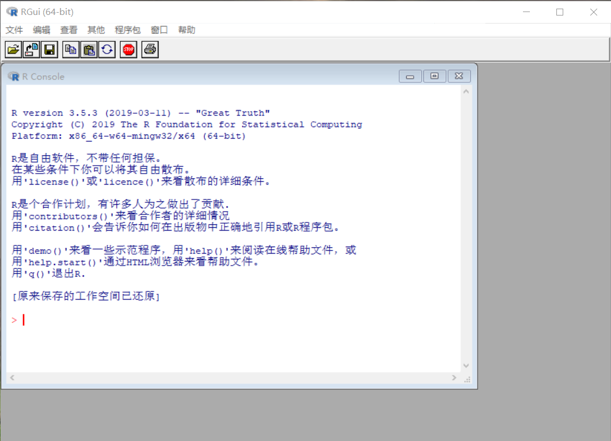
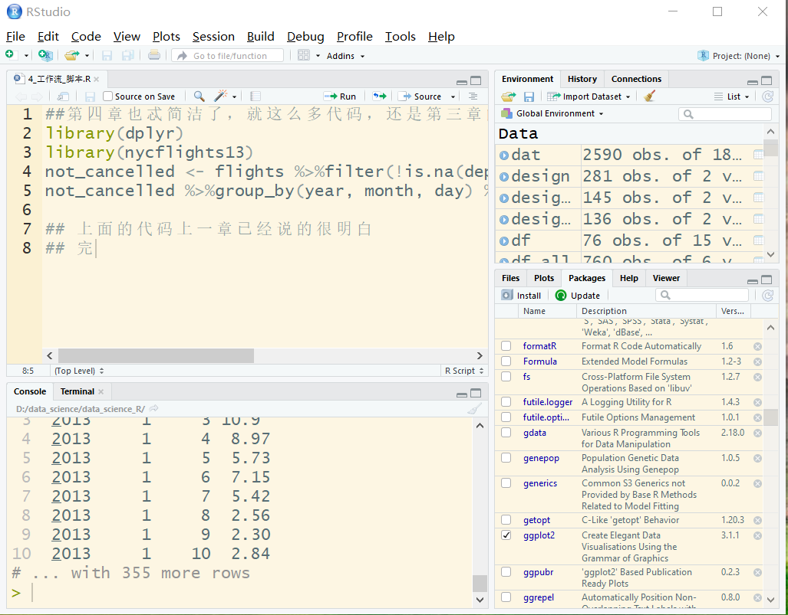
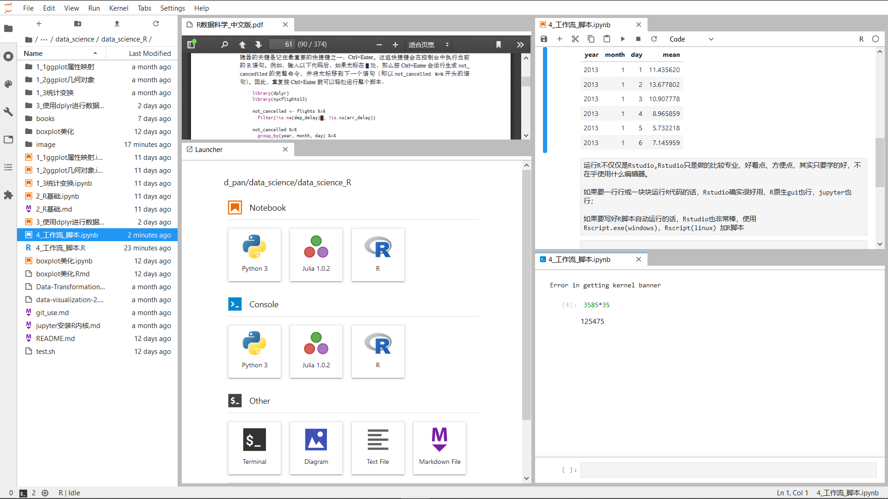

# 第四章 工作流：脚本

这一章书中说的很简单，重复了上一章的两行代码，以及建议我们使用R脚本和Rstudio。没了。

不过我打算添加一点点作为补充


```R
# 加载包
library(dplyr) 
library(nycflights13)
```

    
    Attaching package: ‘dplyr’
    
    The following objects are masked from ‘package:stats’:
    
        filter, lag
    
    The following objects are masked from ‘package:base’:
    
        intersect, setdiff, setequal, union
    


```R
# 运行代码
not_flights <- flights %>% filter(!is.na(dep_delay), !is.na(arr_delay))

not_flights %>% group_by(year, month, day) %>% summarise(mean = mean(dep_delay)) %>% head()
```


<table>
<thead><tr><th scope=col>year</th><th scope=col>month</th><th scope=col>day</th><th scope=col>mean</th></tr></thead>
<tbody>
	<tr><td>2013     </td><td>1        </td><td>1        </td><td>11.435620</td></tr>
	<tr><td>2013     </td><td>1        </td><td>2        </td><td>13.677802</td></tr>
	<tr><td>2013     </td><td>1        </td><td>3        </td><td>10.907778</td></tr>
	<tr><td>2013     </td><td>1        </td><td>4        </td><td> 8.965859</td></tr>
	<tr><td>2013     </td><td>1        </td><td>5        </td><td> 5.732218</td></tr>
	<tr><td>2013     </td><td>1        </td><td>6        </td><td> 7.145959</td></tr>
</tbody>
</table>


运行R不仅仅是Rstudio,Rstudio只是做的比较专业、好看点、方便点，其实只要学的好，不在乎使用什么编辑器。

如果要一行行或一块块运行R代码的话，Rstudio确实很好用，R原生gui也行，jupyter也行；

如果要写好R脚本自动运行的话，Rstudio也非常棒，使用Rscript.exe(windows)，Rscript(linux) 加R脚本

## 对比

Rgui中文，很简洁


Rstudio英文，很丰富


Jupyterlab非常之简洁，不过可以分屏，适合同时使用R和Python进行数据分析的


Rgui和Rstudio适合本地使用，jupyterlab适合本地和远程使用，Rstudioserver也非常适合远程使用，不过没有windows版。

根据个人喜好选择即可，不论选择哪一个，多记几个快捷键肯定是事倍功半。

这些工具还有很多差别的地方，就不一一介绍了，自己慢慢摸索。


```R

```
