# 探索性数据分析
本章是dplyr和ggplot2包运用的综合


```R
# 还是加载包
library(tidyverse)
```

    ─ Attaching packages ──────────────────── tidyverse 1.2.1 ─
    ✔ ggplot2 3.1.0     ✔ purrr   0.2.5
    ✔ tibble  1.4.2     ✔ dplyr   0.7.8
    ✔ tidyr   0.8.2     ✔ stringr 1.3.1
    ✔ readr   1.1.1     ✔ forcats 0.3.0
    ─ Conflicts ───────────────────── tidyverse_conflicts() ─
    ✖ dplyr::filter() masks stats::filter()
    ✖ dplyr::lag()    masks stats::lag()


## 对分布进行可视化表示

在这里要知道是分类变量还是连续变量


```R
# diamonds data
ggplot(diamonds) + geom_bar(aes(x = cut))
# 每一个绘图函数都有一个默认统计函数，这里是计数
```


```R
# 可以使用dplyr包中的count()函数手动计算
diamonds %>% count(cut) 
# 手动计算并画图
diamonds %>% count(cut) %>%  
ggplot() + geom_bar(aes(x = cut, y = n),stat = "identity")
# 需要调整stat参数，可以查看帮助文件看stat
```


<table>
<thead><tr><th scope=col>cut</th><th scope=col>n</th></tr></thead>
<tbody>
	<tr><td>Fair     </td><td> 1610    </td></tr>
	<tr><td>Good     </td><td> 4906    </td></tr>
	<tr><td>Very Good</td><td>12082    </td></tr>
	<tr><td>Premium  </td><td>13791    </td></tr>
	<tr><td>Ideal    </td><td>21551    </td></tr>
</tbody>
</table>


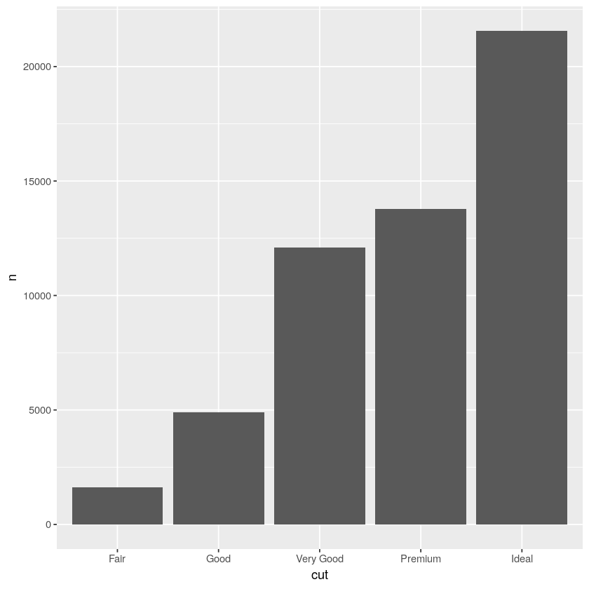


条形图适合分类变量，连续变量可以使用直方图


```R
ggplot(diamonds) + geom_histogram(aes(x = carat), binwidth = 0.5)
# binwidth即是分箱宽度
```


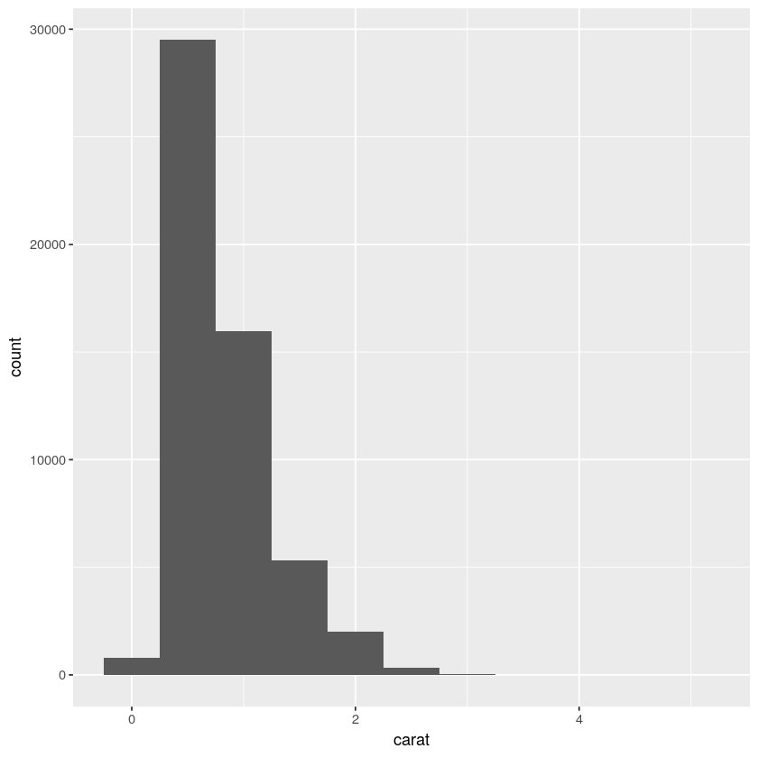


```R
# 可以通过dplyr的count()函数和ggplot2的cut_width()函数组合计算
(carat0.5 <- diamonds %>% count(cut_width(carat, 0.5)))
# 可以将数据小的剔除掉，用filter
c("carat","n") -> names(carat0.5)
ggplot(carat0.5) + 
geom_histogram(aes(x = carat, y = n), stat = "identity")
```


<table>
<thead><tr><th scope=col>cut_width(carat, 0.5)</th><th scope=col>n</th></tr></thead>
<tbody>
	<tr><td>[-0.25,0.25]</td><td>  785       </td></tr>
	<tr><td>(0.25,0.75] </td><td>29498       </td></tr>
	<tr><td>(0.75,1.25] </td><td>15977       </td></tr>
	<tr><td>(1.25,1.75] </td><td> 5313       </td></tr>
	<tr><td>(1.75,2.25] </td><td> 2002       </td></tr>
	<tr><td>(2.25,2.75] </td><td>  322       </td></tr>
	<tr><td>(2.75,3.25] </td><td>   32       </td></tr>
	<tr><td>(3.25,3.75] </td><td>    5       </td></tr>
	<tr><td>(3.75,4.25] </td><td>    4       </td></tr>
	<tr><td>(4.25,4.75] </td><td>    1       </td></tr>
	<tr><td>(4.75,5.25] </td><td>    1       </td></tr>
</tbody>
</table>


    Warning message:
    “Ignoring unknown parameters: binwidth, bins, pad”


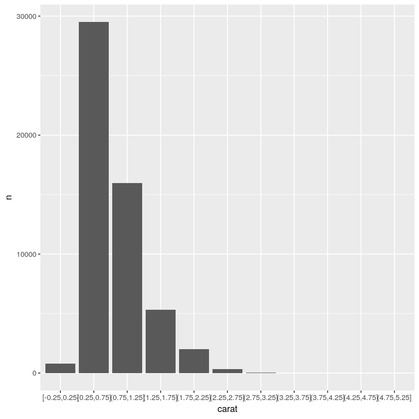


```R
# 接那是
# 如果只考虑重量小于3克拉的钻石
small <- diamonds %>% filter(carat < 3)
small %>% arrange(carat) %>% tail()
ggplot(small, aes(carat)) + geom_histogram(binwidth = 0.1) 
```


<table>
<thead><tr><th scope=col>carat</th><th scope=col>cut</th><th scope=col>color</th><th scope=col>clarity</th><th scope=col>depth</th><th scope=col>table</th><th scope=col>price</th><th scope=col>x</th><th scope=col>y</th><th scope=col>z</th></tr></thead>
<tbody>
	<tr><td>2.74     </td><td>Very Good</td><td>H        </td><td>SI2      </td><td>63.3     </td><td>58       </td><td>17184    </td><td>8.88     </td><td>8.84     </td><td>5.61     </td></tr>
	<tr><td>2.75     </td><td>Ideal    </td><td>D        </td><td>I1       </td><td>60.9     </td><td>57       </td><td>13156    </td><td>9.04     </td><td>8.98     </td><td>5.49     </td></tr>
	<tr><td>2.75     </td><td>Premium  </td><td>H        </td><td>SI2      </td><td>60.5     </td><td>61       </td><td>15415    </td><td>8.99     </td><td>8.97     </td><td>5.48     </td></tr>
	<tr><td>2.77     </td><td>Premium  </td><td>H        </td><td>I1       </td><td>62.6     </td><td>62       </td><td>10424    </td><td>8.93     </td><td>8.83     </td><td>5.56     </td></tr>
	<tr><td>2.80     </td><td>Premium  </td><td>I        </td><td>SI2      </td><td>61.1     </td><td>59       </td><td>15030    </td><td>9.03     </td><td>8.98     </td><td>5.50     </td></tr>
	<tr><td>2.80     </td><td>Good     </td><td>G        </td><td>SI2      </td><td>63.8     </td><td>58       </td><td>18788    </td><td>8.90     </td><td>8.85     </td><td>0.00     </td></tr>
</tbody>
</table>


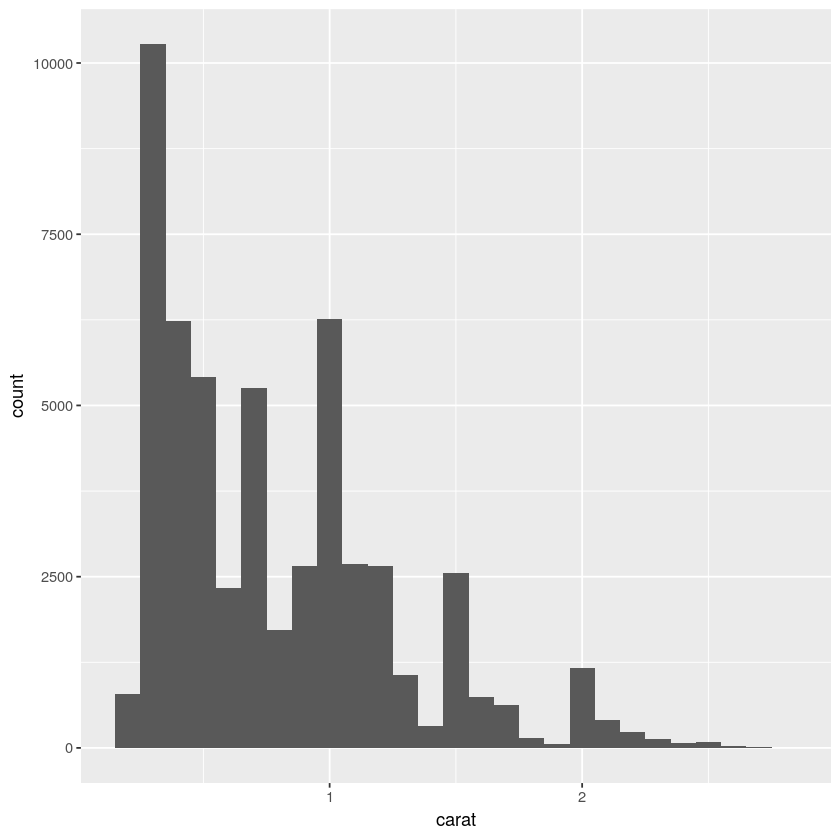


探索性数据分析｜67如果想要在同一张图上叠加多个直方图，那么我们建议你使用geom_freqploy()函数来代替geom_histogram()函数。geom_freqploy()可以执行和geom_histogram()同样的计算过程，但前者不使用条形来显示计数，而是使用折线。叠加的折线远比叠加的条形更容易理解


```R
ggplot(small, aes(x = carat, color = cut)) + 
geom_freqpoly(binwidth = 0.1)
```


```R
# 上图的黄色显示不好，我们调一调颜色
ggplot(small, aes(x = carat, color = cut)) + 
geom_freqpoly(binwidth = 0.1) + 
scale_color_manual(values = c("red","orange","green","blue","#AA99DD"))
# scale_color_manual和scale_fill_manual用于改颜色
```


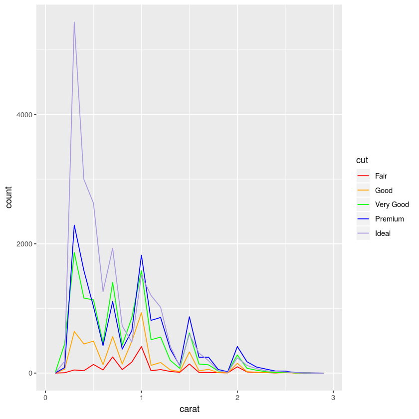


## 典型值


```R
# 看该图和作者提的问题
ggplot(data = small, aes(x = carat)) + geom_histogram(binwidth = 0.01)
# 多个单峰且右偏
```


```R
# 再看美国黄石国家公园喷泉的例子
ggplot(faithful, aes(eruptions)) + geom_histogram(binwidth = 0.25)
# 喷发时间聚集成了两组
```


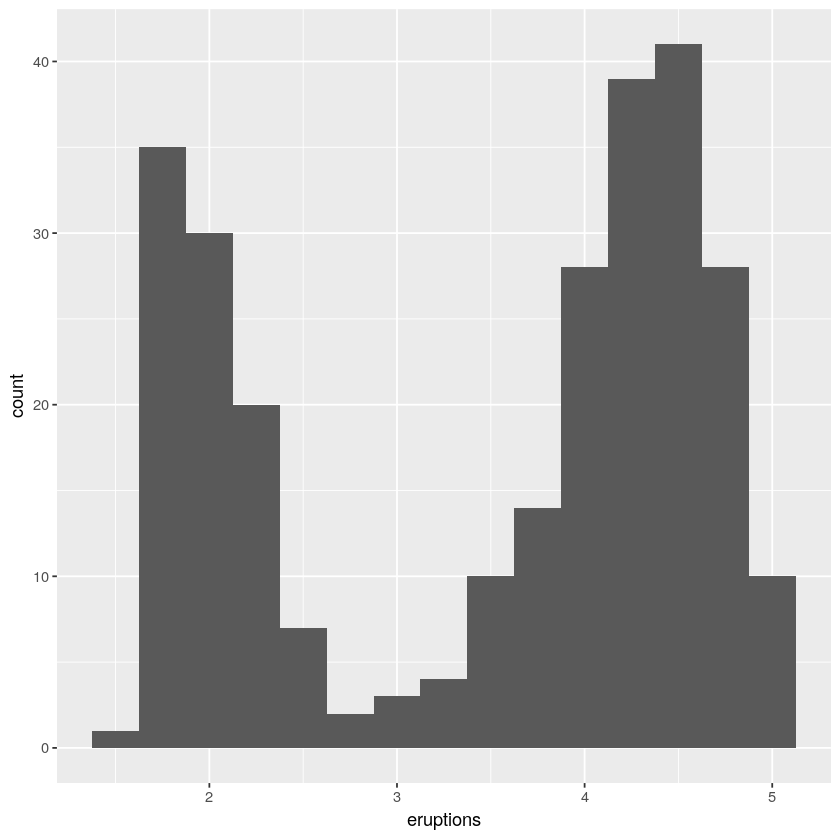


## 异常值

解释看书，这里主要展示代码


```R
# 还是看diamonds数据的例子
ggplot(diamonds) + geom_histogram(aes(x = y), binwidth = 0.5)
# 可以发现y的取值范围宽的出奇
```


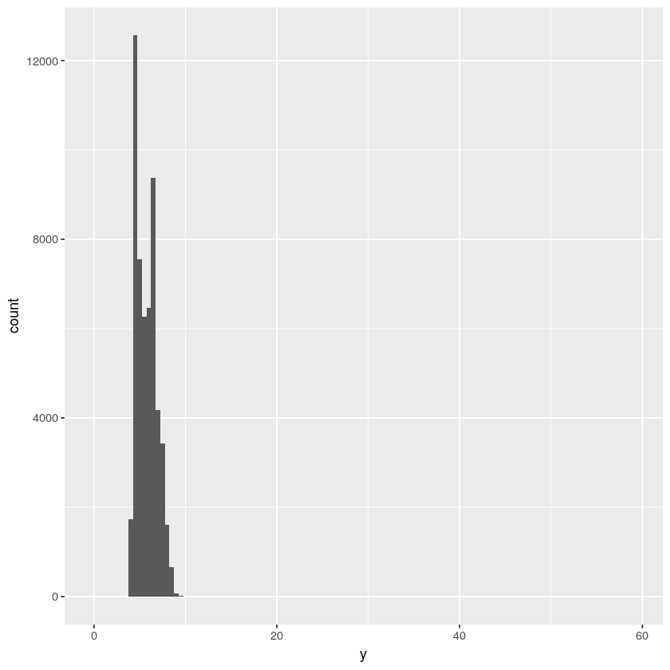


```R
# 我们拉一下坐标轴看看有什么
ggplot(diamonds) + geom_histogram(aes(x = y), binwidth = 0.5) + 
coord_cartesian(ylim = c(0, 50))# 放大y轴,看帮助
# 笛卡尔坐标系是最常见，最常见的坐标系类型。 
# 在坐标系上设置限制将缩放图（就像您正在用放大镜查看它一样），
# 并且不会像在比例尺上设置限制那样更改基础数据。
```


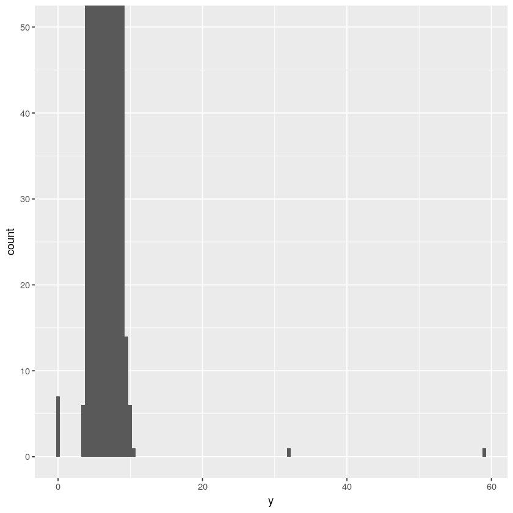


```R
# 可以看到有3个异常值
# 使用dplyr找出它们
diamonds %>% filter(y < 3|y > 20) %>% 
arrange(y) 
# 能立即看出来是异常值
```


<table>
<thead><tr><th scope=col>carat</th><th scope=col>cut</th><th scope=col>color</th><th scope=col>clarity</th><th scope=col>depth</th><th scope=col>table</th><th scope=col>price</th><th scope=col>x</th><th scope=col>y</th><th scope=col>z</th></tr></thead>
<tbody>
	<tr><td>1.00     </td><td>Very Good</td><td>H        </td><td>VS2      </td><td>63.3     </td><td>53       </td><td> 5139    </td><td>0.00     </td><td> 0.0     </td><td>0.00     </td></tr>
	<tr><td>1.14     </td><td>Fair     </td><td>G        </td><td>VS1      </td><td>57.5     </td><td>67       </td><td> 6381    </td><td>0.00     </td><td> 0.0     </td><td>0.00     </td></tr>
	<tr><td>1.56     </td><td>Ideal    </td><td>G        </td><td>VS2      </td><td>62.2     </td><td>54       </td><td>12800    </td><td>0.00     </td><td> 0.0     </td><td>0.00     </td></tr>
	<tr><td>1.20     </td><td>Premium  </td><td>D        </td><td>VVS1     </td><td>62.1     </td><td>59       </td><td>15686    </td><td>0.00     </td><td> 0.0     </td><td>0.00     </td></tr>
	<tr><td>2.25     </td><td>Premium  </td><td>H        </td><td>SI2      </td><td>62.8     </td><td>59       </td><td>18034    </td><td>0.00     </td><td> 0.0     </td><td>0.00     </td></tr>
	<tr><td>0.71     </td><td>Good     </td><td>F        </td><td>SI2      </td><td>64.1     </td><td>60       </td><td> 2130    </td><td>0.00     </td><td> 0.0     </td><td>0.00     </td></tr>
	<tr><td>0.71     </td><td>Good     </td><td>F        </td><td>SI2      </td><td>64.1     </td><td>60       </td><td> 2130    </td><td>0.00     </td><td> 0.0     </td><td>0.00     </td></tr>
	<tr><td>0.51     </td><td>Ideal    </td><td>E        </td><td>VS1      </td><td>61.8     </td><td>55       </td><td> 2075    </td><td>5.15     </td><td>31.8     </td><td>5.12     </td></tr>
	<tr><td>2.00     </td><td>Premium  </td><td>H        </td><td>SI2      </td><td>58.9     </td><td>57       </td><td>12210    </td><td>8.09     </td><td>58.9     </td><td>8.06     </td></tr>
</tbody>
</table>


```R
# 看一下练习题
# 先去掉异常值
diamonds2 <- diamonds %>% filter(y >3 & y <20 & z >0 & z <20)
ggplot(diamonds2) + 
geom_histogram(aes(x = x), binwidth = 0.5, fill = "red", alpha = 0.2) 
ggplot(diamonds2) + 
geom_histogram(aes(x = y), binwidth = 0.5, fill = "green", alpha = 0.2)
ggplot(diamonds2) + 
geom_histogram(aes(x = z), binwidth = 0.5, fill = "blue", alpha = 0.2)
# coord_cartesian(ylim = c(0,50))
# 这里可以优化代码，毕竟重复这么多
```


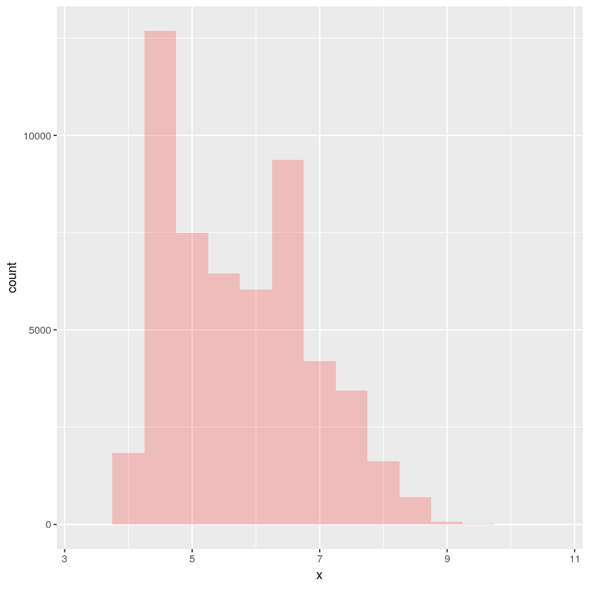


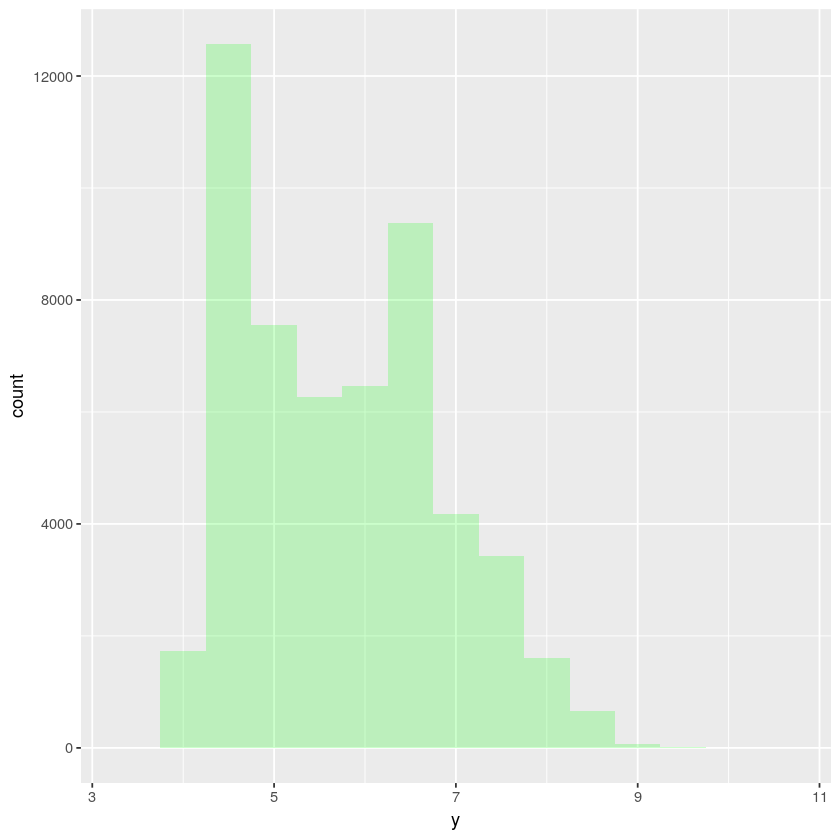


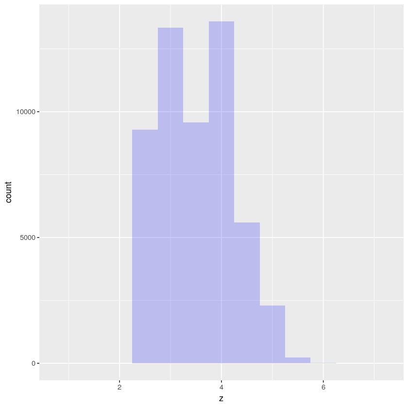


```R
# 再看价格分布
ggplot(diamonds) + 
geom_histogram(aes(x = price, fill = cut), binwidth = 100)
# 能够看出来明显的长尾
ggplot(diamonds) + 
geom_histogram(aes(x = price, fill = cut), binwidth = 1000)
```


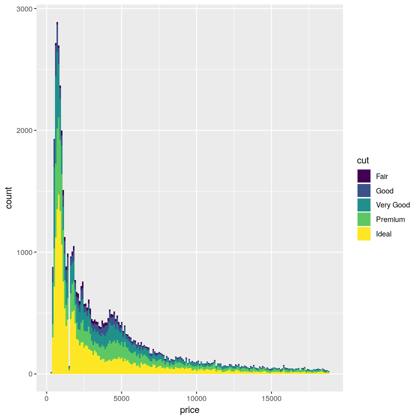


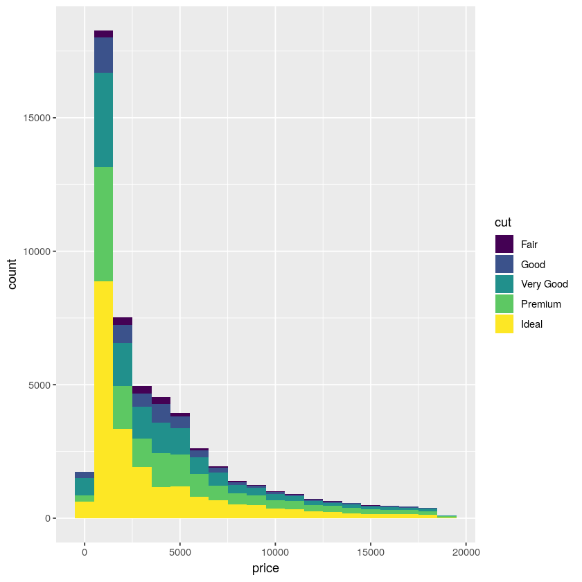


其他题自己看吧

## 缺失值

对于缺失值 有两种选择，一种是删掉，一种是用NA填充


```R
diamonds3 <- diamonds %>% mutate(y = ifelse(y < 3 | y > 20, NA, y))
# ifelse()函数看书
ggplot(diamonds3,aes(x = x, y = y)) + 
geom_point()
# 想要不显示警告信息可以设置na.rm = T
# geom_point(na.rm = T)
```

    Warning message:
    “Removed 9 rows containing missing values (geom_point).”


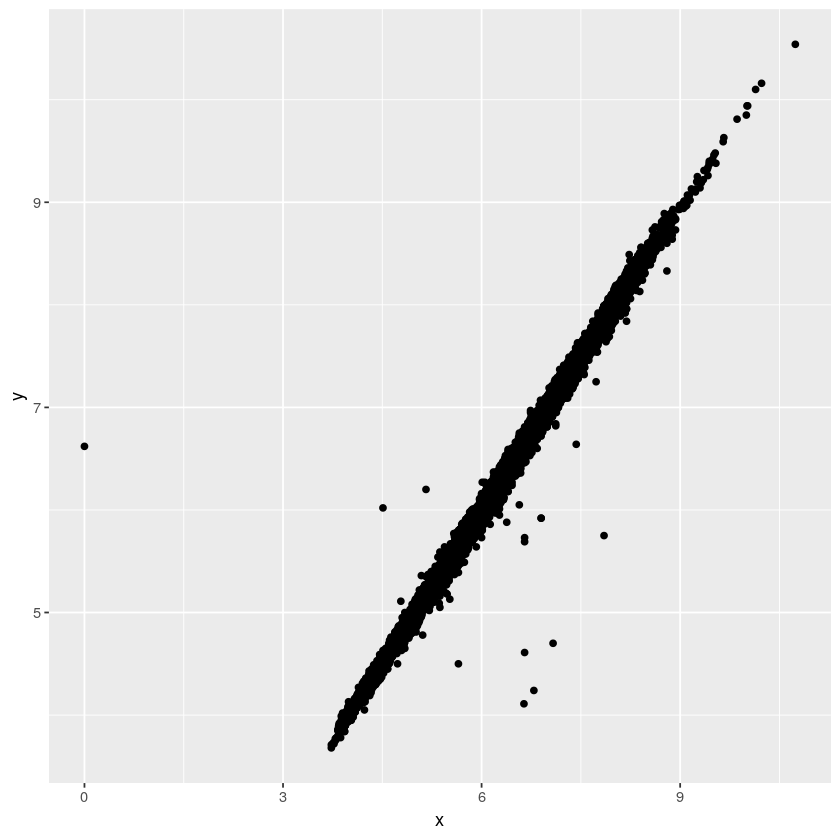


```R
# 再看一个例子
nycflights13::flights %>%
mutate(cancelled = is.na(dep_time),
      sched_hour = sched_dep_time %/% 100,
      sched_min = sched_dep_time %% 100,
      sched_dep_time = sched_hour + sched_min / 60)%>%
ggplot(aes(sched_dep_time)) + 
geom_freqpoly(aes(color = cancelled), binwidth = 1/4)
# 不解释，看书
```


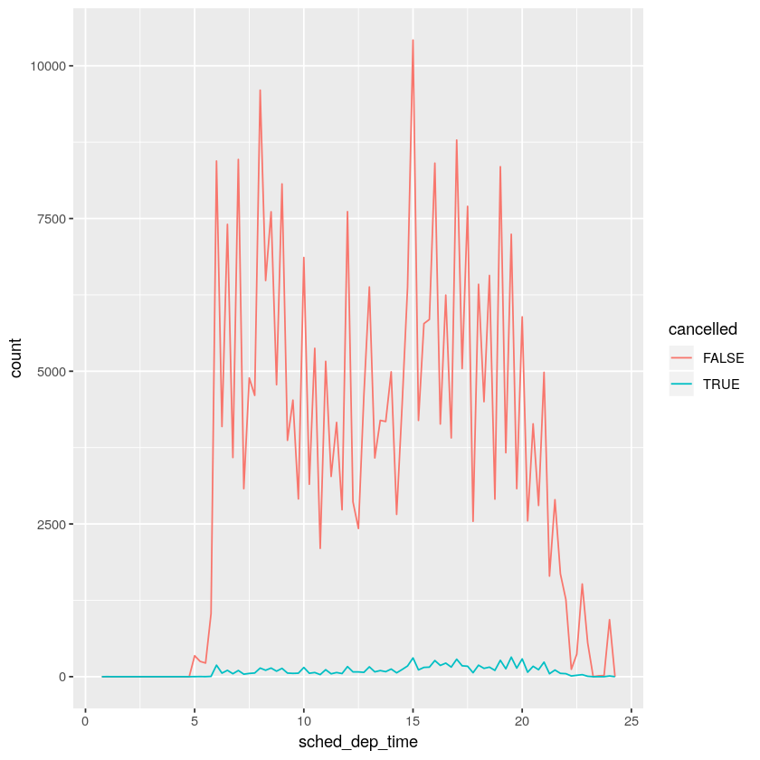


## 相关变动


```R
# 直接上图
# 价格随质量变化
ggplot(diamonds,aes(price)) + 
geom_freqpoly(aes(color = cut), binwidth = 500) + 
scale_color_manual(values = c("#FF0000","#FFAA00","#99AA00","#00FFBB","#00FF00"))
```


```R
ggplot(diamonds) + geom_bar(aes(cut))
```


```R
# 改变y轴显示内容为密度
ggplot(diamonds, aes(x = price, y = ..density..)) + 
geom_freqpoly(aes(color = cut), binwidth = 500)+
scale_color_manual(values = c("red","green","blue","orange","black"))
```


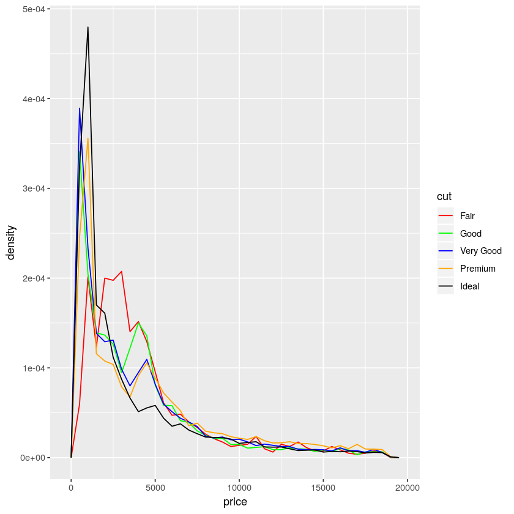


```R
# 箱线图
# 箱线图的特点看书
ggplot(diamonds) + geom_boxplot(aes(x = cut, y = price))
```


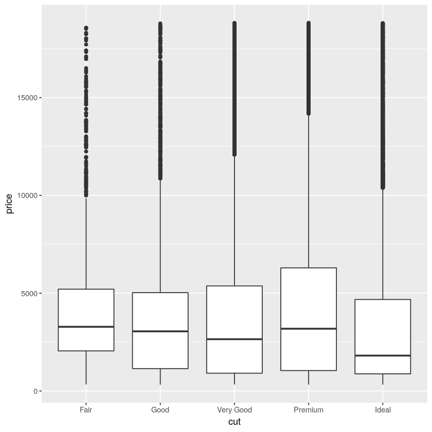


```R
# 使用reorder()函数对有序因子排序
# origin plot
ggplot(mpg,aes(x = class, y = hwy)) + geom_boxplot()
# reorder plot
ggplot(mpg) + 
geom_boxplot(aes(x = reorder(class, hwy, FUN = median),
                y = hwy))
```


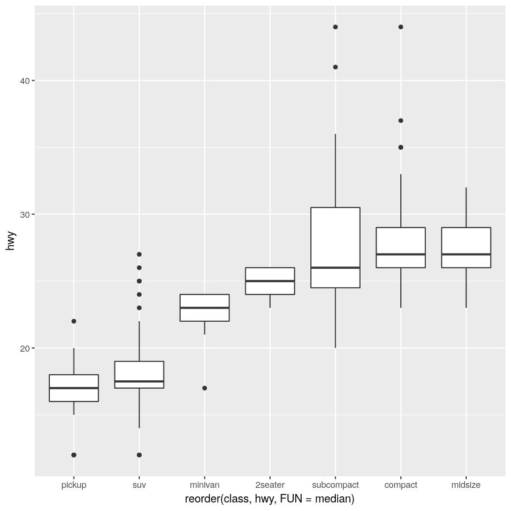


```R
# 如果变量名很长，可以旋转坐标轴
ggplot(mpg) + 
geom_boxplot(aes(x = reorder(class, hwy, FUN = median),
                y = hwy)) + 
coord_flip()
```


```R
## 两个分类变量可视化
ggplot(diamonds) + 
geom_count(aes(x = cut, y = color))
```


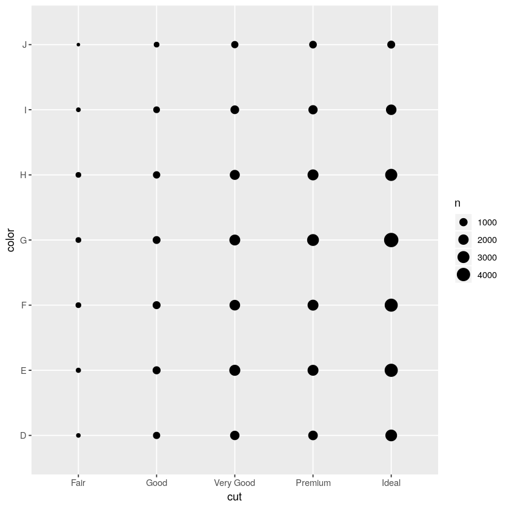


```R
# 手动计算
diamonds %>% count(color, cut)
```


<table>
<thead><tr><th scope=col>color</th><th scope=col>cut</th><th scope=col>n</th></tr></thead>
<tbody>
	<tr><td>D        </td><td>Fair     </td><td> 163     </td></tr>
	<tr><td>D        </td><td>Good     </td><td> 662     </td></tr>
	<tr><td>D        </td><td>Very Good</td><td>1513     </td></tr>
	<tr><td>D        </td><td>Premium  </td><td>1603     </td></tr>
	<tr><td>D        </td><td>Ideal    </td><td>2834     </td></tr>
	<tr><td>E        </td><td>Fair     </td><td> 224     </td></tr>
	<tr><td>E        </td><td>Good     </td><td> 933     </td></tr>
	<tr><td>E        </td><td>Very Good</td><td>2400     </td></tr>
	<tr><td>E        </td><td>Premium  </td><td>2337     </td></tr>
	<tr><td>E        </td><td>Ideal    </td><td>3903     </td></tr>
	<tr><td>F        </td><td>Fair     </td><td> 312     </td></tr>
	<tr><td>F        </td><td>Good     </td><td> 909     </td></tr>
	<tr><td>F        </td><td>Very Good</td><td>2164     </td></tr>
	<tr><td>F        </td><td>Premium  </td><td>2331     </td></tr>
	<tr><td>F        </td><td>Ideal    </td><td>3826     </td></tr>
	<tr><td>G        </td><td>Fair     </td><td> 314     </td></tr>
	<tr><td>G        </td><td>Good     </td><td> 871     </td></tr>
	<tr><td>G        </td><td>Very Good</td><td>2299     </td></tr>
	<tr><td>G        </td><td>Premium  </td><td>2924     </td></tr>
	<tr><td>G        </td><td>Ideal    </td><td>4884     </td></tr>
	<tr><td>H        </td><td>Fair     </td><td> 303     </td></tr>
	<tr><td>H        </td><td>Good     </td><td> 702     </td></tr>
	<tr><td>H        </td><td>Very Good</td><td>1824     </td></tr>
	<tr><td>H        </td><td>Premium  </td><td>2360     </td></tr>
	<tr><td>H        </td><td>Ideal    </td><td>3115     </td></tr>
	<tr><td>I        </td><td>Fair     </td><td> 175     </td></tr>
	<tr><td>I        </td><td>Good     </td><td> 522     </td></tr>
	<tr><td>I        </td><td>Very Good</td><td>1204     </td></tr>
	<tr><td>I        </td><td>Premium  </td><td>1428     </td></tr>
	<tr><td>I        </td><td>Ideal    </td><td>2093     </td></tr>
	<tr><td>J        </td><td>Fair     </td><td> 119     </td></tr>
	<tr><td>J        </td><td>Good     </td><td> 307     </td></tr>
	<tr><td>J        </td><td>Very Good</td><td> 678     </td></tr>
	<tr><td>J        </td><td>Premium  </td><td> 808     </td></tr>
	<tr><td>J        </td><td>Ideal    </td><td> 896     </td></tr>
</tbody>
</table>


```R
# 使用geom_tile()函数填充图形可视化
# 和点是同样的意思
diamonds %>% count(color, cut) %>% 
ggplot() + geom_tile(aes(x = color, y = cut,fill = n))
```


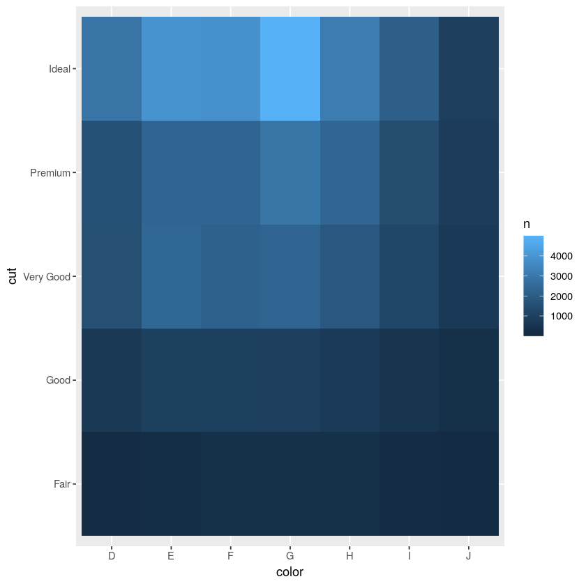


```R
# 上面是两个离散变量，下面看两个连续变量
ggplot(diamonds) + 
geom_point(aes(x = carat, y = price))
# 过绘制有些严重，添加透明度
ggplot(diamonds) + 
geom_point(aes(x = carat, y = price), alpha = 1/100) 
```


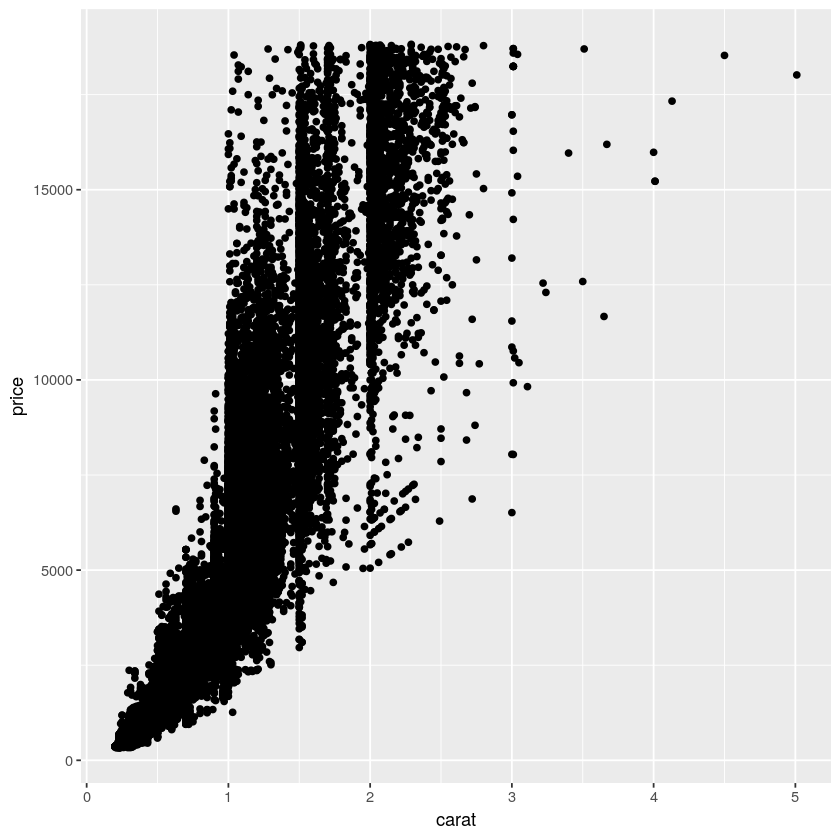


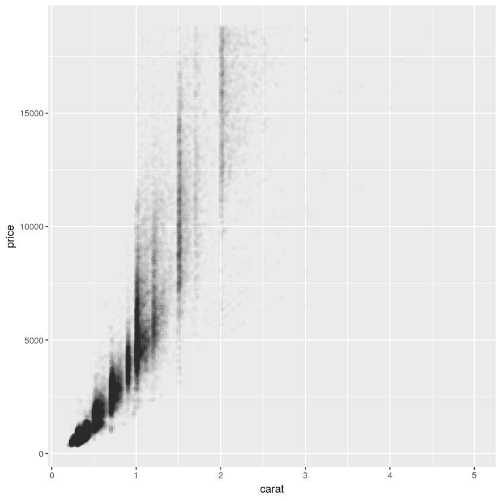


```R
# geom_bin2d()和geom_hex()函数在两个维度上进行分箱
ggplot(data = small) +
geom_bin2d(mapping =aes(x = carat, y = price)) 

ggplot(data = small) +
geom_hex(mapping =aes(x = carat, y = price))
```


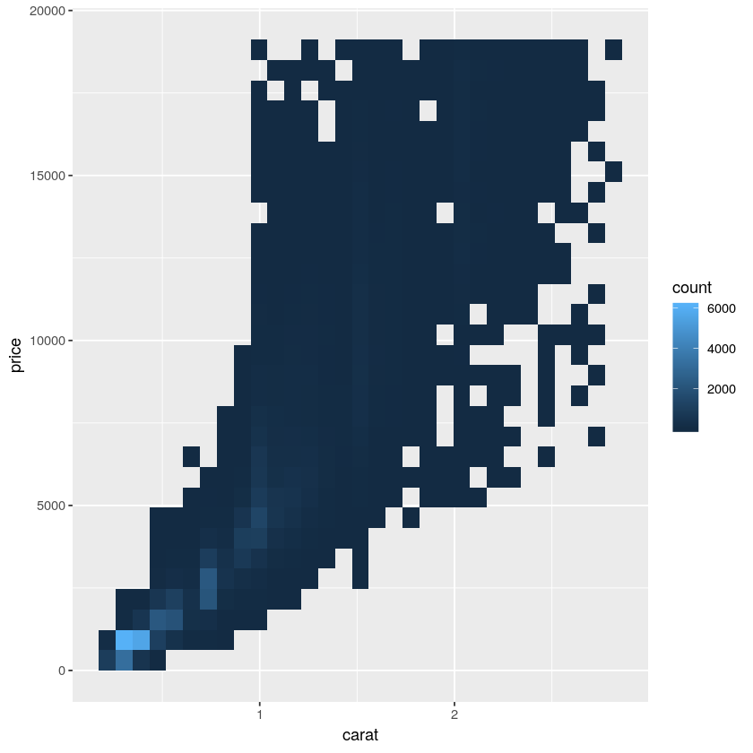


```R
ggplot(small, aes(carat, price)) +
geom_boxplot(aes(group = cut_width(carat, 0.1)))

ggplot(small, aes(carat, price)) +
geom_boxplot(aes(group = cut_width(carat, 0.1)), varwidth = T)
# 在这里不合适啊

ggplot(small, aes(carat, price)) +
geom_boxplot(aes(group = cut_number(carat, 20)))
# 按数量还可以哈
```


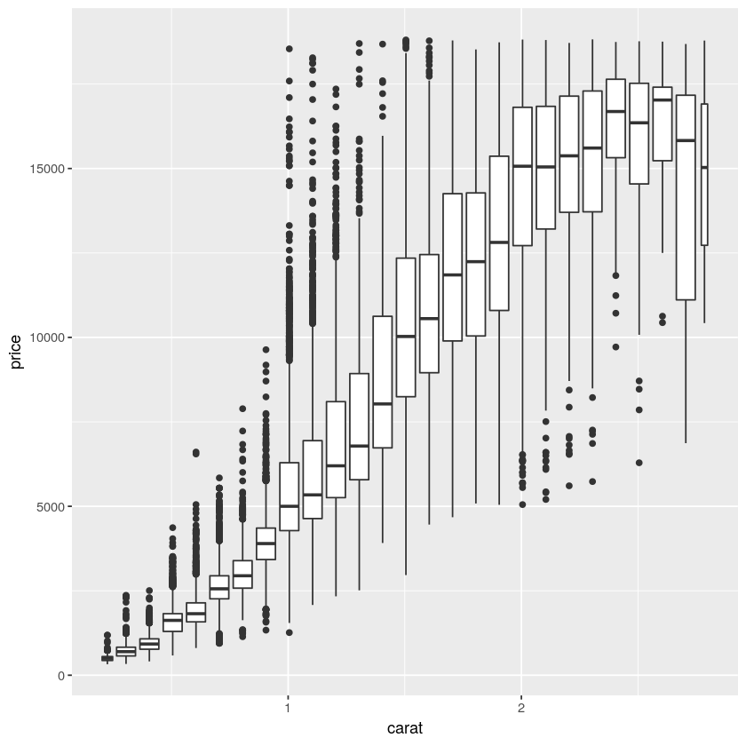


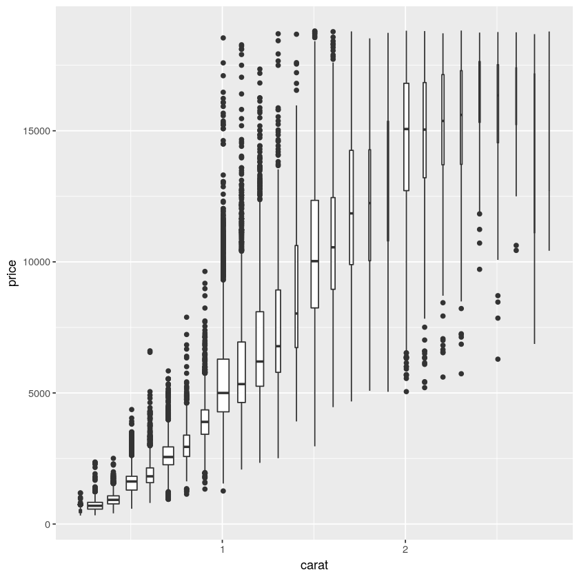


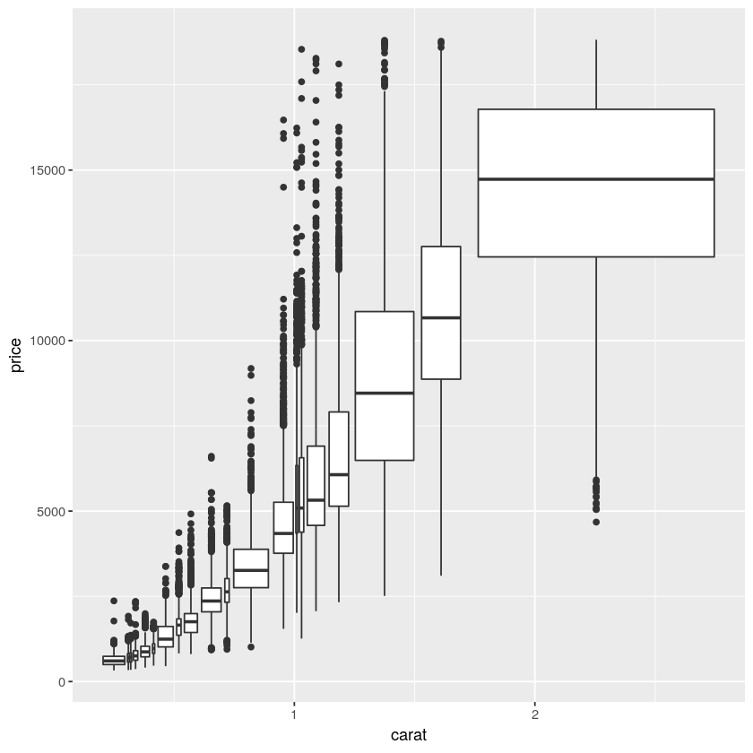


## 模式和模型


```R
ggplot(faithful) + 
geom_point(aes(eruptions, waiting))
# 看这个图就能明白为啥喷发时间聚类成了两类
```


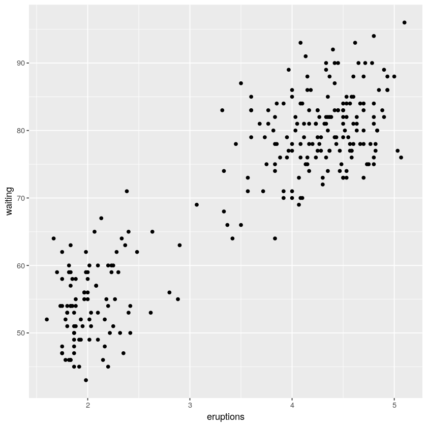


```R
library(modelr)

ggplot(diamonds,aes(x = log(carat), y = log(price))) + 
geom_point() + 
geom_smooth(method = "lm",na.rm = T)

(mod <- lm(log(price) ~ log(carat), data = diamonds))
# 求线性关系
diamonds5 <- diamonds %>% add_residuals(mod) %>% 
mutate(resid = exp(resid))
# add_residuals添加残差
# exp(1) = e(自然对数的底)
ggplot(diamonds5) + geom_point(aes(x = carat, y = resid))
```


    
    Call:
    lm(formula = log(price) ~ log(carat), data = diamonds)
    
    Coefficients:
    (Intercept)   log(carat)  
          8.449        1.676  


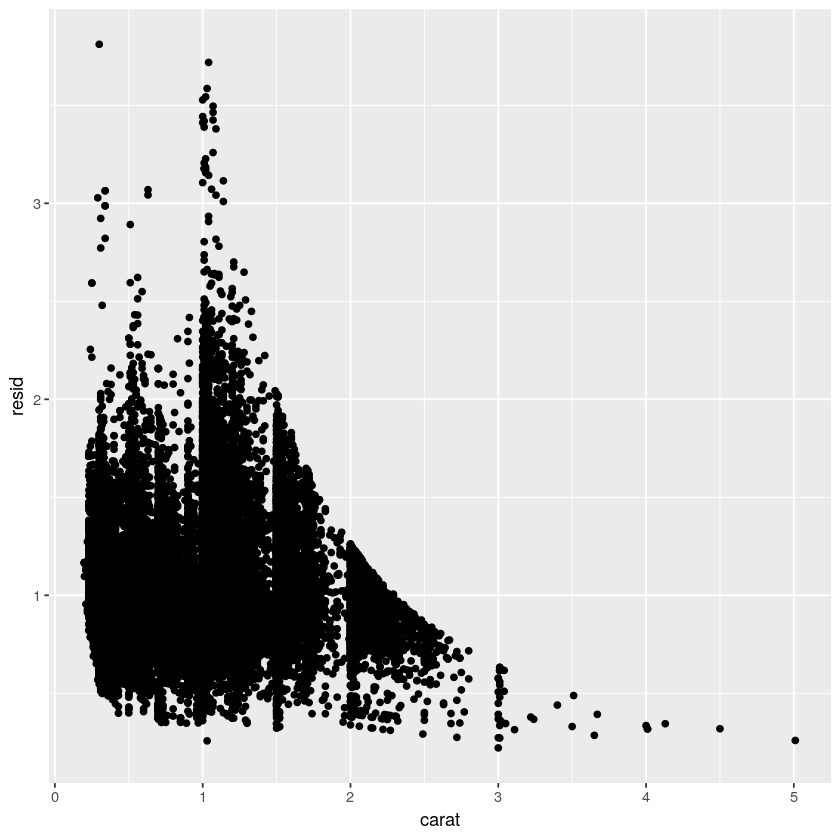


```R
ggplot(diamonds5) + geom_boxplot(aes(cut, resid))
```


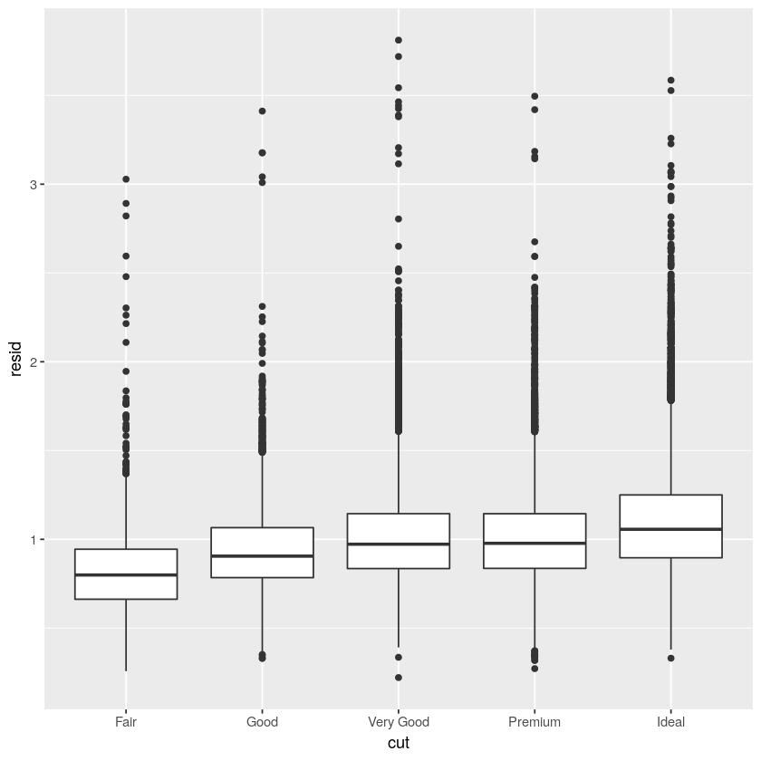


## ggplot2调用
书上的代码写的比较完整，我在写的时候有些参数已经省略了，没想到作者还专门在此提了提，以便于后面的代码更加简洁，刚开始还是不要省略的好，等到后面熟练了，那就要能省则省，这样简洁美观；管道真的是用了之后就离不开了，真的好用。

本章结束，更多资源在网上寻找。


```R

```
