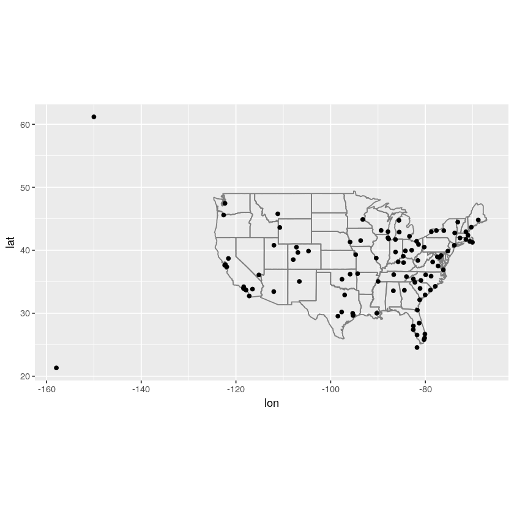

# 使用dplyr处理关系数据

此部分包括表之间的合并连接、筛选连接以及集合操作


```R
library(tidyverse)
library(nycflights13)
```

    ─ Attaching packages ──────────────────── tidyverse 1.2.1 ─
    ✔ ggplot2 3.2.0     ✔ purrr   0.3.2
    ✔ tibble  2.1.3     ✔ dplyr   0.8.3
    ✔ tidyr   0.8.3     ✔ stringr 1.4.0
    ✔ readr   1.3.1     ✔ forcats 0.4.0
    ─ Conflicts ───────────────────── tidyverse_conflicts() ─
    ✖ dplyr::filter() masks stats::filter()
    ✖ dplyr::lag()    masks stats::lag()


nycflights13包含与flights相关的4个表

flights前面已经用过；airlines航空公司的缩写码及全名；airports给出了每个机场的信息；planes给出了每架飞机的信息；weather给出的是天气状况


```R
# 5个表的内容如下
flights %>% head()
airlines %>% head()
airports %>% head()
planes %>% head()
weather %>% head()
```


<table>
<caption>A tibble: 6 × 19</caption>
<thead>
	<tr><th scope=col>year</th><th scope=col>month</th><th scope=col>day</th><th scope=col>dep_time</th><th scope=col>sched_dep_time</th><th scope=col>dep_delay</th><th scope=col>arr_time</th><th scope=col>sched_arr_time</th><th scope=col>arr_delay</th><th scope=col>carrier</th><th scope=col>flight</th><th scope=col>tailnum</th><th scope=col>origin</th><th scope=col>dest</th><th scope=col>air_time</th><th scope=col>distance</th><th scope=col>hour</th><th scope=col>minute</th><th scope=col>time_hour</th></tr>
	<tr><th scope=col>&lt;int&gt;</th><th scope=col>&lt;int&gt;</th><th scope=col>&lt;int&gt;</th><th scope=col>&lt;int&gt;</th><th scope=col>&lt;int&gt;</th><th scope=col>&lt;dbl&gt;</th><th scope=col>&lt;int&gt;</th><th scope=col>&lt;int&gt;</th><th scope=col>&lt;dbl&gt;</th><th scope=col>&lt;chr&gt;</th><th scope=col>&lt;int&gt;</th><th scope=col>&lt;chr&gt;</th><th scope=col>&lt;chr&gt;</th><th scope=col>&lt;chr&gt;</th><th scope=col>&lt;dbl&gt;</th><th scope=col>&lt;dbl&gt;</th><th scope=col>&lt;dbl&gt;</th><th scope=col>&lt;dbl&gt;</th><th scope=col>&lt;dttm&gt;</th></tr>
</thead>
<tbody>
	<tr><td>2013</td><td>1</td><td>1</td><td>517</td><td>515</td><td> 2</td><td> 830</td><td> 819</td><td> 11</td><td>UA</td><td>1545</td><td>N14228</td><td>EWR</td><td>IAH</td><td>227</td><td>1400</td><td>5</td><td>15</td><td>2013-01-01 05:00:00</td></tr>
	<tr><td>2013</td><td>1</td><td>1</td><td>533</td><td>529</td><td> 4</td><td> 850</td><td> 830</td><td> 20</td><td>UA</td><td>1714</td><td>N24211</td><td>LGA</td><td>IAH</td><td>227</td><td>1416</td><td>5</td><td>29</td><td>2013-01-01 05:00:00</td></tr>
	<tr><td>2013</td><td>1</td><td>1</td><td>542</td><td>540</td><td> 2</td><td> 923</td><td> 850</td><td> 33</td><td>AA</td><td>1141</td><td>N619AA</td><td>JFK</td><td>MIA</td><td>160</td><td>1089</td><td>5</td><td>40</td><td>2013-01-01 05:00:00</td></tr>
	<tr><td>2013</td><td>1</td><td>1</td><td>544</td><td>545</td><td>-1</td><td>1004</td><td>1022</td><td>-18</td><td>B6</td><td> 725</td><td>N804JB</td><td>JFK</td><td>BQN</td><td>183</td><td>1576</td><td>5</td><td>45</td><td>2013-01-01 05:00:00</td></tr>
	<tr><td>2013</td><td>1</td><td>1</td><td>554</td><td>600</td><td>-6</td><td> 812</td><td> 837</td><td>-25</td><td>DL</td><td> 461</td><td>N668DN</td><td>LGA</td><td>ATL</td><td>116</td><td> 762</td><td>6</td><td> 0</td><td>2013-01-01 06:00:00</td></tr>
	<tr><td>2013</td><td>1</td><td>1</td><td>554</td><td>558</td><td>-4</td><td> 740</td><td> 728</td><td> 12</td><td>UA</td><td>1696</td><td>N39463</td><td>EWR</td><td>ORD</td><td>150</td><td> 719</td><td>5</td><td>58</td><td>2013-01-01 05:00:00</td></tr>
</tbody>
</table>


<table>
<caption>A tibble: 6 × 2</caption>
<thead>
	<tr><th scope=col>carrier</th><th scope=col>name</th></tr>
	<tr><th scope=col>&lt;chr&gt;</th><th scope=col>&lt;chr&gt;</th></tr>
</thead>
<tbody>
	<tr><td>9E</td><td>Endeavor Air Inc.       </td></tr>
	<tr><td>AA</td><td>American Airlines Inc.  </td></tr>
	<tr><td>AS</td><td>Alaska Airlines Inc.    </td></tr>
	<tr><td>B6</td><td>JetBlue Airways         </td></tr>
	<tr><td>DL</td><td>Delta Air Lines Inc.    </td></tr>
	<tr><td>EV</td><td>ExpressJet Airlines Inc.</td></tr>
</tbody>
</table>


<table>
<caption>A tibble: 6 × 8</caption>
<thead>
	<tr><th scope=col>faa</th><th scope=col>name</th><th scope=col>lat</th><th scope=col>lon</th><th scope=col>alt</th><th scope=col>tz</th><th scope=col>dst</th><th scope=col>tzone</th></tr>
	<tr><th scope=col>&lt;chr&gt;</th><th scope=col>&lt;chr&gt;</th><th scope=col>&lt;dbl&gt;</th><th scope=col>&lt;dbl&gt;</th><th scope=col>&lt;dbl&gt;</th><th scope=col>&lt;dbl&gt;</th><th scope=col>&lt;chr&gt;</th><th scope=col>&lt;chr&gt;</th></tr>
</thead>
<tbody>
	<tr><td>04G</td><td>Lansdowne Airport             </td><td>41.13047</td><td>-80.61958</td><td>1044</td><td>-5</td><td>A</td><td>America/New_York</td></tr>
	<tr><td>06A</td><td>Moton Field Municipal Airport </td><td>32.46057</td><td>-85.68003</td><td> 264</td><td>-6</td><td>A</td><td>America/Chicago </td></tr>
	<tr><td>06C</td><td>Schaumburg Regional           </td><td>41.98934</td><td>-88.10124</td><td> 801</td><td>-6</td><td>A</td><td>America/Chicago </td></tr>
	<tr><td>06N</td><td>Randall Airport               </td><td>41.43191</td><td>-74.39156</td><td> 523</td><td>-5</td><td>A</td><td>America/New_York</td></tr>
	<tr><td>09J</td><td>Jekyll Island Airport         </td><td>31.07447</td><td>-81.42778</td><td>  11</td><td>-5</td><td>A</td><td>America/New_York</td></tr>
	<tr><td>0A9</td><td>Elizabethton Municipal Airport</td><td>36.37122</td><td>-82.17342</td><td>1593</td><td>-5</td><td>A</td><td>America/New_York</td></tr>
</tbody>
</table>


<table>
<caption>A tibble: 6 × 9</caption>
<thead>
	<tr><th scope=col>tailnum</th><th scope=col>year</th><th scope=col>type</th><th scope=col>manufacturer</th><th scope=col>model</th><th scope=col>engines</th><th scope=col>seats</th><th scope=col>speed</th><th scope=col>engine</th></tr>
	<tr><th scope=col>&lt;chr&gt;</th><th scope=col>&lt;int&gt;</th><th scope=col>&lt;chr&gt;</th><th scope=col>&lt;chr&gt;</th><th scope=col>&lt;chr&gt;</th><th scope=col>&lt;int&gt;</th><th scope=col>&lt;int&gt;</th><th scope=col>&lt;int&gt;</th><th scope=col>&lt;chr&gt;</th></tr>
</thead>
<tbody>
	<tr><td>N10156</td><td>2004</td><td>Fixed wing multi engine</td><td>EMBRAER         </td><td>EMB-145XR</td><td>2</td><td> 55</td><td>NA</td><td>Turbo-fan</td></tr>
	<tr><td>N102UW</td><td>1998</td><td>Fixed wing multi engine</td><td>AIRBUS INDUSTRIE</td><td>A320-214 </td><td>2</td><td>182</td><td>NA</td><td>Turbo-fan</td></tr>
	<tr><td>N103US</td><td>1999</td><td>Fixed wing multi engine</td><td>AIRBUS INDUSTRIE</td><td>A320-214 </td><td>2</td><td>182</td><td>NA</td><td>Turbo-fan</td></tr>
	<tr><td>N104UW</td><td>1999</td><td>Fixed wing multi engine</td><td>AIRBUS INDUSTRIE</td><td>A320-214 </td><td>2</td><td>182</td><td>NA</td><td>Turbo-fan</td></tr>
	<tr><td>N10575</td><td>2002</td><td>Fixed wing multi engine</td><td>EMBRAER         </td><td>EMB-145LR</td><td>2</td><td> 55</td><td>NA</td><td>Turbo-fan</td></tr>
	<tr><td>N105UW</td><td>1999</td><td>Fixed wing multi engine</td><td>AIRBUS INDUSTRIE</td><td>A320-214 </td><td>2</td><td>182</td><td>NA</td><td>Turbo-fan</td></tr>
</tbody>
</table>


<table>
<caption>A tibble: 6 × 15</caption>
<thead>
	<tr><th scope=col>origin</th><th scope=col>year</th><th scope=col>month</th><th scope=col>day</th><th scope=col>hour</th><th scope=col>temp</th><th scope=col>dewp</th><th scope=col>humid</th><th scope=col>wind_dir</th><th scope=col>wind_speed</th><th scope=col>wind_gust</th><th scope=col>precip</th><th scope=col>pressure</th><th scope=col>visib</th><th scope=col>time_hour</th></tr>
	<tr><th scope=col>&lt;chr&gt;</th><th scope=col>&lt;int&gt;</th><th scope=col>&lt;int&gt;</th><th scope=col>&lt;int&gt;</th><th scope=col>&lt;int&gt;</th><th scope=col>&lt;dbl&gt;</th><th scope=col>&lt;dbl&gt;</th><th scope=col>&lt;dbl&gt;</th><th scope=col>&lt;dbl&gt;</th><th scope=col>&lt;dbl&gt;</th><th scope=col>&lt;dbl&gt;</th><th scope=col>&lt;dbl&gt;</th><th scope=col>&lt;dbl&gt;</th><th scope=col>&lt;dbl&gt;</th><th scope=col>&lt;dttm&gt;</th></tr>
</thead>
<tbody>
	<tr><td>EWR</td><td>2013</td><td>1</td><td>1</td><td>1</td><td>39.02</td><td>26.06</td><td>59.37</td><td>270</td><td>10.35702</td><td>NA</td><td>0</td><td>1012.0</td><td>10</td><td>2013-01-01 01:00:00</td></tr>
	<tr><td>EWR</td><td>2013</td><td>1</td><td>1</td><td>2</td><td>39.02</td><td>26.96</td><td>61.63</td><td>250</td><td> 8.05546</td><td>NA</td><td>0</td><td>1012.3</td><td>10</td><td>2013-01-01 02:00:00</td></tr>
	<tr><td>EWR</td><td>2013</td><td>1</td><td>1</td><td>3</td><td>39.02</td><td>28.04</td><td>64.43</td><td>240</td><td>11.50780</td><td>NA</td><td>0</td><td>1012.5</td><td>10</td><td>2013-01-01 03:00:00</td></tr>
	<tr><td>EWR</td><td>2013</td><td>1</td><td>1</td><td>4</td><td>39.92</td><td>28.04</td><td>62.21</td><td>250</td><td>12.65858</td><td>NA</td><td>0</td><td>1012.2</td><td>10</td><td>2013-01-01 04:00:00</td></tr>
	<tr><td>EWR</td><td>2013</td><td>1</td><td>1</td><td>5</td><td>39.02</td><td>28.04</td><td>64.43</td><td>260</td><td>12.65858</td><td>NA</td><td>0</td><td>1011.9</td><td>10</td><td>2013-01-01 05:00:00</td></tr>
	<tr><td>EWR</td><td>2013</td><td>1</td><td>1</td><td>6</td><td>37.94</td><td>28.04</td><td>67.21</td><td>240</td><td>11.50780</td><td>NA</td><td>0</td><td>1012.4</td><td>10</td><td>2013-01-01 06:00:00</td></tr>
</tbody>
</table>


用于连接每对数据表的变量称为键

键分为主键和外键

主键：唯一标识其所在数据表中的观测。例如，planes$tailnum是一个主键，因为其可以唯一标识planes表中的每架飞机。

外键：唯一标识另一个数据表中的观测。例如，flights$tailnum是一个外键，因为其出现在flights表中，并可以将每次航班与唯一一架飞机匹配。

一个变量既可以是主键，也可以是外键


```R
# 识别是否是主键可以用count()验证
planes %>% count(tailnum) %>% filter(n > 1)

weather %>% count(year, month, day, hour, origin) %>% 
filter(n > 1)# 不是

flights %>% count(year, month, day, flight) %>% 
filter(n > 1) %>% head()

flights %>% count(year, month, day, tailnum) %>% 
filter(n > 1) %>% head()
```


<table>
<caption>A tibble: 0 × 2</caption>
<thead>
	<tr><th scope=col>tailnum</th><th scope=col>n</th></tr>
	<tr><th scope=col>&lt;chr&gt;</th><th scope=col>&lt;int&gt;</th></tr>
</thead>
<tbody>
</tbody>
</table>


<table>
<caption>A tibble: 3 × 6</caption>
<thead>
	<tr><th scope=col>year</th><th scope=col>month</th><th scope=col>day</th><th scope=col>hour</th><th scope=col>origin</th><th scope=col>n</th></tr>
	<tr><th scope=col>&lt;int&gt;</th><th scope=col>&lt;int&gt;</th><th scope=col>&lt;int&gt;</th><th scope=col>&lt;int&gt;</th><th scope=col>&lt;chr&gt;</th><th scope=col>&lt;int&gt;</th></tr>
</thead>
<tbody>
	<tr><td>2013</td><td>11</td><td>3</td><td>1</td><td>EWR</td><td>2</td></tr>
	<tr><td>2013</td><td>11</td><td>3</td><td>1</td><td>JFK</td><td>2</td></tr>
	<tr><td>2013</td><td>11</td><td>3</td><td>1</td><td>LGA</td><td>2</td></tr>
</tbody>
</table>


<table>
<caption>A tibble: 6 × 5</caption>
<thead>
	<tr><th scope=col>year</th><th scope=col>month</th><th scope=col>day</th><th scope=col>flight</th><th scope=col>n</th></tr>
	<tr><th scope=col>&lt;int&gt;</th><th scope=col>&lt;int&gt;</th><th scope=col>&lt;int&gt;</th><th scope=col>&lt;int&gt;</th><th scope=col>&lt;int&gt;</th></tr>
</thead>
<tbody>
	<tr><td>2013</td><td>1</td><td>1</td><td> 1</td><td>2</td></tr>
	<tr><td>2013</td><td>1</td><td>1</td><td> 3</td><td>2</td></tr>
	<tr><td>2013</td><td>1</td><td>1</td><td> 4</td><td>2</td></tr>
	<tr><td>2013</td><td>1</td><td>1</td><td>11</td><td>3</td></tr>
	<tr><td>2013</td><td>1</td><td>1</td><td>15</td><td>2</td></tr>
	<tr><td>2013</td><td>1</td><td>1</td><td>21</td><td>2</td></tr>
</tbody>
</table>


<table>
<caption>A tibble: 6 × 5</caption>
<thead>
	<tr><th scope=col>year</th><th scope=col>month</th><th scope=col>day</th><th scope=col>tailnum</th><th scope=col>n</th></tr>
	<tr><th scope=col>&lt;int&gt;</th><th scope=col>&lt;int&gt;</th><th scope=col>&lt;int&gt;</th><th scope=col>&lt;chr&gt;</th><th scope=col>&lt;int&gt;</th></tr>
</thead>
<tbody>
	<tr><td>2013</td><td>1</td><td>1</td><td>N0EGMQ</td><td>2</td></tr>
	<tr><td>2013</td><td>1</td><td>1</td><td>N11189</td><td>2</td></tr>
	<tr><td>2013</td><td>1</td><td>1</td><td>N11536</td><td>2</td></tr>
	<tr><td>2013</td><td>1</td><td>1</td><td>N11544</td><td>3</td></tr>
	<tr><td>2013</td><td>1</td><td>1</td><td>N11551</td><td>2</td></tr>
	<tr><td>2013</td><td>1</td><td>1</td><td>N12540</td><td>2</td></tr>
</tbody>
</table>


如果一张表没有主键，有时就需要使用mutate()函数和row_number()函数为表加上一个主键。这样一来，如果你完成了一些筛选工作，并想要使用原始数据检查的话，就可以更容易地匹配观测。这种主键称为代理键。


```R
flights %>% arrange(year, month, day, flight, tailnum, 
                  origin, dest) %>% head()
# filter(n > 1) %>% head()
```


<table>
<caption>A tibble: 6 × 19</caption>
<thead>
	<tr><th scope=col>year</th><th scope=col>month</th><th scope=col>day</th><th scope=col>dep_time</th><th scope=col>sched_dep_time</th><th scope=col>dep_delay</th><th scope=col>arr_time</th><th scope=col>sched_arr_time</th><th scope=col>arr_delay</th><th scope=col>carrier</th><th scope=col>flight</th><th scope=col>tailnum</th><th scope=col>origin</th><th scope=col>dest</th><th scope=col>air_time</th><th scope=col>distance</th><th scope=col>hour</th><th scope=col>minute</th><th scope=col>time_hour</th></tr>
	<tr><th scope=col>&lt;int&gt;</th><th scope=col>&lt;int&gt;</th><th scope=col>&lt;int&gt;</th><th scope=col>&lt;int&gt;</th><th scope=col>&lt;int&gt;</th><th scope=col>&lt;dbl&gt;</th><th scope=col>&lt;int&gt;</th><th scope=col>&lt;int&gt;</th><th scope=col>&lt;dbl&gt;</th><th scope=col>&lt;chr&gt;</th><th scope=col>&lt;int&gt;</th><th scope=col>&lt;chr&gt;</th><th scope=col>&lt;chr&gt;</th><th scope=col>&lt;chr&gt;</th><th scope=col>&lt;dbl&gt;</th><th scope=col>&lt;dbl&gt;</th><th scope=col>&lt;dbl&gt;</th><th scope=col>&lt;dbl&gt;</th><th scope=col>&lt;dttm&gt;</th></tr>
</thead>
<tbody>
	<tr><td>2013</td><td>1</td><td>1</td><td> 856</td><td> 900</td><td>-4</td><td>1226</td><td>1220</td><td>  6</td><td>AA</td><td>1</td><td>N324AA</td><td>JFK</td><td>LAX</td><td>358</td><td>2475</td><td> 9</td><td> 0</td><td>2013-01-01 09:00:00</td></tr>
	<tr><td>2013</td><td>1</td><td>1</td><td>1153</td><td>1123</td><td>30</td><td>1454</td><td>1425</td><td> 29</td><td>B6</td><td>1</td><td>N552JB</td><td>JFK</td><td>FLL</td><td>167</td><td>1069</td><td>11</td><td>23</td><td>2013-01-01 11:00:00</td></tr>
	<tr><td>2013</td><td>1</td><td>1</td><td>1155</td><td>1200</td><td>-5</td><td>1517</td><td>1510</td><td>  7</td><td>AA</td><td>3</td><td>N322AA</td><td>JFK</td><td>LAX</td><td>353</td><td>2475</td><td>12</td><td> 0</td><td>2013-01-01 12:00:00</td></tr>
	<tr><td>2013</td><td>1</td><td>1</td><td> 805</td><td> 800</td><td> 5</td><td>1118</td><td>1106</td><td> 12</td><td>B6</td><td>3</td><td>N570JB</td><td>JFK</td><td>FLL</td><td>165</td><td>1069</td><td> 8</td><td> 0</td><td>2013-01-01 08:00:00</td></tr>
	<tr><td>2013</td><td>1</td><td>1</td><td>1538</td><td>1540</td><td>-2</td><td>1827</td><td>1851</td><td>-24</td><td>DL</td><td>4</td><td>N372DA</td><td>JFK</td><td>MCO</td><td>133</td><td> 944</td><td>15</td><td>40</td><td>2013-01-01 15:00:00</td></tr>
	<tr><td>2013</td><td>1</td><td>1</td><td> 933</td><td> 937</td><td>-4</td><td>1057</td><td>1102</td><td> -5</td><td>B6</td><td>4</td><td>N503JB</td><td>JFK</td><td>BUF</td><td> 66</td><td> 301</td><td> 9</td><td>37</td><td>2013-01-01 09:00:00</td></tr>
</tbody>
</table>


```R
# 为flights添加代理键
flights %>%
  arrange(year, month, day, sched_dep_time, 
          carrier, flight) %>% 
mutate(flight_id = row_number()) %>% head()
# 这是我找的代理键
# row_number()函数是排秩的后面有两个例子
```


<table>
<caption>A tibble: 6 × 20</caption>
<thead>
	<tr><th scope=col>year</th><th scope=col>month</th><th scope=col>day</th><th scope=col>dep_time</th><th scope=col>sched_dep_time</th><th scope=col>dep_delay</th><th scope=col>arr_time</th><th scope=col>sched_arr_time</th><th scope=col>arr_delay</th><th scope=col>carrier</th><th scope=col>flight</th><th scope=col>tailnum</th><th scope=col>origin</th><th scope=col>dest</th><th scope=col>air_time</th><th scope=col>distance</th><th scope=col>hour</th><th scope=col>minute</th><th scope=col>time_hour</th><th scope=col>flight_id</th></tr>
	<tr><th scope=col>&lt;int&gt;</th><th scope=col>&lt;int&gt;</th><th scope=col>&lt;int&gt;</th><th scope=col>&lt;int&gt;</th><th scope=col>&lt;int&gt;</th><th scope=col>&lt;dbl&gt;</th><th scope=col>&lt;int&gt;</th><th scope=col>&lt;int&gt;</th><th scope=col>&lt;dbl&gt;</th><th scope=col>&lt;chr&gt;</th><th scope=col>&lt;int&gt;</th><th scope=col>&lt;chr&gt;</th><th scope=col>&lt;chr&gt;</th><th scope=col>&lt;chr&gt;</th><th scope=col>&lt;dbl&gt;</th><th scope=col>&lt;dbl&gt;</th><th scope=col>&lt;dbl&gt;</th><th scope=col>&lt;dbl&gt;</th><th scope=col>&lt;dttm&gt;</th><th scope=col>&lt;int&gt;</th></tr>
</thead>
<tbody>
	<tr><td>2013</td><td>1</td><td>1</td><td>517</td><td>515</td><td> 2</td><td> 830</td><td> 819</td><td> 11</td><td>UA</td><td>1545</td><td>N14228</td><td>EWR</td><td>IAH</td><td>227</td><td>1400</td><td>5</td><td>15</td><td>2013-01-01 05:00:00</td><td>1</td></tr>
	<tr><td>2013</td><td>1</td><td>1</td><td>533</td><td>529</td><td> 4</td><td> 850</td><td> 830</td><td> 20</td><td>UA</td><td>1714</td><td>N24211</td><td>LGA</td><td>IAH</td><td>227</td><td>1416</td><td>5</td><td>29</td><td>2013-01-01 05:00:00</td><td>2</td></tr>
	<tr><td>2013</td><td>1</td><td>1</td><td>542</td><td>540</td><td> 2</td><td> 923</td><td> 850</td><td> 33</td><td>AA</td><td>1141</td><td>N619AA</td><td>JFK</td><td>MIA</td><td>160</td><td>1089</td><td>5</td><td>40</td><td>2013-01-01 05:00:00</td><td>3</td></tr>
	<tr><td>2013</td><td>1</td><td>1</td><td>544</td><td>545</td><td>-1</td><td>1004</td><td>1022</td><td>-18</td><td>B6</td><td> 725</td><td>N804JB</td><td>JFK</td><td>BQN</td><td>183</td><td>1576</td><td>5</td><td>45</td><td>2013-01-01 05:00:00</td><td>4</td></tr>
	<tr><td>2013</td><td>1</td><td>1</td><td>554</td><td>558</td><td>-4</td><td> 740</td><td> 728</td><td> 12</td><td>UA</td><td>1696</td><td>N39463</td><td>EWR</td><td>ORD</td><td>150</td><td> 719</td><td>5</td><td>58</td><td>2013-01-01 05:00:00</td><td>5</td></tr>
	<tr><td>2013</td><td>1</td><td>1</td><td>559</td><td>559</td><td> 0</td><td> 702</td><td> 706</td><td> -4</td><td>B6</td><td>1806</td><td>N708JB</td><td>JFK</td><td>BOS</td><td> 44</td><td> 187</td><td>5</td><td>59</td><td>2013-01-01 05:00:00</td><td>6</td></tr>
</tbody>
</table>


```R
flights %>%
  arrange(year, month, day, sched_dep_time, carrier, flight) %>%
  mutate(flight_id = row_number()) %>%
  glimpse()

# 这是网上找的，glimpse()函数看着理解吧
```

    Observations: 336,776
    Variables: 20
    $ year           <int> 2013, 2013, 2013, 2013, 2013, 2013, 2013, 2013, 2013,…
    $ month          <int> 1, 1, 1, 1, 1, 1, 1, 1, 1, 1, 1, 1, 1, 1, 1, 1, 1, 1,…
    $ day            <int> 1, 1, 1, 1, 1, 1, 1, 1, 1, 1, 1, 1, 1, 1, 1, 1, 1, 1,…
    $ dep_time       <int> 517, 533, 542, 544, 554, 559, 558, 559, 558, 558, 557…
    $ sched_dep_time <int> 515, 529, 540, 545, 558, 559, 600, 600, 600, 600, 600…
    $ dep_delay      <dbl> 2, 4, 2, -1, -4, 0, -2, -1, -2, -2, -3, NA, 1, 0, -5,…
    $ arr_time       <int> 830, 850, 923, 1004, 740, 702, 753, 941, 849, 853, 83…
    $ sched_arr_time <int> 819, 830, 850, 1022, 728, 706, 745, 910, 851, 856, 84…
    $ arr_delay      <dbl> 11, 20, 33, -18, 12, -4, 8, 31, -2, -3, -8, NA, -6, -…
    $ carrier        <chr> "UA", "UA", "AA", "B6", "UA", "B6", "AA", "AA", "B6",…
    $ flight         <int> 1545, 1714, 1141, 725, 1696, 1806, 301, 707, 49, 71, …
    $ tailnum        <chr> "N14228", "N24211", "N619AA", "N804JB", "N39463", "N7…
    $ origin         <chr> "EWR", "LGA", "JFK", "JFK", "EWR", "JFK", "LGA", "LGA…
    $ dest           <chr> "IAH", "IAH", "MIA", "BQN", "ORD", "BOS", "ORD", "DFW…
    $ air_time       <dbl> 227, 227, 160, 183, 150, 44, 138, 257, 149, 158, 140,…
    $ distance       <dbl> 1400, 1416, 1089, 1576, 719, 187, 733, 1389, 1028, 10…
    $ hour           <dbl> 5, 5, 5, 5, 5, 5, 6, 6, 6, 6, 6, 6, 6, 6, 6, 6, 6, 6,…
    $ minute         <dbl> 15, 29, 40, 45, 58, 59, 0, 0, 0, 0, 0, 0, 0, 0, 0, 0,…
    $ time_hour      <dttm> 2013-01-01 05:00:00, 2013-01-01 05:00:00, 2013-01-01…
    $ flight_id      <int> 1, 2, 3, 4, 5, 6, 7, 8, 9, 10, 11, 12, 13, 14, 15, 16…


```R
# 例子
mutate(mtcars, row_number() == 1L) %>% head()

mtcars %>% filter(between(row_number(), 1, 10)) %>% head()
```


<table>
<caption>A data.frame: 6 × 12</caption>
<thead>
	<tr><th scope=col>mpg</th><th scope=col>cyl</th><th scope=col>disp</th><th scope=col>hp</th><th scope=col>drat</th><th scope=col>wt</th><th scope=col>qsec</th><th scope=col>vs</th><th scope=col>am</th><th scope=col>gear</th><th scope=col>carb</th><th scope=col>row_number() == 1L</th></tr>
	<tr><th scope=col>&lt;dbl&gt;</th><th scope=col>&lt;dbl&gt;</th><th scope=col>&lt;dbl&gt;</th><th scope=col>&lt;dbl&gt;</th><th scope=col>&lt;dbl&gt;</th><th scope=col>&lt;dbl&gt;</th><th scope=col>&lt;dbl&gt;</th><th scope=col>&lt;dbl&gt;</th><th scope=col>&lt;dbl&gt;</th><th scope=col>&lt;dbl&gt;</th><th scope=col>&lt;dbl&gt;</th><th scope=col>&lt;lgl&gt;</th></tr>
</thead>
<tbody>
	<tr><td>21.0</td><td>6</td><td>160</td><td>110</td><td>3.90</td><td>2.620</td><td>16.46</td><td>0</td><td>1</td><td>4</td><td>4</td><td> TRUE</td></tr>
	<tr><td>21.0</td><td>6</td><td>160</td><td>110</td><td>3.90</td><td>2.875</td><td>17.02</td><td>0</td><td>1</td><td>4</td><td>4</td><td>FALSE</td></tr>
	<tr><td>22.8</td><td>4</td><td>108</td><td> 93</td><td>3.85</td><td>2.320</td><td>18.61</td><td>1</td><td>1</td><td>4</td><td>1</td><td>FALSE</td></tr>
	<tr><td>21.4</td><td>6</td><td>258</td><td>110</td><td>3.08</td><td>3.215</td><td>19.44</td><td>1</td><td>0</td><td>3</td><td>1</td><td>FALSE</td></tr>
	<tr><td>18.7</td><td>8</td><td>360</td><td>175</td><td>3.15</td><td>3.440</td><td>17.02</td><td>0</td><td>0</td><td>3</td><td>2</td><td>FALSE</td></tr>
	<tr><td>18.1</td><td>6</td><td>225</td><td>105</td><td>2.76</td><td>3.460</td><td>20.22</td><td>1</td><td>0</td><td>3</td><td>1</td><td>FALSE</td></tr>
</tbody>
</table>


<table>
<caption>A data.frame: 6 × 11</caption>
<thead>
	<tr><th scope=col>mpg</th><th scope=col>cyl</th><th scope=col>disp</th><th scope=col>hp</th><th scope=col>drat</th><th scope=col>wt</th><th scope=col>qsec</th><th scope=col>vs</th><th scope=col>am</th><th scope=col>gear</th><th scope=col>carb</th></tr>
	<tr><th scope=col>&lt;dbl&gt;</th><th scope=col>&lt;dbl&gt;</th><th scope=col>&lt;dbl&gt;</th><th scope=col>&lt;dbl&gt;</th><th scope=col>&lt;dbl&gt;</th><th scope=col>&lt;dbl&gt;</th><th scope=col>&lt;dbl&gt;</th><th scope=col>&lt;dbl&gt;</th><th scope=col>&lt;dbl&gt;</th><th scope=col>&lt;dbl&gt;</th><th scope=col>&lt;dbl&gt;</th></tr>
</thead>
<tbody>
	<tr><td>21.0</td><td>6</td><td>160</td><td>110</td><td>3.90</td><td>2.620</td><td>16.46</td><td>0</td><td>1</td><td>4</td><td>4</td></tr>
	<tr><td>21.0</td><td>6</td><td>160</td><td>110</td><td>3.90</td><td>2.875</td><td>17.02</td><td>0</td><td>1</td><td>4</td><td>4</td></tr>
	<tr><td>22.8</td><td>4</td><td>108</td><td> 93</td><td>3.85</td><td>2.320</td><td>18.61</td><td>1</td><td>1</td><td>4</td><td>1</td></tr>
	<tr><td>21.4</td><td>6</td><td>258</td><td>110</td><td>3.08</td><td>3.215</td><td>19.44</td><td>1</td><td>0</td><td>3</td><td>1</td></tr>
	<tr><td>18.7</td><td>8</td><td>360</td><td>175</td><td>3.15</td><td>3.440</td><td>17.02</td><td>0</td><td>0</td><td>3</td><td>2</td></tr>
	<tr><td>18.1</td><td>6</td><td>225</td><td>105</td><td>2.76</td><td>3.460</td><td>20.22</td><td>1</td><td>0</td><td>3</td><td>1</td></tr>
</tbody>
</table>


```R
# 找以下数据集中的键
# 需要安装包
Lahman::Batting %>% head()
babynames::babynames %>% head()
nasaweather::atmos %>% head()
fueleconomy::vehicles %>% head()
ggplot2::diamonds %>% head()
# 其实就是先了解数据，通过count()和filter()筛选看是否大于1
```


<table>
<caption>A data.frame: 6 × 22</caption>
<thead>
	<tr><th scope=col>playerID</th><th scope=col>yearID</th><th scope=col>stint</th><th scope=col>teamID</th><th scope=col>lgID</th><th scope=col>G</th><th scope=col>AB</th><th scope=col>R</th><th scope=col>H</th><th scope=col>X2B</th><th scope=col>⋯</th><th scope=col>RBI</th><th scope=col>SB</th><th scope=col>CS</th><th scope=col>BB</th><th scope=col>SO</th><th scope=col>IBB</th><th scope=col>HBP</th><th scope=col>SH</th><th scope=col>SF</th><th scope=col>GIDP</th></tr>
	<tr><th scope=col>&lt;chr&gt;</th><th scope=col>&lt;int&gt;</th><th scope=col>&lt;int&gt;</th><th scope=col>&lt;fct&gt;</th><th scope=col>&lt;fct&gt;</th><th scope=col>&lt;int&gt;</th><th scope=col>&lt;int&gt;</th><th scope=col>&lt;int&gt;</th><th scope=col>&lt;int&gt;</th><th scope=col>&lt;int&gt;</th><th scope=col>⋯</th><th scope=col>&lt;int&gt;</th><th scope=col>&lt;int&gt;</th><th scope=col>&lt;int&gt;</th><th scope=col>&lt;int&gt;</th><th scope=col>&lt;int&gt;</th><th scope=col>&lt;int&gt;</th><th scope=col>&lt;int&gt;</th><th scope=col>&lt;int&gt;</th><th scope=col>&lt;int&gt;</th><th scope=col>&lt;int&gt;</th></tr>
</thead>
<tbody>
	<tr><td>abercda01</td><td>1871</td><td>1</td><td>TRO</td><td>NA</td><td> 1</td><td>  4</td><td> 0</td><td> 0</td><td> 0</td><td>⋯</td><td> 0</td><td>0</td><td>0</td><td>0</td><td>0</td><td>NA</td><td>NA</td><td>NA</td><td>NA</td><td>0</td></tr>
	<tr><td>addybo01 </td><td>1871</td><td>1</td><td>RC1</td><td>NA</td><td>25</td><td>118</td><td>30</td><td>32</td><td> 6</td><td>⋯</td><td>13</td><td>8</td><td>1</td><td>4</td><td>0</td><td>NA</td><td>NA</td><td>NA</td><td>NA</td><td>0</td></tr>
	<tr><td>allisar01</td><td>1871</td><td>1</td><td>CL1</td><td>NA</td><td>29</td><td>137</td><td>28</td><td>40</td><td> 4</td><td>⋯</td><td>19</td><td>3</td><td>1</td><td>2</td><td>5</td><td>NA</td><td>NA</td><td>NA</td><td>NA</td><td>1</td></tr>
	<tr><td>allisdo01</td><td>1871</td><td>1</td><td>WS3</td><td>NA</td><td>27</td><td>133</td><td>28</td><td>44</td><td>10</td><td>⋯</td><td>27</td><td>1</td><td>1</td><td>0</td><td>2</td><td>NA</td><td>NA</td><td>NA</td><td>NA</td><td>0</td></tr>
	<tr><td>ansonca01</td><td>1871</td><td>1</td><td>RC1</td><td>NA</td><td>25</td><td>120</td><td>29</td><td>39</td><td>11</td><td>⋯</td><td>16</td><td>6</td><td>2</td><td>2</td><td>1</td><td>NA</td><td>NA</td><td>NA</td><td>NA</td><td>0</td></tr>
	<tr><td>armstbo01</td><td>1871</td><td>1</td><td>FW1</td><td>NA</td><td>12</td><td> 49</td><td> 9</td><td>11</td><td> 2</td><td>⋯</td><td> 5</td><td>0</td><td>1</td><td>0</td><td>1</td><td>NA</td><td>NA</td><td>NA</td><td>NA</td><td>0</td></tr>
</tbody>
</table>


<table>
<caption>A tibble: 6 × 5</caption>
<thead>
	<tr><th scope=col>year</th><th scope=col>sex</th><th scope=col>name</th><th scope=col>n</th><th scope=col>prop</th></tr>
	<tr><th scope=col>&lt;dbl&gt;</th><th scope=col>&lt;chr&gt;</th><th scope=col>&lt;chr&gt;</th><th scope=col>&lt;int&gt;</th><th scope=col>&lt;dbl&gt;</th></tr>
</thead>
<tbody>
	<tr><td>1880</td><td>F</td><td>Mary     </td><td>7065</td><td>0.07238359</td></tr>
	<tr><td>1880</td><td>F</td><td>Anna     </td><td>2604</td><td>0.02667896</td></tr>
	<tr><td>1880</td><td>F</td><td>Emma     </td><td>2003</td><td>0.02052149</td></tr>
	<tr><td>1880</td><td>F</td><td>Elizabeth</td><td>1939</td><td>0.01986579</td></tr>
	<tr><td>1880</td><td>F</td><td>Minnie   </td><td>1746</td><td>0.01788843</td></tr>
	<tr><td>1880</td><td>F</td><td>Margaret </td><td>1578</td><td>0.01616720</td></tr>
</tbody>
</table>


<table>
<caption>A tibble: 6 × 11</caption>
<thead>
	<tr><th scope=col>lat</th><th scope=col>long</th><th scope=col>year</th><th scope=col>month</th><th scope=col>surftemp</th><th scope=col>temp</th><th scope=col>pressure</th><th scope=col>ozone</th><th scope=col>cloudlow</th><th scope=col>cloudmid</th><th scope=col>cloudhigh</th></tr>
	<tr><th scope=col>&lt;dbl&gt;</th><th scope=col>&lt;dbl&gt;</th><th scope=col>&lt;int&gt;</th><th scope=col>&lt;int&gt;</th><th scope=col>&lt;dbl&gt;</th><th scope=col>&lt;dbl&gt;</th><th scope=col>&lt;dbl&gt;</th><th scope=col>&lt;dbl&gt;</th><th scope=col>&lt;dbl&gt;</th><th scope=col>&lt;dbl&gt;</th><th scope=col>&lt;dbl&gt;</th></tr>
</thead>
<tbody>
	<tr><td>36.20000</td><td>-113.8</td><td>1995</td><td>1</td><td>272.7</td><td>272.1</td><td> 835</td><td>304</td><td> 7.5</td><td>34.5</td><td>26.0</td></tr>
	<tr><td>33.70435</td><td>-113.8</td><td>1995</td><td>1</td><td>279.5</td><td>282.2</td><td> 940</td><td>304</td><td>11.5</td><td>32.5</td><td>20.0</td></tr>
	<tr><td>31.20870</td><td>-113.8</td><td>1995</td><td>1</td><td>284.7</td><td>285.2</td><td> 960</td><td>298</td><td>16.5</td><td>26.0</td><td>16.0</td></tr>
	<tr><td>28.71304</td><td>-113.8</td><td>1995</td><td>1</td><td>289.3</td><td>290.7</td><td> 990</td><td>276</td><td>20.5</td><td>14.5</td><td>13.0</td></tr>
	<tr><td>26.21739</td><td>-113.8</td><td>1995</td><td>1</td><td>292.2</td><td>292.7</td><td>1000</td><td>274</td><td>26.0</td><td>10.5</td><td> 7.5</td></tr>
	<tr><td>23.72174</td><td>-113.8</td><td>1995</td><td>1</td><td>294.1</td><td>293.6</td><td>1000</td><td>264</td><td>30.0</td><td> 9.5</td><td> 8.0</td></tr>
</tbody>
</table>


<table>
<caption>A tibble: 6 × 12</caption>
<thead>
	<tr><th scope=col>id</th><th scope=col>make</th><th scope=col>model</th><th scope=col>year</th><th scope=col>class</th><th scope=col>trans</th><th scope=col>drive</th><th scope=col>cyl</th><th scope=col>displ</th><th scope=col>fuel</th><th scope=col>hwy</th><th scope=col>cty</th></tr>
	<tr><th scope=col>&lt;int&gt;</th><th scope=col>&lt;chr&gt;</th><th scope=col>&lt;chr&gt;</th><th scope=col>&lt;int&gt;</th><th scope=col>&lt;chr&gt;</th><th scope=col>&lt;chr&gt;</th><th scope=col>&lt;chr&gt;</th><th scope=col>&lt;int&gt;</th><th scope=col>&lt;dbl&gt;</th><th scope=col>&lt;chr&gt;</th><th scope=col>&lt;int&gt;</th><th scope=col>&lt;int&gt;</th></tr>
</thead>
<tbody>
	<tr><td>27550</td><td>AM General</td><td>DJ Po Vehicle 2WD  </td><td>1984</td><td>Special Purpose Vehicle 2WD</td><td>Automatic 3-spd</td><td>2-Wheel Drive   </td><td>4</td><td>2.5</td><td>Regular</td><td>17</td><td>18</td></tr>
	<tr><td>28426</td><td>AM General</td><td>DJ Po Vehicle 2WD  </td><td>1984</td><td>Special Purpose Vehicle 2WD</td><td>Automatic 3-spd</td><td>2-Wheel Drive   </td><td>4</td><td>2.5</td><td>Regular</td><td>17</td><td>18</td></tr>
	<tr><td>27549</td><td>AM General</td><td>FJ8c Post Office   </td><td>1984</td><td>Special Purpose Vehicle 2WD</td><td>Automatic 3-spd</td><td>2-Wheel Drive   </td><td>6</td><td>4.2</td><td>Regular</td><td>13</td><td>13</td></tr>
	<tr><td>28425</td><td>AM General</td><td>FJ8c Post Office   </td><td>1984</td><td>Special Purpose Vehicle 2WD</td><td>Automatic 3-spd</td><td>2-Wheel Drive   </td><td>6</td><td>4.2</td><td>Regular</td><td>13</td><td>13</td></tr>
	<tr><td> 1032</td><td>AM General</td><td>Post Office DJ5 2WD</td><td>1985</td><td>Special Purpose Vehicle 2WD</td><td>Automatic 3-spd</td><td>Rear-Wheel Drive</td><td>4</td><td>2.5</td><td>Regular</td><td>17</td><td>16</td></tr>
	<tr><td> 1033</td><td>AM General</td><td>Post Office DJ8 2WD</td><td>1985</td><td>Special Purpose Vehicle 2WD</td><td>Automatic 3-spd</td><td>Rear-Wheel Drive</td><td>6</td><td>4.2</td><td>Regular</td><td>13</td><td>13</td></tr>
</tbody>
</table>


<table>
<caption>A tibble: 6 × 10</caption>
<thead>
	<tr><th scope=col>carat</th><th scope=col>cut</th><th scope=col>color</th><th scope=col>clarity</th><th scope=col>depth</th><th scope=col>table</th><th scope=col>price</th><th scope=col>x</th><th scope=col>y</th><th scope=col>z</th></tr>
	<tr><th scope=col>&lt;dbl&gt;</th><th scope=col>&lt;ord&gt;</th><th scope=col>&lt;ord&gt;</th><th scope=col>&lt;ord&gt;</th><th scope=col>&lt;dbl&gt;</th><th scope=col>&lt;dbl&gt;</th><th scope=col>&lt;int&gt;</th><th scope=col>&lt;dbl&gt;</th><th scope=col>&lt;dbl&gt;</th><th scope=col>&lt;dbl&gt;</th></tr>
</thead>
<tbody>
	<tr><td>0.23</td><td>Ideal    </td><td>E</td><td>SI2 </td><td>61.5</td><td>55</td><td>326</td><td>3.95</td><td>3.98</td><td>2.43</td></tr>
	<tr><td>0.21</td><td>Premium  </td><td>E</td><td>SI1 </td><td>59.8</td><td>61</td><td>326</td><td>3.89</td><td>3.84</td><td>2.31</td></tr>
	<tr><td>0.23</td><td>Good     </td><td>E</td><td>VS1 </td><td>56.9</td><td>65</td><td>327</td><td>4.05</td><td>4.07</td><td>2.31</td></tr>
	<tr><td>0.29</td><td>Premium  </td><td>I</td><td>VS2 </td><td>62.4</td><td>58</td><td>334</td><td>4.20</td><td>4.23</td><td>2.63</td></tr>
	<tr><td>0.31</td><td>Good     </td><td>J</td><td>SI2 </td><td>63.3</td><td>58</td><td>335</td><td>4.34</td><td>4.35</td><td>2.75</td></tr>
	<tr><td>0.24</td><td>Very Good</td><td>J</td><td>VVS2</td><td>62.8</td><td>57</td><td>336</td><td>3.94</td><td>3.96</td><td>2.48</td></tr>
</tbody>
</table>


## 　合并连接

合并连接通过键的匹配将两个表的变量组合起来，和mutate()函数一样，连接函数会将变量添加在表的右侧


```R
# 从flights数据集中选择一部分
flights2 <- flights %>% select(year:day, hour, origin, dest, tailnum, carrier)
flights2 %>% head()
```


<table>
<caption>A tibble: 6 × 8</caption>
<thead>
	<tr><th scope=col>year</th><th scope=col>month</th><th scope=col>day</th><th scope=col>hour</th><th scope=col>origin</th><th scope=col>dest</th><th scope=col>tailnum</th><th scope=col>carrier</th></tr>
	<tr><th scope=col>&lt;int&gt;</th><th scope=col>&lt;int&gt;</th><th scope=col>&lt;int&gt;</th><th scope=col>&lt;dbl&gt;</th><th scope=col>&lt;chr&gt;</th><th scope=col>&lt;chr&gt;</th><th scope=col>&lt;chr&gt;</th><th scope=col>&lt;chr&gt;</th></tr>
</thead>
<tbody>
	<tr><td>2013</td><td>1</td><td>1</td><td>5</td><td>EWR</td><td>IAH</td><td>N14228</td><td>UA</td></tr>
	<tr><td>2013</td><td>1</td><td>1</td><td>5</td><td>LGA</td><td>IAH</td><td>N24211</td><td>UA</td></tr>
	<tr><td>2013</td><td>1</td><td>1</td><td>5</td><td>JFK</td><td>MIA</td><td>N619AA</td><td>AA</td></tr>
	<tr><td>2013</td><td>1</td><td>1</td><td>5</td><td>JFK</td><td>BQN</td><td>N804JB</td><td>B6</td></tr>
	<tr><td>2013</td><td>1</td><td>1</td><td>6</td><td>LGA</td><td>ATL</td><td>N668DN</td><td>DL</td></tr>
	<tr><td>2013</td><td>1</td><td>1</td><td>5</td><td>EWR</td><td>ORD</td><td>N39463</td><td>UA</td></tr>
</tbody>
</table>


```R
# 将airlines数据加入到flights2中
flights2 %>% select(-origin,  -dest, -hour) %>% 
left_join(airlines, by = "carrier") %>% head()
# "-"在这里是去掉这些变量的意思
# 让我们选择几个变量连接
flights2 %>% select(year, month, day, dest, carrier) %>%
left_join(airlines, by = "carrier") %>% head()
# 还是要对前面学过的了解
```


<table>
<caption>A tibble: 6 × 6</caption>
<thead>
	<tr><th scope=col>year</th><th scope=col>month</th><th scope=col>day</th><th scope=col>tailnum</th><th scope=col>carrier</th><th scope=col>name</th></tr>
	<tr><th scope=col>&lt;int&gt;</th><th scope=col>&lt;int&gt;</th><th scope=col>&lt;int&gt;</th><th scope=col>&lt;chr&gt;</th><th scope=col>&lt;chr&gt;</th><th scope=col>&lt;chr&gt;</th></tr>
</thead>
<tbody>
	<tr><td>2013</td><td>1</td><td>1</td><td>N14228</td><td>UA</td><td>United Air Lines Inc. </td></tr>
	<tr><td>2013</td><td>1</td><td>1</td><td>N24211</td><td>UA</td><td>United Air Lines Inc. </td></tr>
	<tr><td>2013</td><td>1</td><td>1</td><td>N619AA</td><td>AA</td><td>American Airlines Inc.</td></tr>
	<tr><td>2013</td><td>1</td><td>1</td><td>N804JB</td><td>B6</td><td>JetBlue Airways       </td></tr>
	<tr><td>2013</td><td>1</td><td>1</td><td>N668DN</td><td>DL</td><td>Delta Air Lines Inc.  </td></tr>
	<tr><td>2013</td><td>1</td><td>1</td><td>N39463</td><td>UA</td><td>United Air Lines Inc. </td></tr>
</tbody>
</table>


<table>
<caption>A tibble: 6 × 6</caption>
<thead>
	<tr><th scope=col>year</th><th scope=col>month</th><th scope=col>day</th><th scope=col>dest</th><th scope=col>carrier</th><th scope=col>name</th></tr>
	<tr><th scope=col>&lt;int&gt;</th><th scope=col>&lt;int&gt;</th><th scope=col>&lt;int&gt;</th><th scope=col>&lt;chr&gt;</th><th scope=col>&lt;chr&gt;</th><th scope=col>&lt;chr&gt;</th></tr>
</thead>
<tbody>
	<tr><td>2013</td><td>1</td><td>1</td><td>IAH</td><td>UA</td><td>United Air Lines Inc. </td></tr>
	<tr><td>2013</td><td>1</td><td>1</td><td>IAH</td><td>UA</td><td>United Air Lines Inc. </td></tr>
	<tr><td>2013</td><td>1</td><td>1</td><td>MIA</td><td>AA</td><td>American Airlines Inc.</td></tr>
	<tr><td>2013</td><td>1</td><td>1</td><td>BQN</td><td>B6</td><td>JetBlue Airways       </td></tr>
	<tr><td>2013</td><td>1</td><td>1</td><td>ATL</td><td>DL</td><td>Delta Air Lines Inc.  </td></tr>
	<tr><td>2013</td><td>1</td><td>1</td><td>ORD</td><td>UA</td><td>United Air Lines Inc. </td></tr>
</tbody>
</table>


```R
# 使用mutate()函数和R取子集的方法也可以达到同样的效果
flights2 %>% select(-origin, -dest) %>%
mutate(name = airlines$name[match(carrier, 
                                  airlines$carrier)]) %>% 
head()
```


<table>
<caption>A tibble: 6 × 7</caption>
<thead>
	<tr><th scope=col>year</th><th scope=col>month</th><th scope=col>day</th><th scope=col>hour</th><th scope=col>tailnum</th><th scope=col>carrier</th><th scope=col>name</th></tr>
	<tr><th scope=col>&lt;int&gt;</th><th scope=col>&lt;int&gt;</th><th scope=col>&lt;int&gt;</th><th scope=col>&lt;dbl&gt;</th><th scope=col>&lt;chr&gt;</th><th scope=col>&lt;chr&gt;</th><th scope=col>&lt;chr&gt;</th></tr>
</thead>
<tbody>
	<tr><td>2013</td><td>1</td><td>1</td><td>5</td><td>N14228</td><td>UA</td><td>United Air Lines Inc. </td></tr>
	<tr><td>2013</td><td>1</td><td>1</td><td>5</td><td>N24211</td><td>UA</td><td>United Air Lines Inc. </td></tr>
	<tr><td>2013</td><td>1</td><td>1</td><td>5</td><td>N619AA</td><td>AA</td><td>American Airlines Inc.</td></tr>
	<tr><td>2013</td><td>1</td><td>1</td><td>5</td><td>N804JB</td><td>B6</td><td>JetBlue Airways       </td></tr>
	<tr><td>2013</td><td>1</td><td>1</td><td>6</td><td>N668DN</td><td>DL</td><td>Delta Air Lines Inc.  </td></tr>
	<tr><td>2013</td><td>1</td><td>1</td><td>5</td><td>N39463</td><td>UA</td><td>United Air Lines Inc. </td></tr>
</tbody>
</table>


```R
# 如果对上面的操作不理解，看一看下面分解的操作
match(flights2$carrier, airlines$carrier) %>% head()
airlines$name[match(flights2$carrier, airlines$carrier)] %>% head()
airlines$name[c(12,12,2,4,5,12)]
# match()匹配返回行号，然后就是数据框取子集
```


<ol class=list-inline>
	<li>12</li>
	<li>12</li>
	<li>2</li>
	<li>4</li>
	<li>5</li>
	<li>12</li>
</ol>


<ol class=list-inline>
	<li>'United Air Lines Inc.'</li>
	<li>'United Air Lines Inc.'</li>
	<li>'American Airlines Inc.'</li>
	<li>'JetBlue Airways'</li>
	<li>'Delta Air Lines Inc.'</li>
	<li>'United Air Lines Inc.'</li>
</ol>


<ol class=list-inline>
	<li>'United Air Lines Inc.'</li>
	<li>'United Air Lines Inc.'</li>
	<li>'American Airlines Inc.'</li>
	<li>'JetBlue Airways'</li>
	<li>'Delta Air Lines Inc.'</li>
	<li>'United Air Lines Inc.'</li>
</ol>


```R
# 用例子来说明连接的原理
x <- tribble(
~key, ~val_x,
1,"x1",
2, "x2",
3, "x3")

y <- tribble(
~key, ~val_y,
1, "y1",
2, "y2",
4, "y3")
x
y

```


<table>
<caption>A tibble: 3 × 2</caption>
<thead>
	<tr><th scope=col>key</th><th scope=col>val_x</th></tr>
	<tr><th scope=col>&lt;dbl&gt;</th><th scope=col>&lt;chr&gt;</th></tr>
</thead>
<tbody>
	<tr><td>1</td><td>x1</td></tr>
	<tr><td>2</td><td>x2</td></tr>
	<tr><td>3</td><td>x3</td></tr>
</tbody>
</table>


<table>
<caption>A tibble: 3 × 2</caption>
<thead>
	<tr><th scope=col>key</th><th scope=col>val_y</th></tr>
	<tr><th scope=col>&lt;dbl&gt;</th><th scope=col>&lt;chr&gt;</th></tr>
</thead>
<tbody>
	<tr><td>1</td><td>y1</td></tr>
	<tr><td>2</td><td>y2</td></tr>
	<tr><td>4</td><td>y3</td></tr>
</tbody>
</table>


## 内连接

内连接是等值连接，没有匹配的行不会被包含


```R
# 看例子
x %>% inner_join(y, by = "key")
```


<table>
<caption>A tibble: 2 × 3</caption>
<thead>
	<tr><th scope=col>key</th><th scope=col>val_x</th><th scope=col>val_y</th></tr>
	<tr><th scope=col>&lt;dbl&gt;</th><th scope=col>&lt;chr&gt;</th><th scope=col>&lt;chr&gt;</th></tr>
</thead>
<tbody>
	<tr><td>1</td><td>x1</td><td>y1</td></tr>
	<tr><td>2</td><td>x2</td><td>y2</td></tr>
</tbody>
</table>


## 外连接

外连接则保留至少存在于一个表中的观测，有3种类型

左连接；右连接；全连接


```R
# 看例子
x %>% left_join(y, by = "key")

x %>% right_join(y, by = "key")

x %>% full_join(y, by = "key")
# 没有匹配到的会以NA填充
# 左连接最为常用
```


<table>
<caption>A tibble: 3 × 3</caption>
<thead>
	<tr><th scope=col>key</th><th scope=col>val_x</th><th scope=col>val_y</th></tr>
	<tr><th scope=col>&lt;dbl&gt;</th><th scope=col>&lt;chr&gt;</th><th scope=col>&lt;chr&gt;</th></tr>
</thead>
<tbody>
	<tr><td>1</td><td>x1</td><td>y1</td></tr>
	<tr><td>2</td><td>x2</td><td>y2</td></tr>
	<tr><td>3</td><td>x3</td><td>NA</td></tr>
</tbody>
</table>


<table>
<caption>A tibble: 3 × 3</caption>
<thead>
	<tr><th scope=col>key</th><th scope=col>val_x</th><th scope=col>val_y</th></tr>
	<tr><th scope=col>&lt;dbl&gt;</th><th scope=col>&lt;chr&gt;</th><th scope=col>&lt;chr&gt;</th></tr>
</thead>
<tbody>
	<tr><td>1</td><td>x1</td><td>y1</td></tr>
	<tr><td>2</td><td>x2</td><td>y2</td></tr>
	<tr><td>4</td><td>NA</td><td>y3</td></tr>
</tbody>
</table>


<table>
<caption>A tibble: 4 × 3</caption>
<thead>
	<tr><th scope=col>key</th><th scope=col>val_x</th><th scope=col>val_y</th></tr>
	<tr><th scope=col>&lt;dbl&gt;</th><th scope=col>&lt;chr&gt;</th><th scope=col>&lt;chr&gt;</th></tr>
</thead>
<tbody>
	<tr><td>1</td><td>x1</td><td>y1</td></tr>
	<tr><td>2</td><td>x2</td><td>y2</td></tr>
	<tr><td>3</td><td>x3</td><td>NA</td></tr>
	<tr><td>4</td><td>NA</td><td>y3</td></tr>
</tbody>
</table>


## 重复键

当键不唯一时会出现两种情况


```R
# 一对多
x <-tribble( 
    ~key, ~val_x, 
    1, "x1", 
    2, "x2", 
    2, "x3", 
    1, "x4") 
y <-tribble( 
    ~key, ~val_y, 
    1, "y1", 
    2, "y2") 
left_join(x, y, by = "key")
```


<table>
<caption>A tibble: 4 × 3</caption>
<thead>
	<tr><th scope=col>key</th><th scope=col>val_x</th><th scope=col>val_y</th></tr>
	<tr><th scope=col>&lt;dbl&gt;</th><th scope=col>&lt;chr&gt;</th><th scope=col>&lt;chr&gt;</th></tr>
</thead>
<tbody>
	<tr><td>1</td><td>x1</td><td>y1</td></tr>
	<tr><td>2</td><td>x2</td><td>y2</td></tr>
	<tr><td>2</td><td>x3</td><td>y2</td></tr>
	<tr><td>1</td><td>x4</td><td>y1</td></tr>
</tbody>
</table>


```R
# 多对多
x <-tribble( 
    ~key, ~val_x, 
    1, "x1", 
    2, "x2", 
    2, "x3", 
    3, "x4") 
y <-tribble( 
    ~key, ~val_y, 
    1, "y1", 
    2, "y2", 
    2, "y3", 
    3, "y4")
left_join(x, y, by = "key")
# 多对多会得到所有可能的组合(笛卡尔积)
# 多对多意味着两张表都有重复的键，往往意味着出现了错误
```


<table>
<caption>A tibble: 6 × 3</caption>
<thead>
	<tr><th scope=col>key</th><th scope=col>val_x</th><th scope=col>val_y</th></tr>
	<tr><th scope=col>&lt;dbl&gt;</th><th scope=col>&lt;chr&gt;</th><th scope=col>&lt;chr&gt;</th></tr>
</thead>
<tbody>
	<tr><td>1</td><td>x1</td><td>y1</td></tr>
	<tr><td>2</td><td>x2</td><td>y2</td></tr>
	<tr><td>2</td><td>x2</td><td>y3</td></tr>
	<tr><td>2</td><td>x3</td><td>y2</td></tr>
	<tr><td>2</td><td>x3</td><td>y3</td></tr>
	<tr><td>3</td><td>x4</td><td>y4</td></tr>
</tbody>
</table>


```R
# 定义键列
# 自然连接：使用所有共存的变量连接
flights2 %>% left_join(weather) %>% head()
```

    Joining, by = c("year", "month", "day", "hour", "origin")


<table>
<caption>A tibble: 6 × 18</caption>
<thead>
	<tr><th scope=col>year</th><th scope=col>month</th><th scope=col>day</th><th scope=col>hour</th><th scope=col>origin</th><th scope=col>dest</th><th scope=col>tailnum</th><th scope=col>carrier</th><th scope=col>temp</th><th scope=col>dewp</th><th scope=col>humid</th><th scope=col>wind_dir</th><th scope=col>wind_speed</th><th scope=col>wind_gust</th><th scope=col>precip</th><th scope=col>pressure</th><th scope=col>visib</th><th scope=col>time_hour</th></tr>
	<tr><th scope=col>&lt;int&gt;</th><th scope=col>&lt;int&gt;</th><th scope=col>&lt;int&gt;</th><th scope=col>&lt;dbl&gt;</th><th scope=col>&lt;chr&gt;</th><th scope=col>&lt;chr&gt;</th><th scope=col>&lt;chr&gt;</th><th scope=col>&lt;chr&gt;</th><th scope=col>&lt;dbl&gt;</th><th scope=col>&lt;dbl&gt;</th><th scope=col>&lt;dbl&gt;</th><th scope=col>&lt;dbl&gt;</th><th scope=col>&lt;dbl&gt;</th><th scope=col>&lt;dbl&gt;</th><th scope=col>&lt;dbl&gt;</th><th scope=col>&lt;dbl&gt;</th><th scope=col>&lt;dbl&gt;</th><th scope=col>&lt;dttm&gt;</th></tr>
</thead>
<tbody>
	<tr><td>2013</td><td>1</td><td>1</td><td>5</td><td>EWR</td><td>IAH</td><td>N14228</td><td>UA</td><td>39.02</td><td>28.04</td><td>64.43</td><td>260</td><td>12.65858</td><td>      NA</td><td>0</td><td>1011.9</td><td>10</td><td>2013-01-01 05:00:00</td></tr>
	<tr><td>2013</td><td>1</td><td>1</td><td>5</td><td>LGA</td><td>IAH</td><td>N24211</td><td>UA</td><td>39.92</td><td>24.98</td><td>54.81</td><td>250</td><td>14.96014</td><td>21.86482</td><td>0</td><td>1011.4</td><td>10</td><td>2013-01-01 05:00:00</td></tr>
	<tr><td>2013</td><td>1</td><td>1</td><td>5</td><td>JFK</td><td>MIA</td><td>N619AA</td><td>AA</td><td>39.02</td><td>26.96</td><td>61.63</td><td>260</td><td>14.96014</td><td>      NA</td><td>0</td><td>1012.1</td><td>10</td><td>2013-01-01 05:00:00</td></tr>
	<tr><td>2013</td><td>1</td><td>1</td><td>5</td><td>JFK</td><td>BQN</td><td>N804JB</td><td>B6</td><td>39.02</td><td>26.96</td><td>61.63</td><td>260</td><td>14.96014</td><td>      NA</td><td>0</td><td>1012.1</td><td>10</td><td>2013-01-01 05:00:00</td></tr>
	<tr><td>2013</td><td>1</td><td>1</td><td>6</td><td>LGA</td><td>ATL</td><td>N668DN</td><td>DL</td><td>39.92</td><td>24.98</td><td>54.81</td><td>260</td><td>16.11092</td><td>23.01560</td><td>0</td><td>1011.7</td><td>10</td><td>2013-01-01 06:00:00</td></tr>
	<tr><td>2013</td><td>1</td><td>1</td><td>5</td><td>EWR</td><td>ORD</td><td>N39463</td><td>UA</td><td>39.02</td><td>28.04</td><td>64.43</td><td>260</td><td>12.65858</td><td>      NA</td><td>0</td><td>1011.9</td><td>10</td><td>2013-01-01 05:00:00</td></tr>
</tbody>
</table>


```R
# by = "x" 则只使用选定的公共变量
flights2 %>% left_join(planes, by = "tailnum") %>% head()
```


<table>
<caption>A tibble: 6 × 16</caption>
<thead>
	<tr><th scope=col>year.x</th><th scope=col>month</th><th scope=col>day</th><th scope=col>hour</th><th scope=col>origin</th><th scope=col>dest</th><th scope=col>tailnum</th><th scope=col>carrier</th><th scope=col>year.y</th><th scope=col>type</th><th scope=col>manufacturer</th><th scope=col>model</th><th scope=col>engines</th><th scope=col>seats</th><th scope=col>speed</th><th scope=col>engine</th></tr>
	<tr><th scope=col>&lt;int&gt;</th><th scope=col>&lt;int&gt;</th><th scope=col>&lt;int&gt;</th><th scope=col>&lt;dbl&gt;</th><th scope=col>&lt;chr&gt;</th><th scope=col>&lt;chr&gt;</th><th scope=col>&lt;chr&gt;</th><th scope=col>&lt;chr&gt;</th><th scope=col>&lt;int&gt;</th><th scope=col>&lt;chr&gt;</th><th scope=col>&lt;chr&gt;</th><th scope=col>&lt;chr&gt;</th><th scope=col>&lt;int&gt;</th><th scope=col>&lt;int&gt;</th><th scope=col>&lt;int&gt;</th><th scope=col>&lt;chr&gt;</th></tr>
</thead>
<tbody>
	<tr><td>2013</td><td>1</td><td>1</td><td>5</td><td>EWR</td><td>IAH</td><td>N14228</td><td>UA</td><td>1999</td><td>Fixed wing multi engine</td><td>BOEING</td><td>737-824  </td><td>2</td><td>149</td><td>NA</td><td>Turbo-fan</td></tr>
	<tr><td>2013</td><td>1</td><td>1</td><td>5</td><td>LGA</td><td>IAH</td><td>N24211</td><td>UA</td><td>1998</td><td>Fixed wing multi engine</td><td>BOEING</td><td>737-824  </td><td>2</td><td>149</td><td>NA</td><td>Turbo-fan</td></tr>
	<tr><td>2013</td><td>1</td><td>1</td><td>5</td><td>JFK</td><td>MIA</td><td>N619AA</td><td>AA</td><td>1990</td><td>Fixed wing multi engine</td><td>BOEING</td><td>757-223  </td><td>2</td><td>178</td><td>NA</td><td>Turbo-fan</td></tr>
	<tr><td>2013</td><td>1</td><td>1</td><td>5</td><td>JFK</td><td>BQN</td><td>N804JB</td><td>B6</td><td>2012</td><td>Fixed wing multi engine</td><td>AIRBUS</td><td>A320-232 </td><td>2</td><td>200</td><td>NA</td><td>Turbo-fan</td></tr>
	<tr><td>2013</td><td>1</td><td>1</td><td>6</td><td>LGA</td><td>ATL</td><td>N668DN</td><td>DL</td><td>1991</td><td>Fixed wing multi engine</td><td>BOEING</td><td>757-232  </td><td>2</td><td>178</td><td>NA</td><td>Turbo-fan</td></tr>
	<tr><td>2013</td><td>1</td><td>1</td><td>5</td><td>EWR</td><td>ORD</td><td>N39463</td><td>UA</td><td>2012</td><td>Fixed wing multi engine</td><td>BOEING</td><td>737-924ER</td><td>2</td><td>191</td><td>NA</td><td>Turbo-fan</td></tr>
</tbody>
</table>


```R
# by = c("a"="b")这种方式会匹配x表中的a变量和y表中的b变量。
# 输出结果中使用的是x表中的变量。

flights2 %>% left_join(airports, by = c("dest" = "faa")) %>% 
head()

flights2 %>% left_join(airports, by = c("origin" = "faa")) %>%
head()
```


<table>
<caption>A tibble: 6 × 15</caption>
<thead>
	<tr><th scope=col>year</th><th scope=col>month</th><th scope=col>day</th><th scope=col>hour</th><th scope=col>origin</th><th scope=col>dest</th><th scope=col>tailnum</th><th scope=col>carrier</th><th scope=col>name</th><th scope=col>lat</th><th scope=col>lon</th><th scope=col>alt</th><th scope=col>tz</th><th scope=col>dst</th><th scope=col>tzone</th></tr>
	<tr><th scope=col>&lt;int&gt;</th><th scope=col>&lt;int&gt;</th><th scope=col>&lt;int&gt;</th><th scope=col>&lt;dbl&gt;</th><th scope=col>&lt;chr&gt;</th><th scope=col>&lt;chr&gt;</th><th scope=col>&lt;chr&gt;</th><th scope=col>&lt;chr&gt;</th><th scope=col>&lt;chr&gt;</th><th scope=col>&lt;dbl&gt;</th><th scope=col>&lt;dbl&gt;</th><th scope=col>&lt;dbl&gt;</th><th scope=col>&lt;dbl&gt;</th><th scope=col>&lt;chr&gt;</th><th scope=col>&lt;chr&gt;</th></tr>
</thead>
<tbody>
	<tr><td>2013</td><td>1</td><td>1</td><td>5</td><td>EWR</td><td>IAH</td><td>N14228</td><td>UA</td><td>George Bush Intercontinental   </td><td>29.98443</td><td>-95.34144</td><td>  97</td><td>-6</td><td>A </td><td>America/Chicago </td></tr>
	<tr><td>2013</td><td>1</td><td>1</td><td>5</td><td>LGA</td><td>IAH</td><td>N24211</td><td>UA</td><td>George Bush Intercontinental   </td><td>29.98443</td><td>-95.34144</td><td>  97</td><td>-6</td><td>A </td><td>America/Chicago </td></tr>
	<tr><td>2013</td><td>1</td><td>1</td><td>5</td><td>JFK</td><td>MIA</td><td>N619AA</td><td>AA</td><td>Miami Intl                     </td><td>25.79325</td><td>-80.29056</td><td>   8</td><td>-5</td><td>A </td><td>America/New_York</td></tr>
	<tr><td>2013</td><td>1</td><td>1</td><td>5</td><td>JFK</td><td>BQN</td><td>N804JB</td><td>B6</td><td>NA                             </td><td>      NA</td><td>       NA</td><td>  NA</td><td>NA</td><td>NA</td><td>NA              </td></tr>
	<tr><td>2013</td><td>1</td><td>1</td><td>6</td><td>LGA</td><td>ATL</td><td>N668DN</td><td>DL</td><td>Hartsfield Jackson Atlanta Intl</td><td>33.63672</td><td>-84.42807</td><td>1026</td><td>-5</td><td>A </td><td>America/New_York</td></tr>
	<tr><td>2013</td><td>1</td><td>1</td><td>5</td><td>EWR</td><td>ORD</td><td>N39463</td><td>UA</td><td>Chicago Ohare Intl             </td><td>41.97860</td><td>-87.90484</td><td> 668</td><td>-6</td><td>A </td><td>America/Chicago </td></tr>
</tbody>
</table>


<table>
<caption>A tibble: 6 × 15</caption>
<thead>
	<tr><th scope=col>year</th><th scope=col>month</th><th scope=col>day</th><th scope=col>hour</th><th scope=col>origin</th><th scope=col>dest</th><th scope=col>tailnum</th><th scope=col>carrier</th><th scope=col>name</th><th scope=col>lat</th><th scope=col>lon</th><th scope=col>alt</th><th scope=col>tz</th><th scope=col>dst</th><th scope=col>tzone</th></tr>
	<tr><th scope=col>&lt;int&gt;</th><th scope=col>&lt;int&gt;</th><th scope=col>&lt;int&gt;</th><th scope=col>&lt;dbl&gt;</th><th scope=col>&lt;chr&gt;</th><th scope=col>&lt;chr&gt;</th><th scope=col>&lt;chr&gt;</th><th scope=col>&lt;chr&gt;</th><th scope=col>&lt;chr&gt;</th><th scope=col>&lt;dbl&gt;</th><th scope=col>&lt;dbl&gt;</th><th scope=col>&lt;dbl&gt;</th><th scope=col>&lt;dbl&gt;</th><th scope=col>&lt;chr&gt;</th><th scope=col>&lt;chr&gt;</th></tr>
</thead>
<tbody>
	<tr><td>2013</td><td>1</td><td>1</td><td>5</td><td>EWR</td><td>IAH</td><td>N14228</td><td>UA</td><td>Newark Liberty Intl</td><td>40.69250</td><td>-74.16867</td><td>18</td><td>-5</td><td>A</td><td>America/New_York</td></tr>
	<tr><td>2013</td><td>1</td><td>1</td><td>5</td><td>LGA</td><td>IAH</td><td>N24211</td><td>UA</td><td>La Guardia         </td><td>40.77725</td><td>-73.87261</td><td>22</td><td>-5</td><td>A</td><td>America/New_York</td></tr>
	<tr><td>2013</td><td>1</td><td>1</td><td>5</td><td>JFK</td><td>MIA</td><td>N619AA</td><td>AA</td><td>John F Kennedy Intl</td><td>40.63975</td><td>-73.77893</td><td>13</td><td>-5</td><td>A</td><td>America/New_York</td></tr>
	<tr><td>2013</td><td>1</td><td>1</td><td>5</td><td>JFK</td><td>BQN</td><td>N804JB</td><td>B6</td><td>John F Kennedy Intl</td><td>40.63975</td><td>-73.77893</td><td>13</td><td>-5</td><td>A</td><td>America/New_York</td></tr>
	<tr><td>2013</td><td>1</td><td>1</td><td>6</td><td>LGA</td><td>ATL</td><td>N668DN</td><td>DL</td><td>La Guardia         </td><td>40.77725</td><td>-73.87261</td><td>22</td><td>-5</td><td>A</td><td>America/New_York</td></tr>
	<tr><td>2013</td><td>1</td><td>1</td><td>5</td><td>EWR</td><td>ORD</td><td>N39463</td><td>UA</td><td>Newark Liberty Intl</td><td>40.69250</td><td>-74.16867</td><td>18</td><td>-5</td><td>A</td><td>America/New_York</td></tr>
</tbody>
</table>


```R
airports %>% semi_join(flights, c("faa" = "dest"))%>%
ggplot(aes(lon, lat)) + 
borders("state") + 
geom_point() + 
coord_quickmap()
```





base::merge()函数可以实现所有4种合并连接操作。

dplyrmergeinner_join(x, y)-->merge(x, y)

left_join(x, y)-->merge(x, y, all.x = TRUE)

right_join(x, y)-->merge(x, y, all.y = TRUE)

full_join(x, y)-->merge(x, y, all.x = TRUE, all.y = TRUE

## 筛选连接

筛选连接匹配观测的方式与合并连接相同，但前者影响的是观测，而不是变量。

筛选连接有两种类型。

semi_join(x, y)：保留x表中与y表中的观测相匹配的所有观测。

anti_join(x, y)：丢弃x表中与y表中的观测相匹配的所有观测


```R
(top_dest <- flights %>% count(dest, sort = T) %>% head(10))

flights %>% filter(dest %in% top_dest$dest) %>% head()
```


<table>
<caption>A tibble: 10 × 2</caption>
<thead>
	<tr><th scope=col>dest</th><th scope=col>n</th></tr>
	<tr><th scope=col>&lt;chr&gt;</th><th scope=col>&lt;int&gt;</th></tr>
</thead>
<tbody>
	<tr><td>ORD</td><td>17283</td></tr>
	<tr><td>ATL</td><td>17215</td></tr>
	<tr><td>LAX</td><td>16174</td></tr>
	<tr><td>BOS</td><td>15508</td></tr>
	<tr><td>MCO</td><td>14082</td></tr>
	<tr><td>CLT</td><td>14064</td></tr>
	<tr><td>SFO</td><td>13331</td></tr>
	<tr><td>FLL</td><td>12055</td></tr>
	<tr><td>MIA</td><td>11728</td></tr>
	<tr><td>DCA</td><td> 9705</td></tr>
</tbody>
</table>


<table>
<caption>A tibble: 6 × 19</caption>
<thead>
	<tr><th scope=col>year</th><th scope=col>month</th><th scope=col>day</th><th scope=col>dep_time</th><th scope=col>sched_dep_time</th><th scope=col>dep_delay</th><th scope=col>arr_time</th><th scope=col>sched_arr_time</th><th scope=col>arr_delay</th><th scope=col>carrier</th><th scope=col>flight</th><th scope=col>tailnum</th><th scope=col>origin</th><th scope=col>dest</th><th scope=col>air_time</th><th scope=col>distance</th><th scope=col>hour</th><th scope=col>minute</th><th scope=col>time_hour</th></tr>
	<tr><th scope=col>&lt;int&gt;</th><th scope=col>&lt;int&gt;</th><th scope=col>&lt;int&gt;</th><th scope=col>&lt;int&gt;</th><th scope=col>&lt;int&gt;</th><th scope=col>&lt;dbl&gt;</th><th scope=col>&lt;int&gt;</th><th scope=col>&lt;int&gt;</th><th scope=col>&lt;dbl&gt;</th><th scope=col>&lt;chr&gt;</th><th scope=col>&lt;int&gt;</th><th scope=col>&lt;chr&gt;</th><th scope=col>&lt;chr&gt;</th><th scope=col>&lt;chr&gt;</th><th scope=col>&lt;dbl&gt;</th><th scope=col>&lt;dbl&gt;</th><th scope=col>&lt;dbl&gt;</th><th scope=col>&lt;dbl&gt;</th><th scope=col>&lt;dttm&gt;</th></tr>
</thead>
<tbody>
	<tr><td>2013</td><td>1</td><td>1</td><td>542</td><td>540</td><td> 2</td><td>923</td><td>850</td><td> 33</td><td>AA</td><td>1141</td><td>N619AA</td><td>JFK</td><td>MIA</td><td>160</td><td>1089</td><td>5</td><td>40</td><td>2013-01-01 05:00:00</td></tr>
	<tr><td>2013</td><td>1</td><td>1</td><td>554</td><td>600</td><td>-6</td><td>812</td><td>837</td><td>-25</td><td>DL</td><td> 461</td><td>N668DN</td><td>LGA</td><td>ATL</td><td>116</td><td> 762</td><td>6</td><td> 0</td><td>2013-01-01 06:00:00</td></tr>
	<tr><td>2013</td><td>1</td><td>1</td><td>554</td><td>558</td><td>-4</td><td>740</td><td>728</td><td> 12</td><td>UA</td><td>1696</td><td>N39463</td><td>EWR</td><td>ORD</td><td>150</td><td> 719</td><td>5</td><td>58</td><td>2013-01-01 05:00:00</td></tr>
	<tr><td>2013</td><td>1</td><td>1</td><td>555</td><td>600</td><td>-5</td><td>913</td><td>854</td><td> 19</td><td>B6</td><td> 507</td><td>N516JB</td><td>EWR</td><td>FLL</td><td>158</td><td>1065</td><td>6</td><td> 0</td><td>2013-01-01 06:00:00</td></tr>
	<tr><td>2013</td><td>1</td><td>1</td><td>557</td><td>600</td><td>-3</td><td>838</td><td>846</td><td> -8</td><td>B6</td><td>  79</td><td>N593JB</td><td>JFK</td><td>MCO</td><td>140</td><td> 944</td><td>6</td><td> 0</td><td>2013-01-01 06:00:00</td></tr>
	<tr><td>2013</td><td>1</td><td>1</td><td>558</td><td>600</td><td>-2</td><td>753</td><td>745</td><td>  8</td><td>AA</td><td> 301</td><td>N3ALAA</td><td>LGA</td><td>ORD</td><td>138</td><td> 733</td><td>6</td><td> 0</td><td>2013-01-01 06:00:00</td></tr>
</tbody>
</table>


```R
flights %>% semi_join(top_dest) %>% head()
```

    Joining, by = "dest"


<table>
<caption>A tibble: 6 × 19</caption>
<thead>
	<tr><th scope=col>year</th><th scope=col>month</th><th scope=col>day</th><th scope=col>dep_time</th><th scope=col>sched_dep_time</th><th scope=col>dep_delay</th><th scope=col>arr_time</th><th scope=col>sched_arr_time</th><th scope=col>arr_delay</th><th scope=col>carrier</th><th scope=col>flight</th><th scope=col>tailnum</th><th scope=col>origin</th><th scope=col>dest</th><th scope=col>air_time</th><th scope=col>distance</th><th scope=col>hour</th><th scope=col>minute</th><th scope=col>time_hour</th></tr>
	<tr><th scope=col>&lt;int&gt;</th><th scope=col>&lt;int&gt;</th><th scope=col>&lt;int&gt;</th><th scope=col>&lt;int&gt;</th><th scope=col>&lt;int&gt;</th><th scope=col>&lt;dbl&gt;</th><th scope=col>&lt;int&gt;</th><th scope=col>&lt;int&gt;</th><th scope=col>&lt;dbl&gt;</th><th scope=col>&lt;chr&gt;</th><th scope=col>&lt;int&gt;</th><th scope=col>&lt;chr&gt;</th><th scope=col>&lt;chr&gt;</th><th scope=col>&lt;chr&gt;</th><th scope=col>&lt;dbl&gt;</th><th scope=col>&lt;dbl&gt;</th><th scope=col>&lt;dbl&gt;</th><th scope=col>&lt;dbl&gt;</th><th scope=col>&lt;dttm&gt;</th></tr>
</thead>
<tbody>
	<tr><td>2013</td><td>1</td><td>1</td><td>542</td><td>540</td><td> 2</td><td>923</td><td>850</td><td> 33</td><td>AA</td><td>1141</td><td>N619AA</td><td>JFK</td><td>MIA</td><td>160</td><td>1089</td><td>5</td><td>40</td><td>2013-01-01 05:00:00</td></tr>
	<tr><td>2013</td><td>1</td><td>1</td><td>554</td><td>600</td><td>-6</td><td>812</td><td>837</td><td>-25</td><td>DL</td><td> 461</td><td>N668DN</td><td>LGA</td><td>ATL</td><td>116</td><td> 762</td><td>6</td><td> 0</td><td>2013-01-01 06:00:00</td></tr>
	<tr><td>2013</td><td>1</td><td>1</td><td>554</td><td>558</td><td>-4</td><td>740</td><td>728</td><td> 12</td><td>UA</td><td>1696</td><td>N39463</td><td>EWR</td><td>ORD</td><td>150</td><td> 719</td><td>5</td><td>58</td><td>2013-01-01 05:00:00</td></tr>
	<tr><td>2013</td><td>1</td><td>1</td><td>555</td><td>600</td><td>-5</td><td>913</td><td>854</td><td> 19</td><td>B6</td><td> 507</td><td>N516JB</td><td>EWR</td><td>FLL</td><td>158</td><td>1065</td><td>6</td><td> 0</td><td>2013-01-01 06:00:00</td></tr>
	<tr><td>2013</td><td>1</td><td>1</td><td>557</td><td>600</td><td>-3</td><td>838</td><td>846</td><td> -8</td><td>B6</td><td>  79</td><td>N593JB</td><td>JFK</td><td>MCO</td><td>140</td><td> 944</td><td>6</td><td> 0</td><td>2013-01-01 06:00:00</td></tr>
	<tr><td>2013</td><td>1</td><td>1</td><td>558</td><td>600</td><td>-2</td><td>753</td><td>745</td><td>  8</td><td>AA</td><td> 301</td><td>N3ALAA</td><td>LGA</td><td>ORD</td><td>138</td><td> 733</td><td>6</td><td> 0</td><td>2013-01-01 06:00:00</td></tr>
</tbody>
</table>


```R
flights %>% anti_join(planes, by = "tailnum") %>% 
count(tailnum, sort = T) %>% head()
```


<table>
<caption>A tibble: 6 × 2</caption>
<thead>
	<tr><th scope=col>tailnum</th><th scope=col>n</th></tr>
	<tr><th scope=col>&lt;chr&gt;</th><th scope=col>&lt;int&gt;</th></tr>
</thead>
<tbody>
	<tr><td>NA    </td><td>2512</td></tr>
	<tr><td>N725MQ</td><td> 575</td></tr>
	<tr><td>N722MQ</td><td> 513</td></tr>
	<tr><td>N723MQ</td><td> 507</td></tr>
	<tr><td>N713MQ</td><td> 483</td></tr>
	<tr><td>N735MQ</td><td> 396</td></tr>
</tbody>
</table>


```R
airports %>% count(alt, lon) %>% filter(n > 1) %>% head()
```


<table>
<caption>A tibble: 0 × 3</caption>
<thead>
	<tr><th scope=col>alt</th><th scope=col>lon</th><th scope=col>n</th></tr>
	<tr><th scope=col>&lt;dbl&gt;</th><th scope=col>&lt;dbl&gt;</th><th scope=col>&lt;int&gt;</th></tr>
</thead>
<tbody>
</tbody>
</table>


## 集合操作

intersect(x, y)返回既在x表，又在y表中的观测。

union(x, y)返回x表或y表中的唯一观测。

setdiff(x, y)返回在x表，但不在y表中的观测。


```R
df1 <-tribble( 
    ~x, ~y, 
    1,  1, 
    2,  1) 
df2 <-tribble( 
    ~x, ~y, 
    1,  1, 
    1,  2)
intersect(df1, df2)

union(df1,df2)

setdiff(df1, df2)

setdiff(df2, df1)
```


<table>
<caption>A tibble: 1 × 2</caption>
<thead>
	<tr><th scope=col>x</th><th scope=col>y</th></tr>
	<tr><th scope=col>&lt;dbl&gt;</th><th scope=col>&lt;dbl&gt;</th></tr>
</thead>
<tbody>
	<tr><td>1</td><td>1</td></tr>
</tbody>
</table>


<table>
<caption>A tibble: 3 × 2</caption>
<thead>
	<tr><th scope=col>x</th><th scope=col>y</th></tr>
	<tr><th scope=col>&lt;dbl&gt;</th><th scope=col>&lt;dbl&gt;</th></tr>
</thead>
<tbody>
	<tr><td>1</td><td>1</td></tr>
	<tr><td>2</td><td>1</td></tr>
	<tr><td>1</td><td>2</td></tr>
</tbody>
</table>


<table>
<caption>A tibble: 1 × 2</caption>
<thead>
	<tr><th scope=col>x</th><th scope=col>y</th></tr>
	<tr><th scope=col>&lt;dbl&gt;</th><th scope=col>&lt;dbl&gt;</th></tr>
</thead>
<tbody>
	<tr><td>2</td><td>1</td></tr>
</tbody>
</table>


<table>
<caption>A tibble: 1 × 2</caption>
<thead>
	<tr><th scope=col>x</th><th scope=col>y</th></tr>
	<tr><th scope=col>&lt;dbl&gt;</th><th scope=col>&lt;dbl&gt;</th></tr>
</thead>
<tbody>
	<tr><td>1</td><td>2</td></tr>
</tbody>
</table>


这一章后面写的比较简单，也写的比较少，一方面是对数据不熟，另一方面是其他原因，后面试着补充，本章结束。


```R

```
