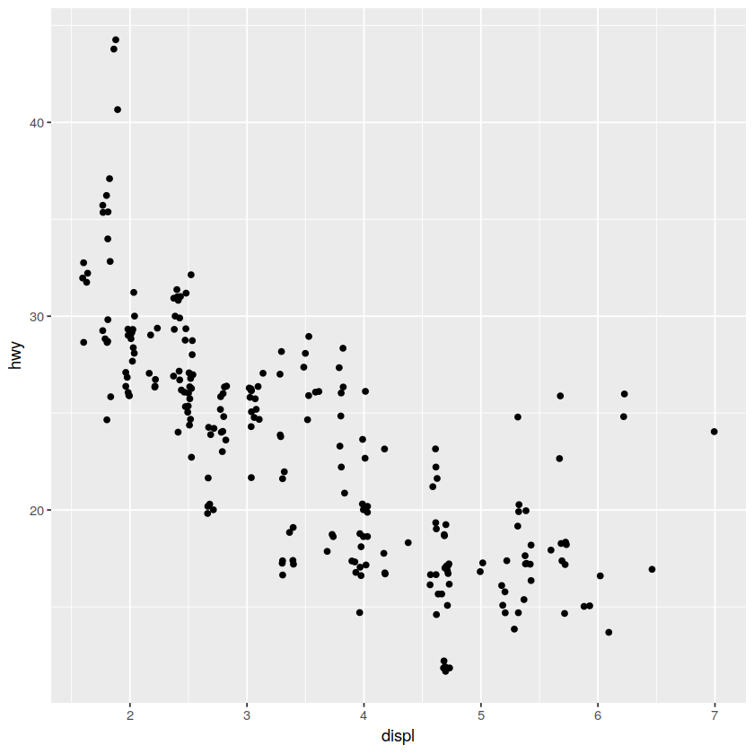

# 统计变换、位置调整与坐标系
简单的统计变换、位置调整与坐标系转换


```R
library(tidyverse)
```

    ─ Attaching packages ──────────────────── tidyverse 1.2.1 ─
    ✔ ggplot2 3.1.0     ✔ purrr   0.2.5
    ✔ tibble  1.4.2     ✔ dplyr   0.7.8
    ✔ tidyr   0.8.2     ✔ stringr 1.3.1
    ✔ readr   1.3.1     ✔ forcats 0.3.0
    ─ Conflicts ───────────────────── tidyverse_conflicts() ─
    ✖ dplyr::filter() masks stats::filter()
    ✖ dplyr::lag()    masks stats::lag()


```R
# 先看一个条形图
ggplot(diamonds) + 
geom_bar(mapping = aes(cut))
```


这是非常简单的条形图，原始数据中并没有关于***cut***的统计信息，在绘图时默认的统计函数计数并画出该条形图，可以查看***?geom_bar***阅读帮助信息

绘图函数***geom***和统计变换函数***stat***是成对出现的，统计中有默认的绘图，绘图中有默认的统计


```R
# 按照百分比绘制条形图
ggplot(diamonds) + 
geom_bar(mapping = aes(x = cut, y = ..prop..,group = 1))# 使用prop时要分组
```


```R
ggplot(diamonds) + 
geom_col(mapping = aes(x = cut, y = depth))
```


```R
ggplot(data = diamonds) +
 geom_bar(
 mapping = aes(x = cut, fill = color)#按照颜色填充
 )　
```


```R
ggplot(diamonds) + 
geom_bar(mapping = aes(x = cut, fill = cut), position = "identity")
# position指定位置，有identity,fill和dodge
```


```R
ggplot(diamonds) + 
geom_bar(mapping = aes(x = cut, fill = clarity), position = "fill")
```


```R
ggplot(diamonds) + 
geom_bar(mapping = aes(x = cut, fill = clarity), position = "dodge")
```


```R
ggplot(mpg) + 
geom_point(mapping = aes(displ,hwy), position = "jitter") 
# 点抖动，避免重叠
```




